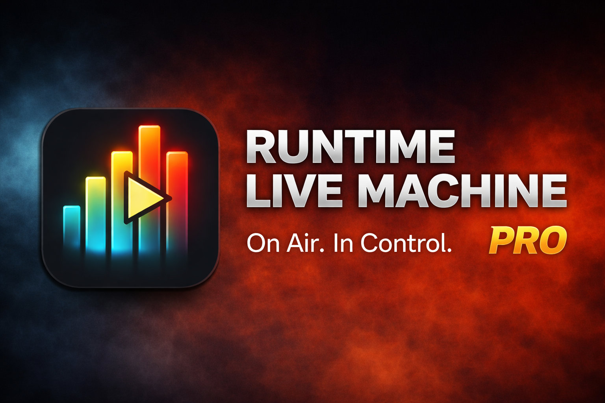

<div align="center">
  

  # Runtime Live Machine Pro

  **On Air. Al tuo controllo.**

  
  
  
  
  

  [](https://github.com/Pitz72/RRLMP/actions/workflows/build.yml)
</div>

---

## Panoramica

**Runtime Live Machine Pro** è un'applicazione desktop di regia audio per la diretta: podcast, web
radio, eventi. Si caricano i file in una griglia di colonne, ognuna con il proprio ruolo, e durante
lo show li si lancia con un click, un tasto o un controller MIDI. Il programma si occupa del resto:
abbassa la musica quando entra una voce, silenzia le basi quando parte una canzone, gestisce le
transizioni tra un brano e l'altro.

Nasce a gennaio 2026 come strumento di [Runtime Radio](https://runtimeradio.com) per condurre le
dirette senza un regista accanto. È stato distribuito come prodotto commerciale fino al settembre
2026, quando è stato ritirato dalla vendita e aperto sotto licenza MIT.

> **Stato del progetto.** Funzionalmente completo e in produzione. Viene mantenuto per correzioni;
> gli sviluppi aperti sono in [`docs/ROADMAP.md`](docs/ROADMAP.md). Le pull request sono benvenute —
> vedi [CONTRIBUTING.md](CONTRIBUTING.md).
>
> Lo scopo è la **regia umana di show finiti**, non l'automazione di una radio 24 ore su 24.

### ✨ Caratteristiche principali

**La griglia di regia**
- **Sei colonne con un ruolo ciascuna** — Show Assets, Jingle, Promo, Canzoni dell'episodio, Voci,
  Pre-Show — e un **pad FX 5×5** per gli effetti sonori che suonano sopra a tutto
- **Banner IN ONDA** sempre presente: titolo, avanzamento con i punti di Intro e Outro, timer
  colorato per fase, UP NEXT
- **Card audio** con badge di stato (LOOP, NEXT, UP NEXT, BPM, Intro, FADE OUT), conti alla rovescia
  di Intro e Outro, allarme **DEAD AIR** sull'intestazione quando la colonna sta per restare muta
- **NoteBoard**: il copione di una clip compare a schermo mentre suona

**Il motore di mixaggio**
- **Gerarchia audio per colonna**: la voce abbassa tutto (ducking), la musica silenzia le basi e le
  riprende da dove erano (Music Dominance), le sigle prendono la scena
- **Smart Mic**: con un microfono USB diretto, la musica scende da sola quando parli
- **Omologazione del volume** EBU R128 (−16 LUFS di default) e **Master Chain** con filtro passa-alto,
  glue multibanda e limiter
- **Transizioni** Crossfade, Segue e Gapless, provabili senza andare in onda
- **Vista Automix** per la colonna Musica, con rilevamento del BPM e passaggi a tempo

**Editor e controllo**
- **Editor della forma d'onda** con trim, marker di Intro e Outro, Auto-Trim dei silenzi e Smart Cues
- **Tastiera** (tasti per clip, F1…F6 sulle colonne visibili, `Esc` = STOP ALL) e **MIDI Learn**
- **Controllo remoto** da tablet o telefono sulla rete locale, protetto da PIN

**Progetti e sessione**
- Progetti **`.lmp`** in JSON, salvataggio automatico, controllo dei file mancanti all'apertura
- **Esporta progetto con audio**: cartella autocontenuta, portabile su un altro computer
- **Registrazione della sessione** dal master, esportabile in WAV, FLAC, MP3, OGG, WEBM
- **Aggiornamenti automatici** con consenso, mai durante una diretta
- Interfaccia in **italiano e inglese**

### 🌐 Documentazione

- **Manuale utente** in PDF: [italiano](manuale-utente/typst/Manuale-Utente-IT.pdf) ·
  [English](manuale-utente/typst/User-Manual-EN.pdf) — apribile anche dal pulsante *Manuale Utente*
  dell'applicazione
- **Guida rapida** dentro l'applicazione (schermata di benvenuto e pannello Info)
- Documentazione tecnica: [`docs/INDEX.md`](docs/INDEX.md), con architettura, roadmap e
  [regole delle colonne](docs/regole-colonne/README.md)

### 📋 Changelog

Un file per versione in [`docs/changelogs/current/`](docs/changelogs/current/), in italiano e in
inglese; lo storico completo delle correzioni è in [`relazione.md`](relazione.md).

---

## Download

Le release si trovano nella pagina **[Releases](https://github.com/Pitz72/RRLMP/releases)**:

| Piattaforma | File |
|---|---|
| **Windows** 10/11 64-bit | `Runtime-Live-Machine-Pro-<versione>.exe` |
| **Linux** (portabile) | `Runtime-Live-Machine-Pro-<versione>.AppImage` |
| **Linux** (Debian/Ubuntu) | `Runtime-Live-Machine-Pro-<versione>.deb` |

**macOS**: nessun installer ufficiale. Chi ha un Mac può compilarlo dal sorgente, le istruzioni sono
in [CONTRIBUTING.md](CONTRIBUTING.md#macos).

I pacchetti non sono firmati con un certificato commerciale: al primo avvio Windows SmartScreen
mostra un avviso (*Ulteriori informazioni* → *Esegui comunque*).

---

## Quick Start (sviluppo)

```bash
# Installa le dipendenze
npm ci

# Avvia in modalità sviluppo (Windows; per Linux e macOS vedi CONTRIBUTING.md)
npm run dev

# Test e controllo dei tipi
npm test

# Build locale (senza pubblicazione)
npm run build
```

---

## Stack Tecnologico

| Livello | Tecnologia |
|---|---|
| Applicazione | Electron 28 |
| Interfaccia | React 18 · TypeScript 5 · Vite 5 · Tailwind CSS 3 |
| Stato | Zustand 4 |
| Audio | Web Audio API nel renderer · FFmpeg / FFprobe nel processo principale |
| Streaming dei file | protocollo `media://` (nessun file audio caricato in memoria) |
| Localizzazione | react-i18next |
| Distribuzione | electron-builder · electron-updater (GitHub Releases) |
| Test | Vitest |
| Manuale | Typst |

---

## Requisiti di Sistema

| | Minimo | Consigliato |
|---|---|---|
| **Windows** | Windows 10 64-bit | Windows 11 64-bit |
| **Linux** | Ubuntu 20.04 / Debian 11 | Ubuntu 22.04 LTS |
| **RAM** | 4 GB | 8 GB o più |
| **Disco** | 300 MB | 1 GB + spazio per i file audio |
| **CPU** | dual-core moderno | quad-core o superiore |

Nessuna scheda audio dedicata richiesta: funziona con qualsiasi periferica riconosciuta dal sistema,
dalla scheda integrata ai mixer USB.

---

## Sostenere il progetto

Il programma è gratuito e lo resterà. Se ti è utile e vuoi dare una mano:

### 👉 **[simonepizzi.runtimeradio.it/contatti](https://simonepizzi.runtimeradio.it/contatti)**

Per una donazione diretta: **[paypal.me/runtimeradio](https://www.paypal.com/paypalme/runtimeradio)**

---

## Privacy

L'applicazione funziona in locale. Si collega solo a GitHub, per il controllo degli aggiornamenti e
per aprire i manuali, e, se lo attivi, apre un piccolo server sulla tua rete locale per il controllo
remoto. Il microfono si attiva solo quando lo armi. Nessuna telemetria, nessun analytics, nessun
account: progetti, registrazioni e impostazioni restano sul tuo disco.

Il modello di sicurezza è descritto in [SECURITY.md](SECURITY.md).

---

## Come è stato scritto

Questo programma è stato scritto facendo un **uso massiccio di modelli linguistici di grandi
dimensioni**: Google **Gemini 3.0** e **3.1**, e Anthropic **Claude Sonnet 4.6**, **Opus 4.7**,
**Opus 4.8**, **Sonnet 5**, **Opus 5** e **Fable 5**. Gran parte del codice che leggi l'hanno prodotta
loro, ed è giusto che sia dichiarato apertamente.

Tutto il resto è di **Simone Pizzi**: il concetto, la visione, la direzione progettuale, la
definizione minuziosa di ogni dettaglio funzionale e la caccia ostinata ai bug. Ogni comportamento
del programma — dalla gerarchia audio decisa dalla colonna alla base che torna da dove era rimasta,
dalla sigla che prende la scena all'aggiornamento che aspetta la fine della diretta — è una decisione
progettuale presa, verificata in regia e corretta a mano fino a farla funzionare.

I modelli hanno scritto il codice. Le decisioni, dalla prima all'ultima, sono state sue.

Lo stesso vale per la documentazione: manuali, guide e note tecniche sono stati redatti con questo
metodo e revisionati riga per riga contro il codice.

---

## Licenza

Rilasciato sotto licenza **MIT** — vedi [LICENSE](LICENSE).

Sviluppato da **Simone Pizzi** per **[Runtime Radio](https://runtimeradio.com)**.

Fino a settembre 2026 il progetto è stato distribuito commercialmente. Quella fase è chiusa: il
software è ora liberamente utilizzabile, modificabile e ridistribuibile secondo i termini MIT.
