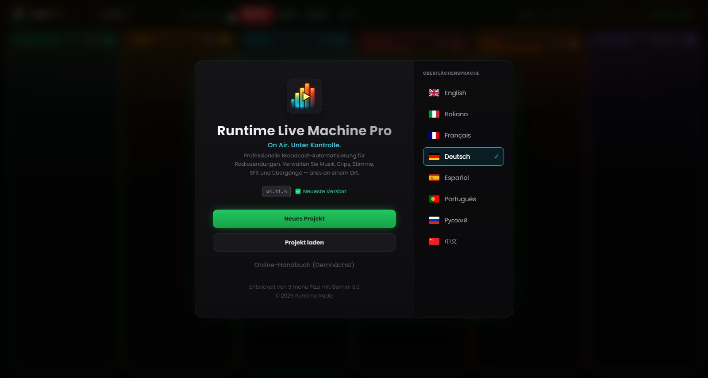

# Kapitel 2 – Installation und erster Start

---

Die Installation von Runtime Live Machine Pro verlangt bewusst nur ein Minimum an Interaktion: wenige Klicks, keine manuelle Konfiguration, keine separat zu installierenden Voraussetzungen. Die Audio-Engine (FFmpeg) steckt bereits im Installationspaket und erfordert von Ihnen keinerlei Eingriff.

---

## 2.1 Systemanforderungen

Prüfen Sie vorab, ob Ihr Computer die Mindestanforderungen erfüllt. Die empfohlenen Spezifikationen sorgen bei langen Sessions oder vielen gleichzeitig geladenen Clips für die beste Erfahrung.

| | Minimum | Empfohlen |
|---|---|---|
| **Betriebssystem (Windows)** | Windows 10 64-bit | Windows 11 64-bit |
| **Betriebssystem (macOS)** | macOS 11 Big Sur | macOS 13 Ventura oder neuer |
| **Betriebssystem (Linux)** | Ubuntu 20.04 / Debian 11 | Ubuntu 22.04 LTS |
| **RAM** | 4 GB | 8 GB oder mehr |
| **Speicherplatz** | 300 MB (Anwendung) | 1 GB + Platz für die Audiodateien |
| **CPU** | Beliebiger moderner Dual-Core | Quad-Core oder besser |

Die Software ist für Apple Silicon (M1, M2, M3) optimiert und läuft nativ auf beiden macOS-Architekturen – Rosetta-Emulation ist nicht nötig.

Eine dedizierte Soundkarte brauchen Sie nicht: RLMP arbeitet mit jedem vom Betriebssystem erkannten Audiogerät, von der integrierten Soundkarte bis zu professionellen USB-Mixern wie dem Rødecaster Pro oder dem RØDECaster Duo.

---

## 2.2 Installation unter Windows

1. Laden Sie die Datei `Runtime-Live-Machine-Pro-1.15.10.exe` aus dem offiziellen Vertriebskanal herunter.
2. Doppelklicken Sie auf die ausführbare Datei: Der NSIS-Installer startet und kopiert die Dateien in die passenden Verzeichnisse.
3. Am Ende legt er eine Verknüpfung auf dem Desktop und im Startmenü an.
4. Nach Abschluss der Installation startet die Anwendung automatisch.

**Hinweis zu Windows SmartScreen.** Weil die Software häufig aktualisiert wird, hat das digitale Signaturzertifikat womöglich noch nicht genug „Reputation“ für die automatische Whitelist von SmartScreen gesammelt. Erscheint die Meldung „Der Computer wurde durch Windows geschützt“, klicken Sie auf *Weitere Informationen* und anschließend auf *Trotzdem ausführen*. Die Software ist frei von Malware; die offiziellen Installer erscheinen ausschließlich in den Vertriebskanälen des Autors.

---

## 2.3 Installation unter macOS

1. Laden Sie die `.dmg`-Datei aus dem offiziellen Kanal herunter.
2. Öffnen Sie die Image-Datei und ziehen Sie das Symbol von Runtime Live Machine Pro in den Ordner *Programme*.
3. Beim ersten Start zeigt macOS möglicherweise eine Gatekeeper-Warnung („Das Programm kann nicht geöffnet werden, da es von einem nicht verifizierten Entwickler stammt“). Öffnen Sie in diesem Fall *Systemeinstellungen* → *Sicherheit* → *Allgemein* und klicken Sie neben dem Namen der Anwendung auf *Trotzdem öffnen*.

Ab macOS 15 (Sequoia) führt der Weg über *Systemeinstellungen* → *Datenschutz & Sicherheit*, dann weiter nach unten bis zum Abschnitt *Sicherheit*.

> **Hinweis.** Die macOS-Anwendung trägt kein Apple-Developer-Zertifikat. Das wirkt sich auch auf den Umgang mit Aktualisierungen aus, wie Kapitel 12 erläutert.

---

## 2.4 Installation unter Linux

Zwei Vertriebsformate stehen zur Verfügung:

- **AppImage** – eine portable ausführbare Datei, keine Installation nötig. Machen Sie sie ausführbar (`chmod +x`) und starten Sie sie direkt.
- **.deb-Paket** – für Debian-, Ubuntu- und Mint-Distributionen. Installieren Sie es mit `sudo dpkg -i dateiname.deb` oder über die grafische Paketverwaltung.

Auf manchen Distributionen muss zusätzlich das Paket `libasound2` für die ALSA-Audiounterstützung installiert werden. Startet die Anwendung nicht, werfen Sie einen Blick in die Dokumentation Ihrer Distribution.

---

## 2.5 Der Begrüßungsbildschirm

*Abbildung 2.1 – Der Begrüßungsbildschirm: Identität der Software, Update-Status, Hauptaktionen und Sprachwähler.*

Beim ersten Start – und bei jedem weiteren, solange Sie kein Projekt öffnen – zeigt RLMP den **Begrüßungsbildschirm**: den Einstiegspunkt für alle vorbereitenden Schritte. Der Bereich gliedert sich in zwei Zonen.

**Linke Zone – Identität und Aktionen.**
Das Logo der Software – die Balken eines VU-Meters mit dem Play-Symbol – kennzeichnet die Pro-Version. Unter Titel und Slogan steht die Nummer der installierten Version, begleitet vom Status des Update-Systems:

- **„Neueste Version“** (grün) – Sie verwenden die aktuellste verfügbare Version.
- **„Update verfügbar“** (Bernstein, blinkend) – es ist eine Schaltfläche: Klicken Sie darauf, um das Update-Fenster zu öffnen (Kapitel 12).
- **„OFFLINE“** (gedämpftes Rot) – der Update-Dienst konnte nicht erreicht werden; die Software funktioniert trotzdem.

Darunter liegen die Hauptaktionen:

- *Neues Projekt* – legt eine leere Session mit ladebereiten Spalten an.
- *Projekt laden* – öffnet eine bestehende `.lmp`-Datei. Bevor sie einsatzbereit ist, führt RLMP eine **Integritätsprüfung** durch: Sie prüft, ob jede referenzierte Audiodatei noch am gespeicherten Pfad liegt. Fehlende Dateien signalisiert sofort ein roter Rahmen am jeweiligen Clip.
- *Handbuch* – der Eintrag existiert, ist derzeit aber deaktiviert: Die aus der Software heraus abrufbare Dokumentation folgt in einer künftigen Version über das Web.

**Rechte Zone – Sprachwähler.**
RLMP unterstützt acht Oberflächensprachen: Englisch, Italienisch, Französisch, Deutsch, Spanisch, Portugiesisch, Russisch und vereinfachtes Chinesisch. Ein cyanfarbener Rahmen mit Häkchen hebt die aktive Sprache hervor. Die Auswahl wirkt sofort und bleibt sitzungsübergreifend gespeichert.

---

## 2.6 Der erste Start: was Sie erwartet

Beim ersten Öffnen eines Projekts fällt im Header das Logo mit dem **PRO**-Badge im schillernden Farbverlauf auf. Im Hintergrund startet mit dem Projekt zugleich die Audio-Engine: FFmpeg wird initialisiert, und das Streaming-Protokoll `media://` stellt sich bereit, um Dateien direkt von der Festplatte auszuliefern, ohne sie in den Speicher zu laden.

Die Software startet bevorzugt im Vollbildmodus. Öffnet sich das Fenster dennoch verkleinert, bringen Sie es mit `F11` (Windows/Linux) oder `Ctrl+Cmd+F` (macOS) in den Vollbildmodus – die beste Voraussetzung für die Regiearbeit.

Der **On-Air-Timer** im Header steht auf `--:--:--`, bis der erste Clip der Session startet. Von da an zählt er die vergangene Sendezeit: eine nützliche Referenz für alle, die mit fest getakteten Playlists arbeiten.
