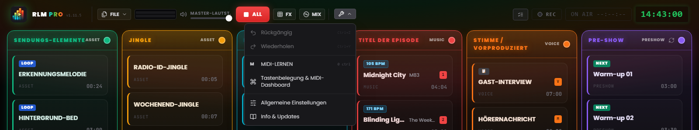
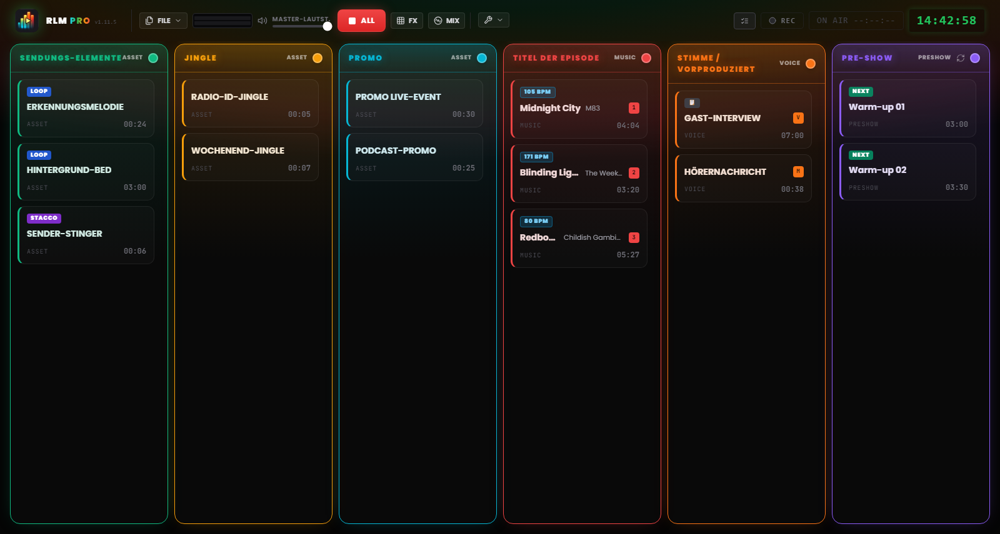

# Kapitel 3 – Die Arbeitsoberfläche

---

Die Oberfläche von Runtime Live Machine Pro ist für den anspruchsvollsten Betriebskontext gebaut, den es gibt: die Live-Sendung. Jede visuelle Entscheidung – das dunkle Thema, der hohe Kontrast, die Größe der Bedienelemente – folgt einer funktionalen Anforderung. Ästhetik um ihrer selbst willen ist das nicht, sondern Ergonomie.

Öffnen Sie ein Projekt, teilt sich der Bildschirm in zwei klar getrennte Zonen: oben die **Steuerleiste**, die Projekt und System verwaltet, in der Mitte das **Regie-Raster**, in dem die eigentliche Arbeit stattfindet.

---

## 3.1 Die Steuerleiste (Header)

Der Header nimmt die gesamte Bildschirmbreite ein. Von links nach rechts vereint er die Identität der Software, die Dateibefehle, das Monitoring samt Transportsteuerung, das Werkzeugmenü und die Session-Anzeigen.

### Identität

**Logo und PRO-Badge.** Links steht das Logo neben dem Schriftzug **RLM PRO** – das Wort „PRO“ ist in einem schillernden Farbverlauf gehalten, der von Cyan über Grün und Bernstein bis Rot reicht. Daneben zeigt eine Monospace-Schrift die installierte Version (`v1.15.10`). Fahren Sie mit der Maus über das Logo, erscheint der vollständige Name der Software samt Versionsnummer.

### Menü Datei

Die Schaltfläche **FILE** öffnet ein Menü mit den Projektoperationen:

- *Neues Projekt* – öffnet eine leere Session. Gibt es ungespeicherte Änderungen, fragt die Software vorher nach.
- *Projekt speichern* – schnelles Speichern in die aktuelle `.lmp`-Datei. Gibt es ungespeicherte Änderungen, hebt sich der Eintrag gelb hervor.
- *Speichern unter…* – öffnet stets den Dialog, praktisch für fortlaufende Versionen (z. B. `Ep47_entwurf.lmp`, `Ep47_final.lmp`).
- *Projekt mit Audio exportieren* – konsolidiert das gesamte Audio innerhalb des Projekts (Unterordner `audio/`) und verweist die Clips dorthin, sodass Sie die Originale gefahrlos löschen können. Beschrieben in Kapitel 10.
- *Projekt laden* – öffnet ein `.lmp`-Projekt von der Festplatte.
- *M3U importieren* – importiert eine Playlist im M3U-Format als Clip-Sequenz.

### Monitoring und Transport

**Stereo-VU-Meter (L/R).** Zwei waagerechte Balken zeigen den tatsächlichen Ausgangspegel nach der Master-Lautstärke: grün bis etwa 85 % des Wegs, dann gelb, schließlich rot nahe dem Endanschlag. Dauerhaftes Rot signalisiert Clipping – senken Sie in dem Fall den Pegel.

**Master-Lautstärke.** Der Fader steuert die Gesamtausgangslautstärke der Software, von 0 bis 100 %. Er wirkt wie ein Master-Fader: Steht er auf null, kommt kein Ton heraus, ganz gleich, was die einzelnen Clips gerade tun. Liegt ein MIDI-Steuerelement auf der Master-Lautstärke, zeigt ein kleines Badge diese Zuordnung an.

**STOP ALL (rote Schaltfläche „ALL“).** Stoppt sofort alle aktiven Clips und setzt laufende Fades zurück – der Notfallbefehl des Systems. Die Taste `Esc` erfüllt denselben Zweck, sobald die Anwendung im Fokus steht, auch während Sie gerade in ein Textfeld schreiben.

> **Hinweis.** Anders als in früheren Versionen ist `Esc` nicht mehr als systemweites Kürzel registriert, sondern wirkt nur, solange RLMP das aktive Fenster ist. So können Dialogfenster `Esc` zum Schließen nutzen, ohne dabei die Sendung zu stoppen.

**FX.** Öffnet und schließt das pad FX, die *jingle machine* der Effekte (Kapitel 7). Ein kleiner Zähler zeigt, wie viele Effekte gerade laufen.

**MIX.** Öffnet und schließt die Automix-Ansicht, das dedizierte Deck der Spalte Musik (Kapitel 7).

### Werkzeuge

Das Menü **Werkzeuge** (Schraubenschlüssel-Symbol) vereint:

- *Rückgängig* und *Wiederholen* – die Änderungshistorie der Playlist (`Ctrl+Z` / `Ctrl+Y`).
- *MIDI Learn* – aktiviert den MIDI-Lernmodus (Kapitel 8).
- *Tastenbelegung* – das Fenster zur Zuweisung von Tasten an Clips.
- *Einstellungen* – die globalen Voreinstellungen der Software (Kapitel 13).
- *Info* – Version, Credits und manuelle Update-Prüfung.

Kurz unter dem Menü blinkt für einen Moment die Anzeige *Auto-saved* auf – die Bestätigung, dass das Projekt automatisch gespeichert wurde.

*Abbildung 3.1 – Die Steuerleiste und das geöffnete Menü Werkzeuge (Rückgängig/Wiederholen, MIDI Learn, Tastenbelegung, Allgemeine Einstellungen, Info).*

### Session-Anzeigen

Auf der rechten Seite des Headers finden sich die Schaltfläche des **Playout Log** (das chronologische Startprotokoll, Kapitel 13), die **Aufnahme**-Schaltfläche (Kapitel 9), der **On-Air-Timer** (er zeigt während der Sendung `ON AIR HH:MM:SS` auf rotem Grund) sowie die digitale **Studiouhr** im 24-Stunden-Format, synchronisiert mit der Systemuhr.

Im Header können außerdem unaufdringliche Benachrichtigungen (**Toasts**) zu abgeschlossenen Vorgängen oder Systemhinweisen erscheinen. Anders als blockierende Dialoge verschwinden sie nach wenigen Sekunden von selbst, ohne die Wiedergabe zu unterbrechen.

---

## 3.2 Das Raster mit sechs Spalten

*Abbildung 3.2 – Die Arbeitsoberfläche: das Raster mit sechs Spalten und den Audio-Karten.*

Das Raster ist das Betriebszentrum der Software: sechs nebeneinanderliegende senkrechte Spalten, jede mit eigener farbiger Kopfzeile und eigener Logik im Audio-Verhalten. Die Soundeffekte haben keine Spalte im Raster – sie leben im pad FX (Kapitel 7).

### Spaltenkopfzeilen

Jede Kopfzeile nennt Name und Typ der Spalte und dient zugleich als Statusanzeige. Im Normalzustand bleibt sie statisch und trägt den charakteristischen Farbton der Spalte. Ist der laufende Clip der letzte verfügbare der Spalte, läuft er nicht in loop und bleiben weniger als **20 Sekunden** bis zum Ende, schlägt die Kopfzeile in den **DEAD-AIR**-Alarm um: Sie pulsiert, wechselt zu Bernstein und zeigt ein Warnsymbol samt Badge **END**. Diese Vorwarnung verschafft Ihnen die Zeit, den nächsten Titel noch vor der Stille vorzubereiten.

Die Farbe jeder Spalte lässt sich anpassen: Ein Klick auf den farbigen Punkt in der Kopfzeile öffnet eine Palette mit **30 Farbtönen**. Die Auswahl speichert die Software in der Projektdatei.

Enthält eine Spalte mindestens einen Clip, erscheint in ihrer Kopfzeile ein **Papierkorb**-Symbol: Der Befehl **Spalte leeren** entfernt in einem Zug sämtliche Clips dieser Spalte. Zur Sicherheit fragt er stets nach und nennt dabei, wie viele Clips entfernt werden; der Vorgang lässt sich mit *Rückgängig* (`Ctrl+Z`) zurücknehmen. Auf leeren Spalten erscheint das Symbol nicht.

Auf der Kopfzeile der Spalte **Pre-Show** sitzt zusätzlich eine **Rotations**-Schaltfläche: Ist sie aktiv, fügt die Warteschlange vor der Sendung automatisch Jingles und Promos in regelmäßigen Abständen ein (Kapitel 13).

### Die sechs Spalten

**Show Assets (Grün)**
Die strukturellen Elemente der Show: Kennungen, Musikbetten, Untermalungen (*bed*), institutionelle Stacchi (Trenner). Sie verhalten sich wie Hintergrundelemente – sie räumen den Platz, sobald Stimmen oder Songs hinzukommen, behalten aber ihre interne Rotation bei, bis man sie stoppt.

**Jingle (Bernstein)** und **Promo (Cyan)**
Zwei eigene Spalten, die eine für identitätsstiftende Jingles, die andere für Promos und Eigenwerbung. Audiotechnisch verhalten sie sich genau wie die Show Assets, gehören also zur selben Familie – doch getrennt gehalten bleibt die Playlist geordnet und lesbar.

**Episoden-Musik (Rot)**
Die Musik-Playlist. Ihre Clips nehmen aktiv am automatischen Mix teil: Stimmen senken sie ab, und beim Einsetzen senken sie ihrerseits die Beds der Assets (Kapitel 6). Auf Musik-Clips erkennt die Software automatisch den **BPM**-Wert und zeigt ihn über ein eigenes Badge an.

**Stimme / Aufnahmen (Orange)**
Interviews, vorproduzierte gesprochene Blöcke, Sprachnachrichten. Diese Spalte genießt die **höchste Priorität** im Mixing-System: Läuft hier ein Clip, sinken alle anderen Signale auf Hintergrundpegel.

**Pre-Show (Violett)**
Die Aufwärm-Playlist vor der Sendung. Sie funktioniert wie eine eigenständige Musik-Warteschlange mit optionaler Rotation von Jingles und Promos. Beginnt die eigentliche Sendung, wird diese Spalte meist geleert oder deaktiviert.

---

## 3.3 Die Audio-Karte (Clip)

Jede importierte Audiodatei materialisiert sich im Raster als rechteckige **Karte** – die operative Einheit des Systems: Sie sehen sie, starten sie, konfigurieren sie, verschieben sie.

### Aufbau einer Karte

**Titel und Interpret.** Der Dateiname oder der in den Eigenschaften vergebene individuelle Name. Ein individueller Titel ändert nur das Etikett in der Software; die Originaldatei auf der Festplatte bleibt unangetastet. Bei Musik-Clips kann unter dem Titel der Name des Interpreten erscheinen.

**Timer.** In Ruhe zeigt er die Gesamtdauer des Clips im Format `MM:SS`. Während der Wiedergabe springt er auf **Countdown** um, mit negativem Vorzeichen (z. B. `−01:20`). Bleiben weniger als 15 Sekunden bis zum Ende, färbt sich der Timer **rot**.

**Status-Badges.** Kleine Etiketten teilen sofort die konfigurierten Eigenschaften mit:

- **STACCO** – der Clip ist so eingestellt, dass er sich über die anderen legt, ohne sie zu stoppen.
- **LOOP** – der Clip startet am Ende der Wiedergabe wieder von vorn.
- **NEXT** – am Ende dieses Clips startet automatisch der nächste in der Spalte.
- **▶ UP NEXT** – hebt hervor, welcher Clip als nächster in der automatischen Sequenz startet.
- **### BPM** – das erkannte Tempo, auf Musik-Clips, auf einem fluoreszierend gelben Badge mit hoher Sichtbarkeit.
- **I ##s** – der Clip hat einen konfigurierten Intro-Punkt (Kapitel 5): Das Badge in Cyan nennt dessen Dauer in Sekunden und ist stets sichtbar, auch bei stehendem Clip.
- **TRIM…** – laufende Stilleanalyse (Auto-Trim).
- **FADE OUT** – erscheint auf dem ausgehenden Clip während eines crossfade oder einer Blende.
- **📋** – der Clip hat eine Notiz in der NoteBoard (Kapitel 13).

**Zuweisungen.** Hat der Clip eine Tastaturtaste zugewiesen, erscheint der Buchstabe in einem Badge in der Farbe der Spalte; bei einem MIDI-Binding erscheint stattdessen das Etikett `M`, gefolgt von der Notennummer (z. B. `M60`).

**Struktur-Cues.** Sind Marker konfiguriert, erscheinen während der Wiedergabe die Countdowns `INTRO: −MM:SS` (in Cyan) und `OUTRO IN: −MM:SS` (in Orange), bis hin zur Warnung `🚨 OUTRO`, sobald das Outro begonnen hat.

**Wiedergabeanzeige.** Läuft ein Clip, leuchtet die Karte auf: grüner Rahmen, ein Hintergrund mit leuchtendem Schein, ein pulsierender Punkt und der hervorgehobene Titel. Der Fortschrittsbalken zieht dabei über den Kartenhintergrund.

### Interaktion mit den Karten

- **Linksklick** – startet den Clip, wenn er steht, und stoppt ihn (mit Fade Out), wenn er läuft.
- **Ctrl + Klick** (Windows/Linux) oder **Cmd + Klick** (macOS) – wählt den Clip aus, ohne ihn zu starten. Der Rahmen wird blau – nützlich für Mehrfachauswahl und Löschen im Block.
- **Taste Entf** (oder *Delete* / *Backspace*) – löscht die ausgewählten Clips aus dem Raster. Sind mehrere Clips markiert, fragt die Software vorher nach.
- **Rechtsklick** – öffnet die **Clip-Einstellungen**: Eigenschaften, Waveform-Editor, Notizen (Kapitel 5).
- **Drag & Drop** – eine Karte lässt sich innerhalb der Spalte umsortieren oder in eine andere ziehen. Ein leuchtender blauer Indikator zeigt während des Ziehens die Einfügeposition.

### Karten im Fehlerzustand

Eine Karte mit dem Hinweis **DATEI FEHLT** und rotem Rahmen zeigt: Die referenzierte Audiodatei ist nicht mehr erreichbar – verschoben, umbenannt oder auf einer nicht angeschlossenen externen Festplatte. Der Clip lässt sich erst wieder abspielen, wenn die Datei am ursprünglichen Pfad verfügbar ist. Wie Sie mit Pfadfehlern umgehen, behandelt Kapitel 14.
