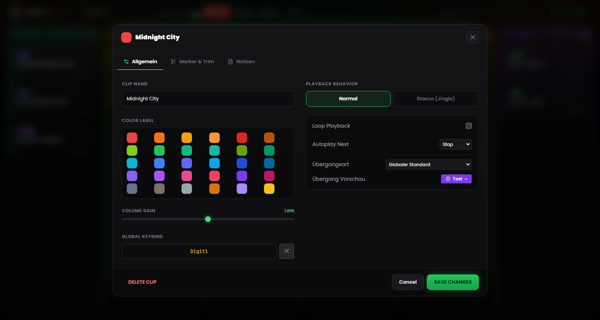
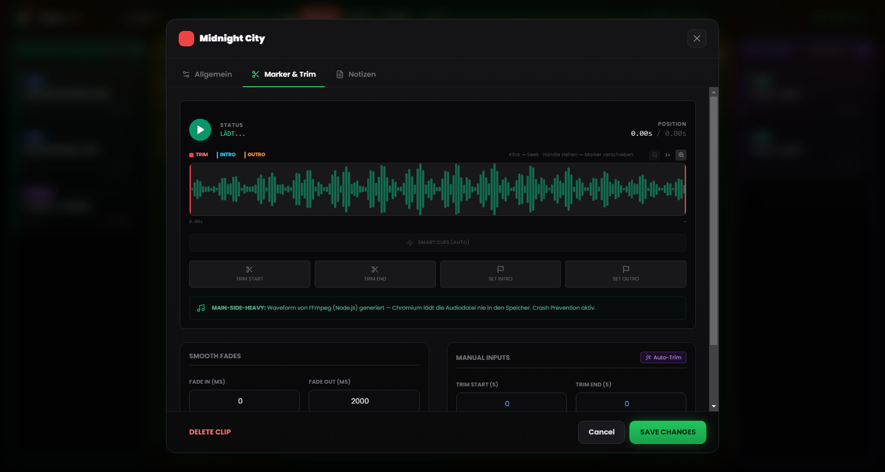

# Kapitel 5 – Clip-Eigenschaften und Waveform-Editor

---

Jede Audiodatei bringt ihre eigene Vorgeschichte mit ins Raster: Aufnahmen mit ein paar Sekunden Stille am Anfang, Titel mit endlosen Outros, Interviews, deren Pegel gegenüber dem Rest der Show viel zu leise ausfällt. RLMP verlangt in solchen Fällen keinen Umweg über einen externen Audio-Editor, nur weil eine Datei nicht „sendefertig“ ist. Stattdessen bringt jeder Clip sein eigenes Konfigurationspanel mit, inklusive eines visuellen Waveform-Editors zum Schneiden und Markieren.

Sämtliche Änderungen über diese Werkzeuge sind **nicht destruktiv**: Die Originaldatei bleibt auf der Festplatte unangetastet. RLMP hält die Einstellungen in der Projektdatei `.lmp` fest und wendet sie erst während der Wiedergabe an.

Um die Einstellungen eines Clips zu öffnen, klicken Sie mit der **rechten Maustaste** auf die Karte.

---

## 5.1 Grundeigenschaften

*Abbildung 5.1 – Die Clip-Einstellungen: Clip Name, Color Label, Volume Gain, Playback Behavior, Next Action und Tastenzuweisung.*

### Name und Erscheinung

**Clip Name.** Sie können dem Clip einen individuellen Namen geben, unabhängig vom Namen der Originaldatei. Dieser Name erscheint auf der Karte im Raster. Wählen Sie Namen, die beschreiben und im laufenden Betrieb wirklich helfen: „ERÖFFNUNGS-KENNUNG“ liest sich schneller als `kennung_rev3_final_def.mp3`, wenn nur drei Sekunden bleiben, um den richtigen Clip zu finden.

**Color Label.** Standardmäßig übernimmt der Clip die Farbe seiner Spalte. Wer ihn visuell hervorheben will, weist ihm hier eine eigene Farbe zu – praktisch, um kritische Clips zu kennzeichnen (etwa die Schlusskennung) oder thematische Gruppen innerhalb einer Spalte auseinanderzuhalten.

### Volume Gain

Der Schieberegler Volume Gain reicht von 0 % bis 150 % und greift als Pre-Fader am einzelnen Clip an, noch vor der globalen Master-Lautstärke.

Am häufigsten dient er der Pegelanpassung: Eine leise aufgenommene Sprachspur – eine WhatsApp-Nachricht etwa, oder ein Telefonmitschnitt – lässt sich über 100 % anheben, bis sie zur Lautstärke der anderen Spuren passt. Umgekehrt drückt man einen besonders „heißen“ Clip herunter, ohne an der Master-Lautstärke zu rühren.

---

## 5.2 Der Waveform-Editor

*Abbildung 5.2 – Der Waveform-Editor: Trim-Handles, Intro- und Outro-Marker, Auto-Trim, Smart Cues und Blenden.*

Der visuelle Editor ist das Kernstück des Konfigurationspanels. Er sitzt in dessen Mitte und zeigt die grafische Darstellung des gesamten Clip-Audios.

### Navigation im Editor

**Horizontaler Zoom.** Die Wellenform lässt sich von 1× (vollständige Ansicht) bis 8× vergrößern, mit Zwischenstufen bei 1×, 2×, 3×, 4×, 6× und 8× – gesteuert über den Zoom-Schieberegler oder das Mausrad oberhalb des Editors. Bei hohem Zoom folgt die Ansicht automatisch der aktuellen Position.

**Adaptives Lineal.** Die Zeitachse am oberen Rand passt sich dem Zoomlevel an: In der Vollansicht zeigt sie grobe Bezugsmarken, bei maximalem Zoom verdichten sich diese bis auf die Sekunde.

**Playhead.** Während der Vorschau läuft ein weißer, senkrechter Indikator in Echtzeit über die Wellenform und zeigt die aktuelle Position. Ein Klick auf die Wellenform springt die Wiedergabe direkt dorthin.

### Die vier Handles

Vier ziehbare **Handles** sitzen im Editor, jedes mit eigener Funktion und eigener Farbe:

**Trim Start (rotes Handle, links).** Legt fest, wo der Clip tatsächlich beginnt. Alles links davon wird bei der Wiedergabe übersprungen. Ziehen Sie es nach rechts, um Stille oder unerwünschte Passagen am Anfang loszuwerden.

**Trim End (rotes Handle, rechts).** Legt den tatsächlichen Endpunkt fest – alles rechts davon bleibt unberücksichtigt. Nach links gezogen, kürzt es das Outro. Trim Start und Trim End dürfen sich dabei nie überschneiden.

**Intro Marker (cyanfarbenes Handle).** Er markiert, wo die Hauptmelodie nach einem eventuellen Vorspann einsetzt. Ist er einmal gesetzt, erscheint auf der laufenden Karte der Countdown **INTRO: −MM:SS**.

**Outro Marker (oranges Handle).** Er markiert den Beginn des Outros – meist der Moment, ab dem man zu sprechen beginnt, um den Übergang zu füllen. Auf der Karte läuft dann der Countdown **OUTRO IN: −MM:SS**. Passt der Wert nicht zum Trim oder zur Dauer, deaktiviert die Software ihn automatisch und macht Sie darauf aufmerksam.

Wer nicht ziehen möchte, kann auch vier *Set*-Schaltflächen nutzen: Sie setzen das jeweilige Handle auf die aktuelle Playhead-Position, praktisch zum Markieren während des Abhörens. Die Werte bleiben trotzdem in den zugehörigen Feldern präzise editierbar.

### Auto-Trim (Zauberstab)

Die Schaltfläche mit dem **Zauberstab**-Symbol startet die automatische Stilleerkennung über FFmpeg. Die Schwelle ist dabei nicht starr: Zuerst schätzt die Software den mittleren Pegel der Datei, dann setzt sie die Stilleschwelle etwa 25 dB darunter (innerhalb eines Sicherheitsbereichs von −55 bis −20 dB; fehlt eine brauchbare Schätzung, greift sie auf −40 dB zurück). Trim Start und Trim End werden so automatisch gesetzt, anfängliche Stille und stumme Outros verschwinden ohne manuellen Eingriff.

Besonders bei unbearbeiteten Sprachaufnahmen zahlt sich das aus: Telefonate, Sprachnachrichten, auf dem Handy aufgenommene Interviews. Auto-Trim auf die gesamte Spalte Stimme anzuwenden, dauert vor einer Show keine Minute und macht die Übergänge spürbar sauberer.

> **Technischer Hinweis.** Die Analyse läuft im Main Process über FFmpeg, ohne die Datei im Renderer in den Speicher zu laden. Selbst bei großen Dateien bleibt die Analysezeit im Bereich weniger Sekunden.

### Smart Cues (automatische Markererkennung)

Neben Auto-Trim gibt es **Smart Cues**: Die Funktion schlägt Intro- und Outro-Marker automatisch vor. Mit einer aggressiveren Schwelle findet sie den Punkt, an dem das Audio volle Energie erreicht (Intro), und jenen, an dem die Schlussblende einsetzt (Outro) – und platziert beide Marker, ohne dass Sie sie nach Gehör suchen müssen.

### Vorschau des Übergangs

Existiert ein **nachfolgender** Clip in derselben Spalte, spielt die Schaltfläche **„Test →“** die letzten Sekunden des aktuellen Clips ab und lässt direkt im Editor den Übergang zum nächsten auslösen. Eine *Stop*-Schaltfläche bricht die Vorschau bei Bedarf ab.

---

## 5.3 Verhaltensweisen und Automatisierung

### Playback Behavior (Überlagerungsmodus)

**Normal** – das Standardverhalten. Startet dieser Clip, unterbricht er jeden anderen laufenden Clip in derselben Spalte (mit Fade Out). Für Songs und Beds ist genau das richtig: Ein Song schließt die anderen aus.

**Stacco (Jingle)** – der Clip startet, ohne die anderen zu unterbrechen. Er genießt hohe Priorität: Die anderen Assets der Spalte werden stummgeschaltet, die Musik abgesenkt, gestoppt wird aber nichts. Typisch ist eine *Station-ID* („Sie hören…“), die über dem Intro eines Titels „reiten“ soll, oder ein kurzer Jingle über einem Bed in Loop.

### Next Action (Automatisierung am Ende)

Hier legen Sie fest, was passiert, sobald der Clip den Punkt Trim End erreicht.

**Stop** – das Standardverhalten für Musik, Stimme und Assets: Der Clip endet und stoppt.

**Play Next** – nähert sich der Clip dem Ende, startet automatisch der nächste Clip der Spalte, mit dem konfigurierten Übergang. Auf der Karte erscheint das Badge **NEXT**. In der Spalte Pre-Show ist das der Standard, und de facto entsteht so eine automatische Playlist: über mehrere aufeinanderfolgende Clips eingestellt, entstehen Blöcke, die ohne Unterbrechung durchlaufen.

Die Wiedergabe in **Loop** steht als eigene Option daneben: Aktiviert, beginnt der Clip nahtlos von vorn (ab Trim Start), und das Badge **LOOP** erscheint auf der Karte. Sie eignet sich für Musikbetten, Klangumgebungen oder Hintergrundkennungen, die laufen sollen, bis man sie ausdrücklich stoppt. Die Übergangsmodi – Crossfade, Segue, Gapless – folgen in Kapitel 13.

---

## 5.4 Blenden (Fade In und Fade Out)

Für jeden einzelnen Clip lässt sich hier die Dauer von Ein- und Ausblenden festlegen. Die Werte reichen von 0 bis 60.000 Millisekunden (60 Sekunden), die Kurve verläuft linear.

**Fade In.** Die Zeit, die die Lautstärke ab dem Start bis zum Maximalpegel braucht. Bei 2000 ms ergibt sich ein sanfter Anstieg über zwei Sekunden. Sinnvoll bei Musikbetten, die weich einsetzen sollen; bei 0 belassen Sie ihn für Stimmen und Effekte, die sofort da sein müssen.

**Fade Out.** Die Blendzeit beim Schließen – ob nun per Klick auf einen aktiven Clip oder im Übergang. Übliche Werte: 2000–3000 ms für Songs, 500–1000 ms für Beds, 0 ms für harte Stacchi.

Ein Fade Out von 0 ms schließt sofort („hard cut“). Bei einem Musiktitel in der Sendung wirkt das schnell wie ein technischer Fehler – überlegen Sie also genau, wann sich das eignet.

---

## 5.5 Steuerungszuweisung

Jeder Clip lässt sich auch über eine Tastaturtaste oder einen MIDI-Controller starten.

**Global Keybind.** Die dem Clip zugewiesene Tastaturtaste – festgelegt entweder im eigenen Feld der Clip-Einstellungen (klicken und die gewünschte Taste drücken) oder über das Fenster **Tastenbelegung** im Menü Werkzeuge. Das zugehörige Badge erscheint auf der Karte. Ist die Taste bereits vergeben, meldet die Software den Konflikt, bevor sie überschreibt.

**MIDI Bind.** Die zugewiesene MIDI-Note (z. B. `NOTE:60`). Zugewiesen wird sie über den Modus **MIDI Learn** (siehe Kapitel 8) – nicht durch händisches Eintippen der Nummer.

Die Bindings der Clips speichert die Projektdatei: Wandert das Projekt auf einen anderen Computer mit demselben MIDI-Controller, funktionieren die Zuordnungen ohne Neukonfiguration.
