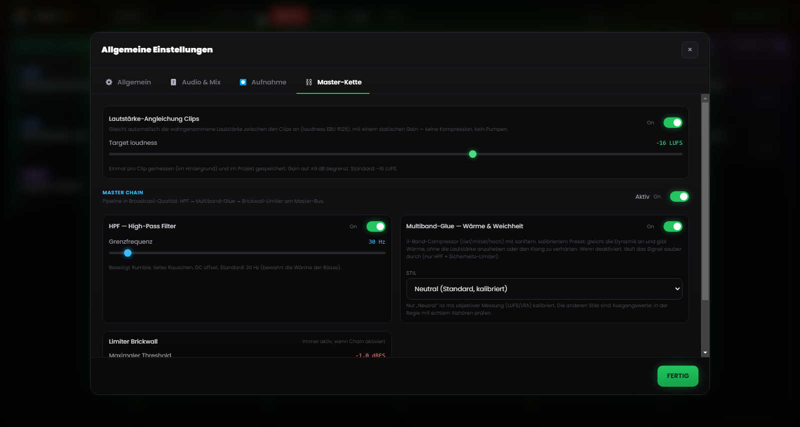

# Kapitel 6 – Die Mixing-Engine

---

Wer Radioregie manuell fährt, kennt das Grundproblem: zu viele Handlungen auf einmal. Einen Titel starten, die Musik absenken, ins Mikrofon sprechen, den nächsten Clip vorbereiten, dabei die Uhr im Blick behalten. Jede zusätzliche Aktion ist eine Gelegenheit zum Fehler – und der Fehler ist hier öffentlich und sofort.

Die Mixing-Engine von Runtime Live Machine Pro nimmt Ihnen den Großteil dieser Zwischenschritte ab, indem sie sie an die Software delegiert. Automatisierung heißt hier nicht „die Software macht Dinge hinter Ihrem Rücken“, sondern schlicht: Die Regeln, die Sie selbst anwenden würden, hätten Sie nur genug Hände dafür, laufen jetzt von allein.

---

## 6.1 Die Audio-Hierarchie

Das automatische Mixing-System beruht auf einer **Prioritätshierarchie** zwischen den Clip-Typen – am leichtesten versteht man sie als Rangfolge des „Rederechts“.

**Stimme / Aufnahmen – absolute Priorität.**
Läuft ein Sprach-Clip, bleibt er auf Nennlautstärke, während alles andere zurücktritt. Kein anderes Signal kann diese Regel außer Kraft setzen.

**Episoden-Musik.**
Der Stimme räumt sie den Platz, den Beds der Assets steht sie aber vor. Setzt ein Song ein, gehen die Musikbetten der Assets auf null (gestoppt werden sie nicht: Sie laufen still weiter, bereit zur Rückkehr). Das ist die Music Dominance, mehr dazu weiter unten.

**Show Assets, Jingle und Promo – die Service-Beds.**
Die Stimme senkt sie ab, die Musik schaltet sie stumm. Trägt ein Asset allerdings das Attribut **Stacco** (Trenner), übernimmt es die Führung (siehe §6.4).

**Effekte des pad FX.**
Die Soundeffekte stehen außerhalb dieser Hierarchie: Sie erklingen auf eigener Lautstärke, legen sich über alles, was gerade on air ist, und werden nie stummgeschaltet. Nur eine Höflichkeit gilt dem Gesprochenen gegenüber: Ist eine Stimme aktiv, sinken die Effekte auf halbe Lautstärke (50 %), damit sie nicht zugedeckt wird, und steigen danach von selbst wieder an.

---

## 6.2 Automatisches Ducking

**Ducking** nennt man den Mechanismus, der ein Signal absenkt, sobald ein höher priorisiertes Signal in die Wiedergabe eintritt.

Der häufigste Fall: Ein Song läuft in voller Dynamik, Sie starten ein vorproduziertes Interview aus der Spalte Stimme. RLMP zieht den Song in diesem Moment auf etwa **20 % der Lautstärke** herunter (eine Reduktion von rund 14 dB), mit einer weichen halbsekündigen Blende, sodass die Stimme den Klangraum verständlich einnimmt. Endet das Interview, steigt der Song mit einem ebenso flüssigen Fade In zurück auf die ursprüngliche Lautstärke.

Der Operator muss nichts tun – ein einziger Klick genügte, um das Interview zu starten. Ausmaß und Geschwindigkeit der Reduktion lassen sich in den Einstellungen regeln (Kapitel 13).

---

## 6.3 Music Dominance: intelligente Verwaltung der Beds

Ein klassischer klanglicher Fehler entsteht, wenn sich ein Song und ein Musikbett (*bed*) überlagern: zwei rhythmische Elemente prallen aufeinander, zwei Kick-Drums fallen nicht zusammen – das Ergebnis klingt wirr.

RLMP begegnet diesem Szenario mit der **Music Dominance**.

**Das typische Szenario.** Ein Bed läuft in Loop in der Spalte Assets, unter der Stimme des Moderators. Der startet nun einen Titel aus der Spalte Musik.

**Was RLMP tut.** Gestoppt wird das Bed nicht – das müsste man später ohnehin von Hand neu starten. Stattdessen zieht RLMP es still auf **Lautstärke null** und hält es „im Phantom“ am Laufen: Die Datei läuft weiter, der Loop läuft weiter, nur zu hören ist nichts mehr.

**Das klangliche Ergebnis.** Man hört ausschließlich den Song. Das Bed ist verschwunden, ohne dass der Operator eingegriffen hätte.

**Die Rückkehr.** Endet der Song, taucht das Bed mit einem automatischen Fade In wieder auf – genau an der Stelle, an der es im Loop stand. Der Fluss Bed → Song → Bed läuft ohne einen einzigen zusätzlichen Klick ab.

---

## 6.4 Stacchi: die Ausnahme von der Regel

Das Verhalten **Stacco** (Trenner, konfigurierbar in den Eigenschaften jedes Clips, siehe Kapitel 5) kehrt die Hierarchie vorübergehend um: Der Clip, der es trägt, übernimmt den Vorrang. Er schaltet die anderen Assets seiner Spalte stumm, senkt die Musik ab – stoppt aber nichts. Die Blende fällt schneller aus als beim gewöhnlichen Ducking, für einen perkussiveren, klareren Einstieg.

Typisch ist der Einsatz bei der gesprochenen *Station-ID* („Sie hören…“): Sie muss klar hörbar sein, während das Bed darunter weiterläuft. Wer ein gepflegteres Ergebnis will, kombiniert den Stacco mit einem kurzen Fade In (300–500 ms) – so wird der Einstieg weich statt abrupt.

---

## 6.5 Lautstärke-Angleichung (loudness)

Clips unterschiedlicher Herkunft kommen fast nie mit demselben Pegel an: eine sauber gemasterte Kennung hier, eine leise aufgenommene Telefonstimme dort, dazu ein Titel, der schon mit seiner ganz eigenen Lautstärke heruntergeladen wurde. Damit nicht ständig von Hand am Gain gedreht werden muss, wendet RLMP standardmäßig eine **Lautstärke-Angleichung** an – basierend auf dem Loudness-Standard EBU R128, mit einem Zielwert von **−16 LUFS**.

Die Software bewertet dabei die wahrgenommene Lautheit jedes Clips und nähert sie einer gemeinsamen Referenz an, sodass Songs, Stimmen und Beds von Anfang an auf einer stimmigen Ebene starten. Die Funktion ist standardmäßig aktiv; den Zielwert regeln Sie unter Einstellungen → Master Chain.

---

## 6.6 Master Chain: die Prozessorkette auf dem Master-Bus

*Abbildung 6.1 – Die Master Chain: Lautstärke-Angleichung (−16 LUFS), HPF bei 30 Hz, Multiband-Glue und Limiter Brickwall.*

Nach der Master-Lautstärke durchläuft das kombinierte Signal aller laufenden Clips eine **Prozessorkette** auf dem Master-Bus, bevor es das Ausgabegerät erreicht. Diese Kette ist standardmäßig aktiv und von Haus aus auf einen broadcast-tauglichen Klang ausgelegt – eine aufwendige Konfiguration braucht es dafür nicht.

Drei Stufen sind in Reihe geschaltet.

**High-Pass Filter (HPF) bei 30 Hz.**
Er entfernt unnötige Sub-Bass-Frequenzen, die Headroom fressen und Wiedergabesysteme verschmutzen können, mit sanfter Flankensteilheit. Die Grenzfrequenz lässt sich regeln (20–200 Hz); deaktiviert, wird die Stufe vollständig transparent.

**Multiband-Glue.**
Kein einzelner Kompressor, sondern drei „sanfte“ Kompressoren, die parallel auf drei Frequenzbändern arbeiten – Bässe, Mitten, Höhen – getrennt durch einen Crossover. Jedes Band verfügt über kalibrierte Schwellen und Verhältnisse, die den Mix „verkleben“, ohne ihn zu quetschen, und die dynamische Varianz zwischen unterschiedlich lauten Clips eindämmen. Der Stil lässt sich über Presets wählen (Neutral, Rock, Jazz, Elektronisch); Neutral ist voreingestellt.

**Limiter Brickwall.**
Die Schwelle liegt bei −1 dBFS, mit hohem Limiting-Verhältnis und blitzschneller Reaktion. Er garantiert, dass das Signal den maximal zulässigen Pegel nie überschreitet, und verhindert digitale Verzerrung (Clipping) – ganz gleich, was davor passiert.

Die gesamte Kette und jede einzelne Stufe lässt sich unter Einstellungen → Master Chain konfigurieren und abschalten; dort findet sich auch eine Schaltfläche zum Wiederherstellen der Standardwerte. Verarbeitet bereits ein Hardware-Mixer oder eine externe Kette das Signal, schalten Sie die Master Chain am besten ab, um doppelte Bearbeitung zu vermeiden.
