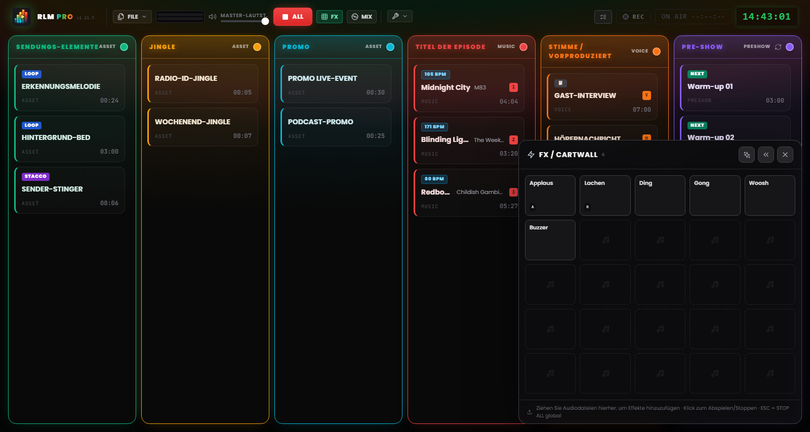
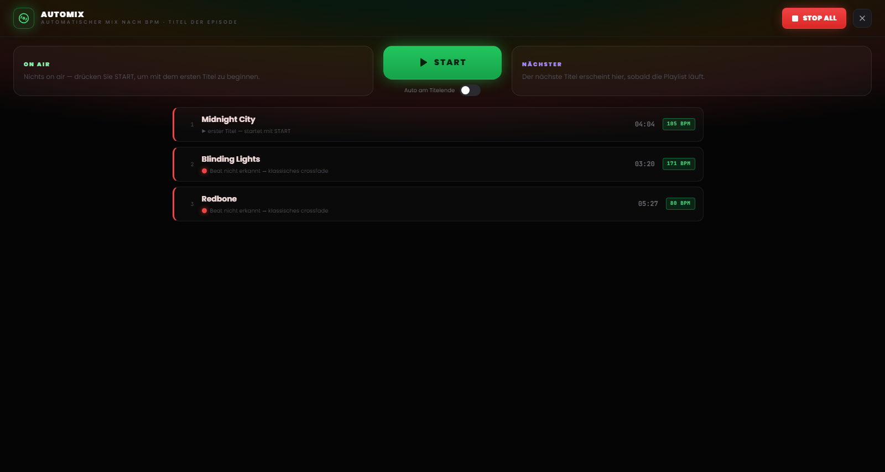

# Kapitel 7 – Das pad FX und die Automix-Ansicht

---

Über dem Raster liegen zwei Arbeitsflächen, per Tastendruck abrufbar, gedacht für zwei gegensätzliche Momente der Regie: das **pad FX**, um Effekte und Stacchi (Trenner) treffsicher zu starten, ohne irgendetwas zu unterbrechen, und die **Automix-Ansicht**, mit der sich der Musikfluss steuern lässt wie von einem DJ. Platz nimmt keine der beiden dem Raster weg – sie öffnen sich bei Bedarf und schließen sich mit einem Klick.

---

## 7.1 Das pad FX: die jingle machine

*Abbildung 7.1 – Das pad FX: die jingle machine 5×5 der Soundeffekte, mit überlagerndem Start.*

Für die Soundeffekte gibt es keine eigene Spalte im Raster. Sie leben im **pad FX**, einem Panel aus einem Zellenraster (einer *jingle machine*), das sich über die Schaltfläche **FX** im Header öffnet und schwebend in einer Bildschirmecke bleibt.

Das Pad ist ein **nicht blockierendes Overlay**: Es verdeckt das Board nicht und fängt anderswo keine Klicks ab. Ein Effekt lässt sich starten, während man im selben Moment an den Spalten oder den Header-Befehlen weiterarbeitet. Deshalb schließt `Esc` das Pad auch nicht – die Taste bleibt der immer verfügbare STOP-ALL-Befehl. Schließen lässt sich das Pad über die eigene Schließen-Schaltfläche oder erneut über den FX-Umschalter.

### Effekte laden und starten

Das Pad startet mit 25 Zellen (5×5) und wächst um weitere Zeilen, sobald neue Effekte hinzukommen. Zum Befüllen **ziehen Sie die Audiodateien direkt auf die Zellen** des Pads – genauso, wie Sie es mit einer Spalte des Rasters tun würden.

Ein Klick auf eine Zelle **startet den Effekt**. Die Effekte des Pads sind polyphon und überlagern sich: Mehrere Zellen können gleichzeitig erklingen, über allem, was gerade on air ist, ohne es zu stoppen. Am Audio-Verhalten ändert sich gegenüber einem normalen Clip nichts, nur die Startfläche ist eine andere. Wie viele Effekte gerade erklingen, zeigt ein Zähler neben der Schaltfläche FX im Header.

### Einen Effekt konfigurieren

Konfiguriert werden die Effekte auf zwei Ebenen, für zwei unterschiedliche Bedürfnisse:

- **Schnelleinstellungen** – der übliche Fall für eine Jingle Machine: Name, Farbe, Lautstärke, Loop. Wenige Sekunden genügen.
- **Vollständige Einstellungen** – dasselbe Fenster wie bei den Raster-Clips (Waveform-Editor, Trim, Marker, Fade, Tastenzuweisung), erreichbar über „Vollständige Einstellungen…“ innerhalb der Schnelleinstellungen.

### Position des Pads

Das Pad sitzt entweder unten links oder unten rechts im Bildschirm; die Vorliebe stellen Sie mit den Pfeilen am Pad selbst ein, und sie bleibt über die Sessions hinweg gespeichert. Rechts verdeckt es die NoteBoard und die letzte Spalte – wählen Sie die Seite danach, wie Ihre Playlist angeordnet ist.

> **Hinweis.** Im Modus MIDI Learn **wählt** ein Klick auf eine Zelle des Pads den Effekt für die Zuweisung aus, statt ihn abzuspielen – so geht kein Jingle versehentlich on air, während Sie die Steuerungen zuordnen (siehe Kapitel 8).

---

## 7.2 Die Automix-Ansicht

*Abbildung 7.2 – Die Automix-Ansicht: das Deck der Spalte Musik, die BPM-Kompatibilität und der Automatikmodus am Titelende.*

Die **Automix-Ansicht** ist das Deck der Spalte Musik: eine bildschirmfüllende Ansicht, abgerufen über die Schaltfläche **MIX** im Header, die die Musik-Playlist wie eine DJ-Konsole präsentiert. Sie öffnet sich über dem Board, aber unter dem pad FX, sodass die Effekte auch bei geöffnetem Automix nutzbar bleiben. Wie beim Pad schließt `Esc` sie nicht – sie bleibt der Notfallbefehl, und STOP ALL bleibt im Header erreichbar.

### Das Deck

In der Mitte steht der **on air** laufende Titel, in der Warteschlange folgt der **nächste** Titel der Spalte Musik samt verbleibender Zeit. Von hier aus starten Sie eine Spur und steuern den Wechsel von einem Titel zum nächsten mit einem einzigen Befehl: Die große Übergangs-Schaltfläche wendet denselben Crossfade an, den Sie auch aus dem Raster kennen, ergänzt um die zusätzliche Sorgfalt des rhythmischen Andockens.

### Kompatibilität und beat-matched Übergänge

Neben jedem Titel zeigt ein **Kompatibilitätspunkt** die rhythmische Nähe zum vorherigen Titel:

- **Grün** – die beiden Tempi docken gut aneinander an, der Übergang kann beat-matched erfolgen.
- **Gelb** – Andocken möglich, allerdings mit gewissen Vorbehalten.
- **Rot** – die Tempi liegen zu weit auseinander für ein sauberes Andocken.

Ist das rhythmische Andocken nicht praktikabel – BPM nicht erkannt, Beat unsicher, Tempi zu unterschiedlich –, meldet die Software das und greift automatisch auf einen **klassischen Crossfade** zurück, ganz ohne Überraschungen in der Sendung.

### Der Automatikmodus

Am unteren Rand der Ansicht sitzt ein Schalter für die **Automatik am Titelende**. Aktiviert, startet RLMP den Wechsel zum nächsten Titel von selbst, sobald sich die on air laufende Spur dem Ende nähert.

Dieser Modus bildet eine bewusste Ausnahme von der Philosophie der Software, die die Show grundsätzlich nicht automatisiert. Deshalb ist er **standardmäßig deaktiviert** und funktioniert **nur, solange die Automix-Ansicht geöffnet bleibt** – schließen Sie die Ansicht, deaktiviert sich die Automatik mit. Für einen durchgehenden Musikblock, die halbe Stunde reiner Musik vor der Rückkehr ans Mikrofon, ist er genau richtig – für die gesamte Sendung nicht.
