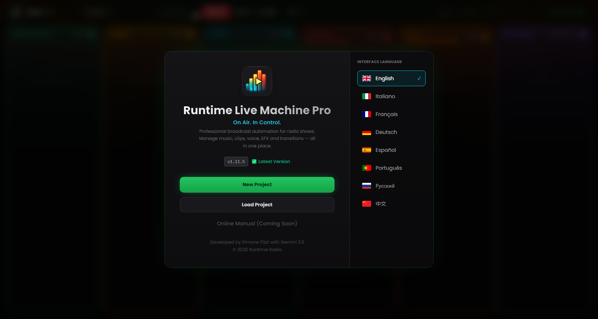

# Chapter 2 — Installation and first launch

---

Installing Runtime Live Machine Pro is designed to require the least possible interaction: a few clicks, no manual configuration, no prerequisites to install separately. The audio engine (FFmpeg) is bundled into the installation package and requires nothing from you.

---

## 2.1 System requirements

Before proceeding, check that your computer meets the minimum requirements. The recommended specifications ensure the best experience during long sessions or with many clips loaded at once.

| | Minimum | Recommended |
|---|---|---|
| **Operating system (Windows)** | Windows 10 64-bit | Windows 11 64-bit |
| **Operating system (macOS)** | macOS 11 Big Sur, building from source | macOS 13 Ventura or later |
| **Operating system (Linux)** | Ubuntu 20.04 / Debian 11 | Ubuntu 22.04 LTS |
| **RAM** | 4 GB | 8 GB or more |
| **Disk space** | 300 MB (application) | 1 GB + space for audio files |
| **CPU** | Any modern dual-core | Quad-core or better |

Ready-made packages are available for Windows and Linux. There is no official installer for macOS: the program is built from source (section 2.3).

A dedicated sound card is not required: RLMP works with any audio device recognized by the operating system, from the built-in sound card up to professional USB mixers such as the Rødecaster Pro or the RØDECaster Duo.

---

## 2.2 Installation on Windows

1. Download the file `Runtime-Live-Machine-Pro-1.15.33.exe` from the project’s **Releases** page on GitHub (`github.com/Pitz72/RRLMP/releases`).
2. Double-click the executable. The NSIS installer starts and copies the files to the appropriate directories.
3. When it finishes, a shortcut is created on the Desktop and in the Start menu.
4. The application launches automatically once installation is complete.

**A note on Windows SmartScreen.** The installers are not signed with a commercial certificate, so SmartScreen doesn’t recognize them automatically. If the warning “Windows protected your PC” appears, click *More info* and then *Run anyway*. The software is free of malware; the official installers are published exclusively on the project’s Releases page, and the source code is public.

---

## 2.3 macOS: building from source

There is no official installer for macOS. Runtime Live Machine Pro is free software: if you have a Mac, you can download the source code and build the program on your own computer.

1. Install **Node.js 20** (and git, if you want to clone the repository).
2. Download the code from `github.com/Pitz72/RRLMP`, with the *Code* button or with `git clone`.
3. In the project folder run, in order: `npm ci`, `npm run build:main`, `npm run build:preload`, `npx vite build` and `npx electron-builder --mac --publish never`.
4. The `.dmg` file is in the `builds/` folder: open it and drag the application into *Applications*.

A package built this way is not signed: on first launch macOS shows a Gatekeeper warning. Right-click the application and choose *Open*, or allow it from *System Settings* → *Privacy & Security*, in the *Security* section. Always up-to-date instructions are in the project’s `CONTRIBUTING.md` file.

> **Note.** An application you build yourself reports new versions but can’t install them: to update, download the updated code and build again (Chapter 12). `.lmp` projects stay compatible.

---

## 2.4 Installation on Linux

Two distribution formats are available:

- **AppImage** — a portable executable, no installation required. Make the file executable (`chmod +x`) and launch it directly.
- **.deb package** — for Debian/Ubuntu/Mint distributions. Install with `sudo dpkg -i filename.deb` or open it with the graphical package manager.

On some distributions you may need to install the `libasound2` package for ALSA audio support. Consult your distribution’s documentation if the application won’t start.

---

## 2.5 The welcome screen

*Figure 2.1 — The welcome screen: software identity, update status, main actions and the language drop-down in the top-right corner.*

On first launch — and at every subsequent launch, until you open a project — RLMP presents the **welcome screen**, the gateway to all preliminary operations. In the centre you find the software identity and actions; in the top-right corner, the language drop-down.

**Identity and actions.**
The software logo (the bars of a VU meter with the play symbol) identifies the Pro edition. Below the title and slogan is the installed version number, accompanied by the status of the update system:

- **“Latest Version”** (green) — you are running the most recent version available.
- **“Update Available”** (amber, flashing) — this is a button: click it to open the update window (Chapter 12).
- **“OFFLINE”** (dim red) — the update service could not be reached; the software works all the same.

Below that are the main actions:

- *New Project* — creates an empty session with the columns ready to load.
- *Load Project* — opens an existing `.lmp` file. Before making it operational, RLMP runs an **integrity check**: it verifies that every referenced audio file still exists at the stored path. Missing files are flagged immediately with a red border on their clip.
- *User Manual* — opens this manual as a PDF in the browser, in the interface language (English or Italian). An internet connection is required.
- *Quick Guide* — a short getting-started guide that opens inside the software and can be read offline too.

**Language (top-right corner).**
RLMP supports two interface languages: English and Italian. The drop-down in the top-right corner shows the flag and name of the active language: click it and pick the other one. The selection takes effect immediately and is remembered from one session to the next.

---

## 2.6 The first launch: what to expect

When you first open a project, you’ll notice in the header the logo with the **PRO** badge and its iridescent gradient. Behind the interface, opening the project starts the audio engine in the background: FFmpeg is initialized and the `media://` streaming protocol begins listening, ready to serve files from disk without loading them into memory.

The software starts preferably in full-screen mode. If the window opens resized, press `F11` (Windows/Linux) or `Ctrl+Cmd+F` (macOS) to bring it full screen — the ideal condition for production work.

The **On Air timer** in the header stays at `--:--:--` until the first clip of the session is launched. From that moment it starts counting the time elapsed on air: a useful reference for anyone working with fixed-time running orders.
