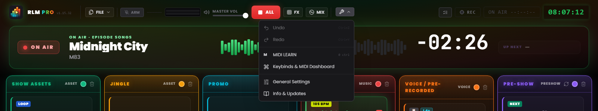
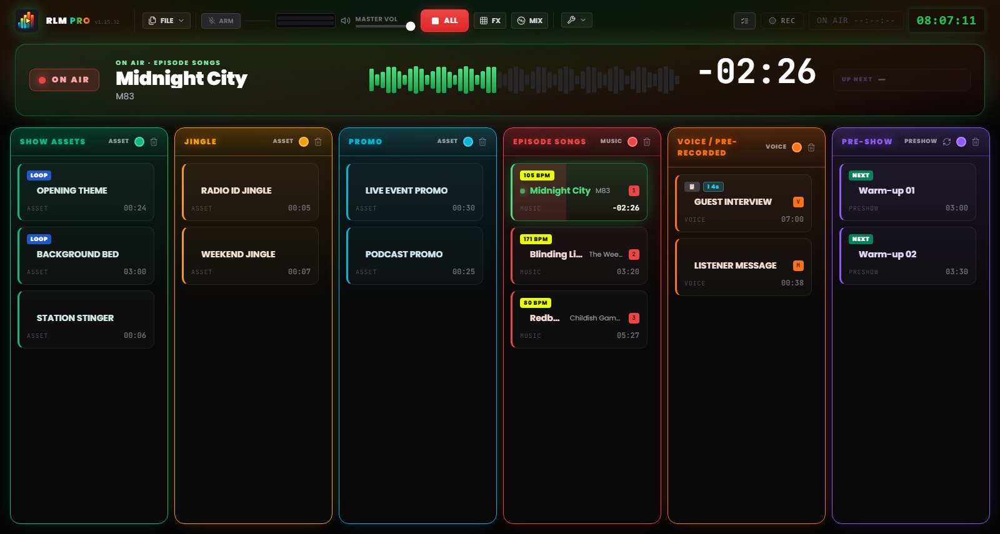

# Chapter 3 — The working interface

---

The Runtime Live Machine Pro interface is built for the most demanding operating context: the live show. Every visual choice answers a functional requirement. The dark theme, the high contrast, the size of the controls: this is ergonomics, not aesthetics for their own sake.

When you open a project, the screen divides into three bands: the **Control Bar** at the top, which manages the project and the system; the **ON AIR banner** just below it, which puts the playing track front and centre; and the **broadcast grid** in the centre, where the actual work happens.

---

## 3.1 The Control Bar (Header)

The header spans the full width of the screen. From left to right, it gathers the software identity, the file commands, the monitoring and transport controls, the tools menu and the session indicators.

### Identity

**Logo and PRO badge.** On the left, the logo sits beside the wordmark **RLM PRO**, with the word “PRO” rendered in an iridescent gradient running from cyan to green, amber and red. Next to it, in monospaced type, is the installed version (`v1.15.32`). Hover over the logo to reveal the full software name and version number.

### File menu

The **FILE** button opens a menu with the project operations:

- *New Project* — opens an empty session. If there are unsaved changes, the software asks for confirmation.
- *Save Project* — a quick save to the current `.lmp` file. The entry turns yellow when there are unsaved changes.
- *Save As…* — always opens the dialog box, for creating progressive versions (e.g. `Ep47_draft.lmp`, `Ep47_final.lmp`).
- *Export project with audio* — consolidates all the audio inside the project (an `audio/` subfolder) and repoints the clips to it, so you can safely delete the originals. Described in Chapter 10.
- *Load Project* — opens a `.lmp` project from disk.
- *Import M3U* — imports a playlist in M3U format as a sequence of clips.

### Monitoring and transport

**Stereo VU meter (L/R).** Two horizontal bars show the real output level after the Master Volume. The colour scale is intuitive: green up to about 85% of the way, then yellow, and finally red near full scale. Persistent red signals clipping: lower the level.

**Master Volume.** The fader controls the software’s overall output volume, from 0 to 100%. It acts as a master fader: brought to zero, no sound comes out, regardless of the state of the individual clips. If you have mapped a MIDI control to the Master Volume, a small badge shows the assignment.

**STOP ALL (red “ALL” button).** Instantly stops every active clip and cancels any fades in progress. It is the system’s emergency command. The `Esc` key does the same when the application is in focus, even while you are typing in a text field.

> **Note.** Unlike previous versions, `Esc` is no longer registered as a system-wide global shortcut: it acts when RLMP is the active window. This choice lets dialog boxes use `Esc` to close without stopping the live show.

**ARM (microphone).** Arms and disarms the microphone for **Smart Mic** (Chapter 6). Disarmed, the button is grey; armed, it turns red, and it lights up and pulses while you speak. Next to it appear a small eight-bar VU with the microphone level and the **Mic Vol** slider; the **On Mix** badge shows that the voice is also going into the mix. Smart Mic must be enabled in the *Microphone* tab of the Settings (Chapter 13): if you turn it off, the microphone is disarmed.

**FX.** Opens and closes the pad FX, the effects *jingle machine* (Chapter 7). A small counter shows how many effects are playing at that moment.

**MIX.** Opens and closes the Automix view, the deck dedicated to the Music column (Chapter 7).

### Tools

The **Tools** menu (wrench icon) gathers:

- *Undo* and *Redo* — the running-order edit history (`Ctrl+Z` / `Ctrl+Y`).
- *MIDI Learn* — enables MIDI learning mode (Chapter 8).
- *Keybinds* — the window for assigning keys to clips.
- *Settings* — the software’s global preferences (Chapter 13).
- *Info* — version, credits and manual update check.

Just below the menu, the *Auto-saved* indicator appears briefly to confirm that the project has been saved automatically.

*Figure 3.1 — The Control Bar and the open Tools menu (Undo/Redo, MIDI Learn, Keybinds, General Settings, Info).*

### Session indicators

On the right side of the header sit the **Playout Log** button (the chronological launch log, Chapter 13), the **Recording** button (Chapter 9), the **On Air timer** (which, when live, shows `ON AIR HH:MM:SS` on a red background) and the digital **studio clock** in 24-hour format, synchronized with the system clock.

The header area can also show unobtrusive notifications (**toasts**) about completed operations or system warnings. Unlike blocking dialogs, toasts disappear on their own after a few seconds and don’t interrupt playback.

---

## 3.2 The ON AIR banner

Between the Control Bar and the grid sits a full-width banner that puts the track on air front and centre, readable even from across the room. It is **always there**: with nothing playing it shows the **OFF AIR** state in muted colours and the words “No track on air”; when a clip starts it lights up in green, without changing size or shifting the columns.

From left to right you find:

- **ON AIR** — the indicator with the red dot, which pulses while a track is on air.
- **Title and column** — the “ON AIR” label followed by the column name, the clip title in large type and, below it, the artist (or “In loop” for looping clips).
- **Progress bar** — fills with green as the track plays; two vertical ticks mark the Intro point (cyan) and the Outro point (orange), if configured (Chapter 5).
- **Timer** — the time left until the end of the track, in a colour that changes with the phase: **cyan** during the intro (counting down to the end of the intro), **white** in the body of the track, **orange** from the Outro point on, **flashing red** in the last 10 seconds. For looping clips it shows “LOOP”. In the 15 seconds before the Outro, the **OUTRO IN** warning appears below the timer with its countdown.
- **UP NEXT** — the title of the clip that will start next, when the clip on air is set to *Play Next*; otherwise the box stays dimmed.

If several clips are playing together, the banner shows the one from the highest-priority column, in this order: Episode Songs, Pre-Show, Voice, then the other columns. Pad FX effects never appear in the banner. When one track hands over to the next in a sequence, the banner holds the track that just ended for a moment instead of flashing OFF AIR.

---

## 3.3 The six-column grid

*Figure 3.2 — The working interface: the ON AIR banner with a track on air and the six-column grid with the audio cards.*

The grid is the software’s operational centre: six vertical columns side by side, each with its own colour-coded header and its own audio-behaviour logic. Sound effects have no column in the grid: they live in the pad FX (Chapter 7).

### Column headers

Each header shows the column name and type, and doubles as a status indicator. Under normal conditions it is static and coloured in the column’s characteristic tone. When the playing clip is the last one available in the column, is not looping, and less than **20 seconds** remain until the end, the header goes into a **DEAD AIR** alarm: it pulses, turns amber, shows a warning icon and the **END** badge. It’s the advance notice that gives you time to prepare the next track before silence.

Each column’s colour is customizable: click the coloured dot in the header to open a palette of **30 shades**. The choice is saved in the project file.

When a column contains at least one clip, a **trash** icon appears in its header: the **Clear column** command removes every clip in that column in one go. For safety it always asks for confirmation, stating how many clips will be removed, and the operation can be reversed with *Undo* (`Ctrl+Z`). On empty columns the icon does not appear.

The **Pre-Show** column header also carries a **rotation** button: when active, the pre-broadcast queue automatically inserts jingles and promos at regular intervals (Chapter 13).

### The six columns

**Show Assets (Green)**
The structural elements of the show: idents, backing tracks, beds, institutional stingers. They behave as background elements: they yield space when voices or songs come in, but keep their internal rotation until they are stopped.

**Jingle (Amber)** and **Promo (Cyan)**
Two columns dedicated, respectively, to identifying jingles and to promos or self-promotion. In audio terms they behave exactly like Show Assets (they belong to the same family), but keeping them separate keeps the running order tidy and readable.

**Episode Songs (Red)**
The music playlist. Clips in this column take an active part in the automatic mixing: they are lowered when voices play and, in turn, silence the Asset beds when they start playing (Chapter 6). On music clips the software automatically detects the **BPM**, shown with a dedicated badge.

**Voice / Recordings (Orange)**
Interviews, pre-recorded spoken segments, voice messages. This column has the **highest priority** in the mixing system: when a clip here is playing, all other signals are lowered to a background level.

**Pre-Show (Purple)**
The pre-broadcast warm-up playlist. It works as a self-contained music queue, with optional rotation of jingles and promos. When the show proper begins, this column is typically emptied or disabled.

---

## 3.4 The audio card (Clip)

Every imported audio file materializes in the grid as a rectangular **card**. The card is the operating unit of the system: you see it, launch it, configure it, move it.

### Anatomy of a card

**Title and artist.** The file name, or the custom name assigned in the properties. The custom title changes only the label inside the software; the original file on disk stays untouched. For music clips, the artist name may appear below the title.

**Timer.** At rest, it shows the clip’s total duration in `MM:SS` format. During playback it switches to a **countdown**, with the negative prefix (e.g. `−01:20`). When less than 15 seconds remain, the timer turns **red**.

**Status badges.** Small labels communicate the configured properties at a glance:

- **LOOP** — the clip will restart from the beginning when playback ends.
- **NEXT** — when this clip ends, the next one in the column will start automatically.
- **▶ UP NEXT** — highlights which clip will be next to start in the automatic sequence.
- **### BPM** — the detected tempo, on music clips, shown on a high-visibility fluorescent-yellow badge.
- **I ##s** — the clip has an Intro point configured (Chapter 5): the badge, in cyan, shows its duration in seconds and is always visible, even when the clip is stopped.
- **TRIM…** — silence analysis in progress (Auto-Trim).
- **FADE OUT** — appears on the outgoing clip during a crossfade or a fade.
- **📋** — the clip has a note attached in the NoteBoard (Chapter 13).

**Assignments.** If the clip has a keyboard key assigned, the letter appears in a badge in the column’s colour; if it has a MIDI binding, the label `M` appears followed by the note number (e.g. `M60`).

**Structure cues.** If markers are configured, the countdowns `INTRO: −MM:SS` (in cyan) and `OUTRO IN: −MM:SS` (in orange) appear during playback, up to the `🚨 OUTRO` warning when the tail has begun.

**Playback indicator.** When a clip is playing, the card lights up: green border, background with a luminous glow, a pulsing dot and the title highlighted. The progress bar sweeps across the card’s background.

### Interacting with the cards

- **Left click** — starts the clip if it is stopped; stops it (with a fade out) if it is playing.
- **Ctrl + Click** (Windows/Linux) or **Cmd + Click** (macOS) — selects the clip without starting it. The border turns blue. Useful for multiple selection and bulk deletion.
- **Delete key** (or *Delete* / *Backspace*) — removes the selected clips from the grid. If more than one clip is selected, the software asks for confirmation.
- **Right click** — opens the **Clip Settings**: properties, waveform editor, notes (Chapter 5).
- **Drag & Drop** — drag a card to reorder it within the column or move it to another. A luminous blue indicator shows the insertion point while dragging.

### Cards in an error state

A card marked **MISSING FILE** with a red border signals that the referenced audio file is no longer reachable: it has been moved, renamed, or is on an external disk that is not connected. The clip is not playable until the file returns to its original path. Handling path errors is covered in Chapter 14.
