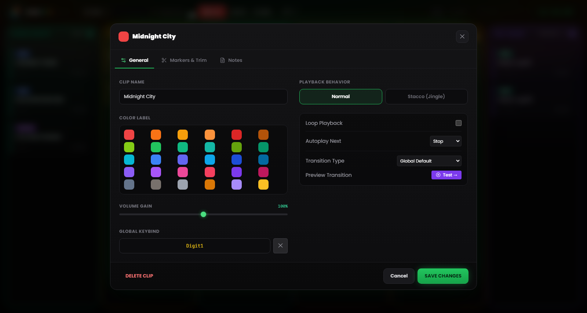
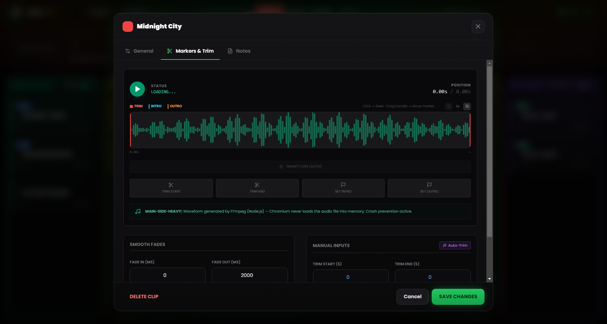

# Chapter 5 — Clip properties and the Waveform Editor

---

Every audio file has a history before it reaches the grid: recordings with seconds of silence at the start, tracks with endless tails, interviews with a level too low against the rest of the show. Rather than reaching for an external audio editor every time a file isn’t “broadcast-ready”, RLMP provides a configuration panel for each clip and a visual waveform editor with trimming and marking features.

Every change made through these tools is **non-destructive**: the original file on disk stays unchanged. RLMP stores the settings in the `.lmp` project file and applies them on the fly during playback.

To open a clip’s settings, **right-click** on the card.

---

## 5.1 Basic properties

*Figure 5.1 — The clip settings: name, colour label, Volume Gain, behaviour, Next Action and key assignment.*

### Name and appearance

**Clip Name.** You can give the clip a custom name, independent of the original file name. The name is displayed on the card in the grid. Use descriptive names that are operationally useful during the live show: “OPENING THEME” is easier to read than `theme_rev3_final_def.mp3` when you have three seconds to find the right clip.

**Custom colour.** By default, the clip inherits the colour of its column. Here you can assign a specific colour to make it stand out visually. Useful for marking critical clips (e.g. the closing theme) or for distinguishing thematic groups within the same column.

### Volume (Gain)

The Volume Gain slider runs from 0% to 150% and acts as a pre-fader on the specific clip, before the global Master Volume.

The most common use case is level alignment: if you have a voice message recorded at low intensity (e.g. a WhatsApp message or a phone recording), you can push it beyond 100% to bring it closer to the volume of the other tracks. Conversely, you can lower a particularly “hot” clip without touching the Master Volume.

---

## 5.2 The waveform editor

*Figure 5.2 — The waveform editor: Trim handles, Intro and Outro markers, Auto-Trim, Smart Cues and fades.*

The visual editor is the heart of the configuration panel. It occupies the central area and shows a graphical representation of the entire clip’s audio.

### Navigating the editor

**Horizontal zoom.** You can zoom the waveform view from 1× (full view) up to 8×, with intermediate steps (1×, 2×, 3×, 4×, 6×, 8×), using the zoom slider or the mouse wheel over the editor. At high zoom, the view scrolls to follow the current position.

**Adaptive ruler.** The time axis at the top of the editor adjusts automatically to the zoom: at full view it shows sparse references, at maximum zoom it packs them down to the second.

**Playhead.** During preview playback, a white vertical indicator moves in real time along the waveform, showing the current position. A click on the waveform moves playback to that point.

### The four handles

The editor has four draggable **handles**, each with a precise function and colour:

**Trim Start (red handle, left).** Defines the clip’s actual start point. Everything to its left is skipped during playback. Drag it right to remove silences or unwanted parts from the beginning.

**Trim End (red handle, right).** Defines the actual end point. Everything to its right is ignored. Drag it left to shorten the tail. Trim Start and Trim End cannot overlap.

**Intro Marker (cyan handle).** Marks the structural point where the main melody enters the track, after any intro. Once set, the countdown **INTRO: −MM:SS** appears on the playing card.

**Outro Marker (orange handle).** Marks the point where the track’s tail begins, typically the moment to start talking to fill the transition. The countdown **OUTRO IN: −MM:SS** appears on the card. If the value turns out to be inconsistent with the trim or the duration, the software disables it and warns you.

Besides dragging, four *Set* buttons place each handle at the playhead’s current position, for marking on the fly while listening. The values remain precisely editable in their respective fields.

### Auto-Trim (Magic Wand)

The button with the **magic wand** icon starts automatic silence detection via FFmpeg. The threshold is not fixed: the software first estimates the file’s average level and sets the silence threshold about 25 dB below it (within a safety range between −55 and −20 dB; if no estimate is available, it falls back to −40 dB). Trim Start and Trim End are set automatically, removing leading silences and mute tails without manual work.

This is especially useful for unprocessed voice recordings: phone calls, voice messages, interviews recorded on mobile devices. Running Auto-Trim over the entire Voice column before a show takes less than a minute and makes the transitions cleaner.

> **Technical note.** The analysis happens in the Main Process via FFmpeg, without loading the file into the Renderer’s memory. On large files, the analysis time stays in the order of a few seconds.

### Smart Cues (automatic marker detection)

Alongside Auto-Trim, the **Smart Cues** feature automatically proposes the Intro and Outro markers. Using a more aggressive threshold, it finds the point where the audio reaches full energy (Intro) and the point where the final fade begins (Outro), placing the two markers without your having to find them by ear.

### Transition preview

If there is a **next** clip in the same column, the **“Test →”** button plays the last few seconds of the current clip and lets the transition into the next one trigger, right there in the editor. During the preview a *Stop* button ends the test.

---

## 5.3 Behaviours and automation

### Overlap: the column decides

When a clip is started, it interrupts any other clip playing in the same column (with a fade out): one song excludes the others. Only the **pad FX** effects overlap freely, playing on top of anything without stopping it.

If an element has to “ride” what’s on air — a *station ID* (“You’re listening to…”) over a track’s intro, a short jingle over a looping bed — no clip setting is needed: put it in the **pad FX** (it plays at full volume over the music) or in the **Voice** column (which additionally lowers everything else with ducking). A clip’s purpose is determined by the column it lives in; the old per-clip “Stacco (Jingle)” behaviour of previous versions has been removed.

### Next Action (end-of-clip automation)

Defines what happens when the clip reaches the Trim End point.

**Stop** — the default behaviour for Songs, Voice and Assets. The clip ends and stops.

**Play Next** — when the clip nears the end, it automatically starts the next clip in the column with the configured transition. The **NEXT** badge appears on the card. It’s the default behaviour of the Pre-Show column and effectively creates an automatic playlist: you can set it on several consecutive clips to build blocks that flow without breaks.

**Loop** playback is a separate option: when active, the clip restarts from the beginning (from Trim Start) seamlessly, and the **LOOP** badge appears on the card. Use it for music beds, sound environments or background idents that should keep running until explicitly stopped. The transition modes — Crossfade, Segue, Gapless — are described in Chapter 13.

---

## 5.4 Fades (Fade In and Fade Out)

The panel lets you set, per clip, the duration of the incoming and outgoing fades. Values range from 0 to 60,000 milliseconds (60 seconds) and the curve applied is linear.

**Fade In.** The time the volume takes to reach its maximum level from the start. A value of 2000 ms produces a gradual two-second rise. Use it on music beds that should emerge gently; keep it at 0 for voices and effects that need to be heard immediately.

**Fade Out.** The fade time at close, both when you click an active clip and during transitions. Typical values: 2000–3000 ms for songs, 500–1000 ms for beds, 0 ms for hard stingers.

A 0 ms fade out produces an immediate close (“hard cut”). On a music track, live, it can be perceived as a technical error: consider carefully when it is appropriate.

---

## 5.5 Assigning controls

Every clip can also be launched from a keyboard key or a MIDI controller.

**Trigger Keybind.** The keyboard key assigned to the clip. You can set it from the dedicated field in the clip settings (click and press the desired key) or from the **Keybinds** window reachable from the Tools menu. The corresponding badge appears on the card. If the key is already assigned to another clip, the software reports the conflict before overwriting.

**MIDI Bind.** The assigned MIDI note (e.g. `NOTE:60`). The assignment is made through **MIDI Learn** mode (see Chapter 8), not by typing the number by hand.

Clip bindings are saved in the project file: carry the project to another computer with the same MIDI controller and the mappings will work without reconfiguration.
