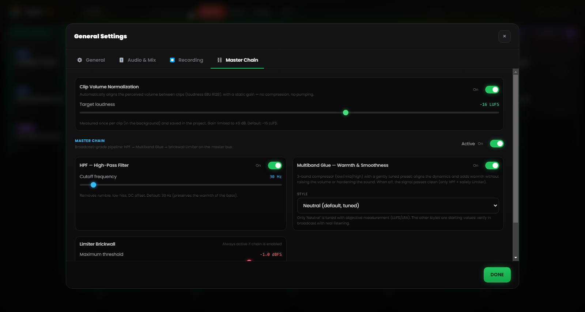

# Chapter 6 — The mixing engine

---

The underlying problem of manual radio production is the multiplication of simultaneous actions: start a track, lower the music, speak into the microphone, prepare the next clip, keep an eye on the clock. Every extra operation is an opportunity for error, in a setting where the error is public and immediate.

Runtime Live Machine Pro’s mixing engine eliminates most of these intermediate actions by delegating them to the software. It doesn’t do things behind your back. It automates the rules you would apply yourself if you had enough hands to carry them all out.

---

## 6.1 The audio hierarchy

The automatic mixing system is based on a **priority hierarchy** among the types of clip. The easiest way to grasp it is to picture it as a scale of “the right to speak”.

**Voice / Recordings — absolute priority.**
When a voice clip is playing, it stays at its nominal volume and everything else drops. No other signal can override this rule.

**Episode Songs.**
They yield space to Voice, but they rule over the Asset beds. When a song comes in, the Asset music beds go to zero (they don’t stop: they keep running in silence, ready to return). This is Music Dominance, described further on.

**Show Assets, Jingle and Promo — the service beds.**
They are lowered by Voice and silenced by Songs. When an asset is a **Stacco**, however, it becomes the one in command (see §6.4).

**Pad FX effects.**
Sound effects stay outside the hierarchy: they play at their own volume, overlap whatever is on air, and are never silenced. There is one courtesy toward speech: when a voice is active, the effects drop to half volume (50%) so as not to cover it, then rise again on their own.

---

## 6.2 Automatic ducking

**Ducking** is the mechanism by which a signal is lowered when a higher-priority signal starts playing.

The most common case: a song is playing at full dynamics; you launch a pre-recorded interview from the Voice column. At that moment RLMP brings the song to about **20% of its volume** (a reduction of roughly 14 dB) with a soft half-second fade, so the voice occupies the sonic space intelligibly. As soon as the interview ends, the song rises back to its original volume with an equally smooth fade in.

The operator touches nothing. The gesture performed was a single click: starting the interview. The amount of the reduction and its speed are adjustable in the Settings (Chapter 13).

---

## 6.3 Music Dominance: intelligent management of beds

A classic sonic mistake is the moment when a song and a music bed overlap: two rhythmic elements colliding, two kick drums that don’t line up, and the result is muddled.

RLMP handles this scenario with **Music Dominance**.

**The typical scenario.** A bed is looping in the Assets column, under the host’s voice. The host launches a track from the Songs column.

**What RLMP does.** It doesn’t stop the bed, because stopping it would then require restarting it by hand. Instead it silently brings it to **zero volume**, keeping it playing “as a ghost”: the file keeps running, the loop continues, but nothing is heard.

**The sonic result.** Only the song is heard. The bed has vanished without the operator doing anything.

**The return.** When the song ends, the bed re-emerges with an automatic fade in, resuming from the point it had reached in the loop. The flow (bed → song → bed) happens without a single extra click.

---

## 6.4 Stacchi: the exception to the rule

The **Stacco** behaviour (a *stinger*; configurable in every clip’s properties, see Chapter 5) temporarily reverses the hierarchy: the clip that carries it becomes the priority. It silences the other assets in its column and lowers the music, but stops nothing. The fade applied is faster than that of ordinary ducking, for a more percussive, clean entrance.

The typical use is the spoken *station ID* (“You’re listening to…”): it has to be clearly audible while the bed underneath keeps running. For a more polished result, pair the Stacco with a short fade in (300–500 ms): the entrance will be soft, not abrupt.

---

## 6.5 Volume levelling (loudness)

Clips from different sources almost always arrive at different levels: a properly mastered ident, a quietly recorded phone voice, a track downloaded at its own volume. To avoid constant manual Gain adjustments, RLMP applies by default a **volume levelling** based on the EBU R128 loudness standard, with a target of **−16 LUFS**.

In practice, the software evaluates the perceived loudness of each clip and brings it closer to a common reference, so that songs, voices and beds start out on a coherent footing. The feature is enabled by default and the target value is adjustable in Settings → Master Chain.

---

## 6.6 Master Chain: the processor chain on the master bus

*Figure 6.1 — The Master Chain: volume levelling (−16 LUFS), HPF at 30 Hz, multiband glue and brickwall limiter.*

The combined signal of all playing clips, after the Master Volume, passes through a **processor chain** on the master bus before reaching the output device. The chain is enabled by default and designed for a broadcast-grade sound without requiring advanced configuration.

It comprises three stages in series.

**High-Pass Filter (HPF) at 30 Hz.**
Removes the useless sub-bass frequencies that eat up headroom and can muddy playback systems, with a gentle slope. The cutoff frequency is adjustable (20–200 Hz). When disabled, the stage becomes completely transparent.

**Multiband glue.**
Not a single compressor, but three “gentle” compressors working in parallel across three frequency bands (lows, mids, highs), separated by a crossover. Each band has thresholds and ratios calibrated to “glue” the mix without crushing it, and to hold the dynamic variance between clips of different levels in check. The style is selectable among a few presets (Neutral, Rock, Jazz, Electronic); the default preset is Neutral.

**Brickwall limiter.**
Threshold at −1 dBFS, with a high limiting ratio and a very fast reaction. It guarantees the signal never exceeds the maximum allowed level, preventing digital distortion (clipping) whatever happens upstream.

The whole chain, and each individual stage, is configurable and can be disabled from Settings → Master Chain, where you’ll also find a button to restore the defaults. In a context where the signal is already processed by a hardware mixer or an external chain, you can disable it to avoid double processing.
