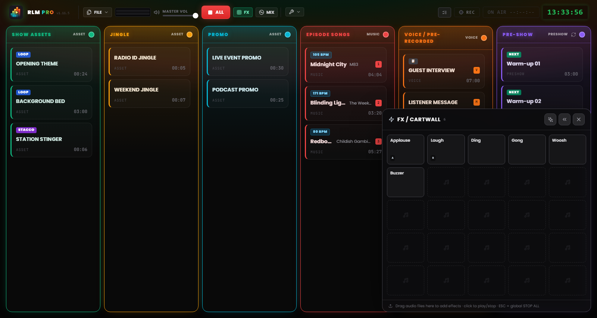
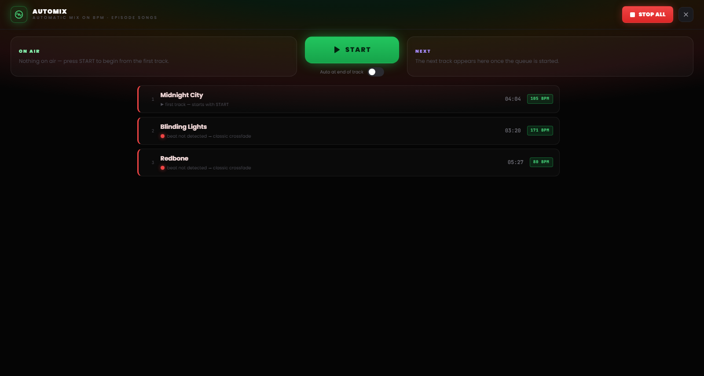

# Chapter 7 — The Pad FX and the Automix view

---

Two working surfaces live above the grid, each summoned with a key and built for opposite moments of production. The **pad FX** fires off effects and stingers reliably without interrupting anything. The **Automix view** handles the music flow the way a DJ would. Neither takes space away from the grid: they open when you need them and close with a click.

---

## 7.1 The pad FX: the jingle machine

*Figure 7.1 — The pad FX: the 5×5 jingle machine of sound effects, with overlapping playback.*

Sound effects have no column in the grid. They live in the **pad FX**, a grid panel of cells (a *jingle machine*) that opens from the **FX** button in the header and stays floating in a corner of the screen.

The pad is a **non-blocking overlay**: it doesn’t obscure the board and doesn’t intercept clicks elsewhere. You can launch an effect and, at the same moment, keep operating on the columns or the header controls. For that reason the `Esc` key doesn’t close the pad: it remains the STOP ALL command, always available. The pad closes from its own close button or by toggling FX again.

### Loading and launching effects

The pad starts with a grid of 25 cells (5×5) and grows in rows as you add more effects. To populate it, **drag audio files straight onto the pad’s cells**, exactly as you would with a grid column.

A click on a cell **launches the effect**. The pad effects are polyphonic and overlap: several cells can play together, over anything on air, without stopping it. The audio behaviour is identical to a normal clip; only the launch surface changes. A counter next to the FX button in the header shows how many effects are playing at that moment.

### Configuring an effect

Effects are configured on two levels, meant for two different needs:

- **Quick settings** — the common case for a jingle machine: name, colour, volume, loop. It takes a few seconds.
- **Full settings** — the same window as the grid clips (waveform editor, trim, markers, fades, key assignment), reachable from the “Full settings…” entry within the quick settings.

### Pad position

The pad can sit in the bottom-left or bottom-right corner of the screen: the preference is set with the arrows on the pad itself and is remembered across sessions. On the right it covers the NoteBoard and the last column; choose the side based on how you’ve laid out your running order.

> **Note.** In MIDI Learn mode, a click on a pad cell **selects** the effect for assignment instead of playing it — so you don’t send a jingle on air while mapping the controls (see Chapter 8).

---

## 7.2 The Automix view

*Figure 7.2 — The Automix view: the Music-column deck, BPM compatibility and automatic end-of-track mode.*

The **Automix view** is the deck of the Music column: a full-screen display, summoned from the **MIX** button in the header, that presents the music running order like a DJ console. It opens above the board but below the pad FX, so the effects stay usable even while Automix is open. As with the pad, `Esc` doesn’t close it: it remains the emergency command, and the STOP ALL button stays reachable in the header.

### The deck

At the centre you find the track **on air** and, in the queue, the **next** track in the Music column, with the time remaining. From here you can start a track and manage the passage from one track to the next with a single command: the big transition button applies the same crossfade you would use from the grid, but with the added care of rhythmic locking.

### Compatibility and beat-matched transitions

Next to each track, a **compatibility dot** with the previous track shows their rhythmic affinity:

- **Green** — the two tempos lock well: the transition can be beat-matched.
- **Yellow** — locking is possible but with some reservations.
- **Red** — the tempos are too far apart for a clean lock.

When rhythmic locking isn’t practical (BPM not detected, uncertain beat, tempos too different), the software declares it and automatically falls back to a **classic crossfade**, with no surprises on air.

### Automatic mode

At the bottom of the view there’s a switch for **end-of-track automation**. When it’s active, RLMP starts the passage to the next track on its own when the track on air nears the end.

This mode is a deliberate exception to the software’s philosophy, which by design does not automate the show. That’s why it is **disabled by default** and works **only while the Automix view is open**: closing the view disables the automation. It’s the right tool for a continuous music block, the half-hour of music-only before returning to the mic, not for the entire live show.
