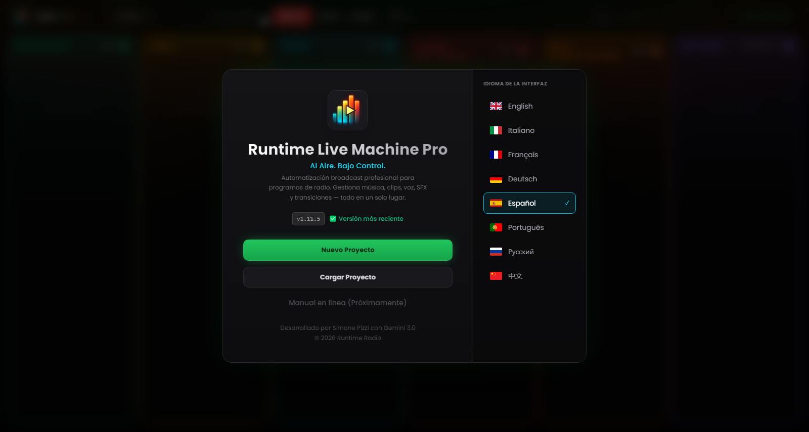

# Capítulo 2 — Instalación y primer arranque

---

Instalar Runtime Live Machine Pro apenas requiere intervención por tu parte: pocos clics, ninguna configuración manual, ningún requisito previo que instalar aparte. El motor de audio (FFmpeg) viene integrado en el paquete de instalación, así que no tienes que ocuparte de él.

---

## 2.1 Requisitos del sistema

Antes de seguir, comprueba que tu ordenador cumple los requisitos mínimos. Las especificaciones recomendadas dan la mejor experiencia en sesiones largas o cuando hay muchos clips cargados a la vez.

| | Mínimo | Recomendado |
|---|---|---|
| **Sistema operativo (Windows)** | Windows 10 64-bit | Windows 11 64-bit |
| **Sistema operativo (macOS)** | macOS 11 Big Sur | macOS 13 Ventura o posterior |
| **Sistema operativo (Linux)** | Ubuntu 20.04 / Debian 11 | Ubuntu 22.04 LTS |
| **RAM** | 4 GB | 8 GB o más |
| **Espacio en disco** | 300 MB (aplicación) | 1 GB + espacio para los archivos de audio |
| **CPU** | Cualquier dual-core moderno | Quad-core o superior |

El software está optimizado para Apple Silicon (M1, M2, M3) y funciona de forma nativa en ambas arquitecturas de macOS, sin pasar por la emulación Rosetta.

No hace falta una tarjeta de sonido dedicada: RLMP funciona con cualquier dispositivo de audio reconocido por el sistema operativo, desde la tarjeta integrada hasta mixers USB profesionales como el Rødecaster Pro o el RØDECaster Duo.

---

## 2.2 Instalación en Windows

1. Descarga el archivo `Runtime-Live-Machine-Pro-1.15.10.exe` desde el canal de distribución oficial.
2. Haz doble clic en el ejecutable. El instalador NSIS se abrirá y copiará los archivos en los directorios correspondientes.
3. Al terminar, se creará un acceso directo en el Escritorio y en el menú Inicio.
4. La aplicación se abre automáticamente al completarse la instalación.

**Nota sobre Windows SmartScreen.** El software se actualiza con frecuencia, así que el certificado de firma digital puede no haber acumulado todavía la «reputación» que SmartScreen exige para incluirlo en su lista blanca automática. Si aparece el aviso «Windows protegió tu PC», haz clic en *Más información* y después en *Ejecutar de todas formas*. El software no contiene malware: los instaladores oficiales solo se publican a través de los canales de distribución del autor.

---

## 2.3 Instalación en macOS

1. Descarga el archivo `.dmg` desde el canal oficial.
2. Abre la imagen de disco y arrastra el icono de Runtime Live Machine Pro a la carpeta *Aplicaciones*.
3. Es posible que, en el primer arranque, macOS muestre un aviso de Gatekeeper («No se puede abrir la app porque procede de un desarrollador no identificado»). Para seguir adelante, ve a *Preferencias del Sistema* → *Seguridad y privacidad* → *General* y haz clic en *Abrir de todas formas*, junto al nombre de la aplicación.

A partir de macOS 15 (Sequoia), la ruta cambia a *Ajustes del Sistema* → *Privacidad y seguridad*, donde tendrás que desplazarte hasta la sección *Seguridad*.

> **Nota.** La aplicación de macOS no está firmada con un certificado Apple Developer. Esto también influye en cómo se gestionan las actualizaciones, como se explica en el Capítulo 12.

---

## 2.4 Instalación en Linux

Hay dos formatos de distribución disponibles:

- **AppImage** — ejecutable portable, sin instalación. Dale permisos de ejecución al archivo (`chmod +x`) y ábrelo directamente.
- **Paquete .deb** — pensado para Debian, Ubuntu, Mint y derivadas. Se instala con `sudo dpkg -i nombrearchivo.deb`, o simplemente abriéndolo con el gestor gráfico de paquetes.

En algunas distribuciones puede hacer falta instalar el paquete `libasound2` para que funcione el audio ALSA. Si la aplicación no arranca, revisa la documentación de tu distribución.

---

## 2.5 La pantalla de bienvenida

*Figura 2.1 — La pantalla de bienvenida: identidad del software, estado de la actualización, acciones principales y selector de idioma.*

En el primer arranque, y en todos los siguientes mientras no abras un proyecto, RLMP muestra la **pantalla de bienvenida**: el punto de acceso a todas las operaciones previas. El panel se divide en dos zonas.

**Zona izquierda — Identidad y acciones.**
El logo del software (las barras de un VU meter con el símbolo de play) identifica la versión Pro. Bajo el título y el eslogan aparece el número de versión instalada, acompañado del estado del sistema de actualización:

- **«Versión más reciente»** (verde) — estás usando la última versión disponible.
- **«Actualización disponible»** (ámbar, parpadeante) — es un botón: haz clic para abrir la ventana de actualización (Capítulo 12).
- **«OFFLINE»** (rojo tenue) — no se ha podido contactar con el servicio de actualización; el software funciona igualmente.

Debajo encontrarás las acciones principales:

- *Nuevo Proyecto* — crea una sesión vacía con las columnas listas para recibir clips.
- *Cargar Proyecto* — abre un archivo `.lmp` existente. Antes de ponerlo en marcha, RLMP hace un **control de integridad**: comprueba que cada archivo de audio referenciado siga existiendo en la ruta memorizada. Si falta alguno, el clip correspondiente se señala de inmediato con un borde rojo.
- *Manual* — la opción aparece en pantalla, pero todavía está desactivada: la documentación consultable desde dentro del software llegará en una versión futura, a través de la web.

**Zona derecha — Selector de idioma.**
RLMP admite ocho idiomas de interfaz: inglés, italiano, francés, alemán, español, portugués, ruso y chino simplificado. El idioma activo queda resaltado con un borde cian y una marca de verificación. El cambio surte efecto de inmediato y queda memorizado de una sesión a otra.

---

## 2.6 El primer arranque: qué esperar

Al abrir un proyecto por primera vez, verás en el encabezado el logo con la insignia **PRO** en gradiente iridiscente. Aunque no lo veas, abrir el proyecto pone en marcha el motor de audio en segundo plano: se inicializa FFmpeg y el protocolo de streaming `media://` queda a la escucha, listo para servir los archivos del disco sin cargarlos en memoria.

Por defecto, el software arranca en modo pantalla completa. Si la ventana aparece redimensionada, pulsa `F11` (Windows/Linux) o `Ctrl+Cmd+F` (macOS) para pasar a pantalla completa, que es la condición ideal para trabajar en regia.

El **temporizador On Air** del encabezado se queda en `--:--:--` hasta que lanzas el primer clip de la sesión. A partir de ahí empieza a contar el tiempo transcurrido en directo, una referencia útil si trabajas con escaletas de tiempo fijo.
