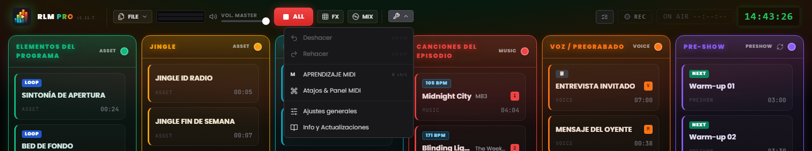
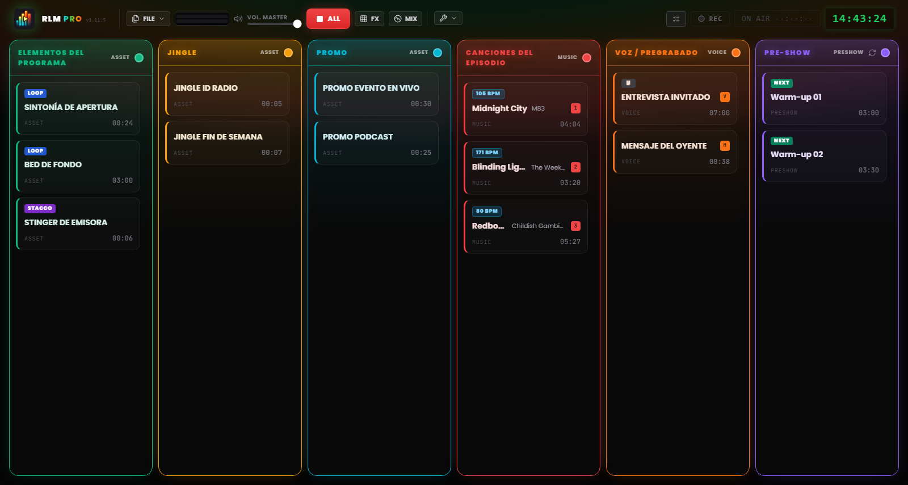

# Capítulo 3 — La interfaz de trabajo

---

La interfaz de Runtime Live Machine Pro está pensada para el contexto más exigente que existe: el directo. El tema oscuro, el alto contraste, el tamaño de los controles: cada decisión visual responde a una necesidad funcional concreta. Aquí no manda la estética por sí misma, sino la ergonomía.

Al abrir un proyecto, la pantalla queda dividida en dos zonas: arriba, la **Barra de Control**, que gestiona el proyecto y el sistema; en el centro, la **Rejilla de Regia**, donde ocurre el trabajo de verdad.

---

## 3.1 La Barra de Control (Header)

El encabezado ocupa todo el ancho de la pantalla. De izquierda a derecha encontramos la identidad del software, los comandos sobre archivos, la monitorización y los controles de transporte, el menú de herramientas y los indicadores de sesión.

### Identidad

**Logo e insignia PRO.** A la izquierda, el logo acompaña al rótulo **RLM PRO**: la palabra «PRO» luce un gradiente iridiscente que recorre el cian, el verde, el ámbar y el rojo. Justo al lado, en caracteres monoespaciados, aparece la versión instalada (`v1.11.5`). Si pasas el ratón por encima del logo, se muestra el nombre completo del software junto con el número de versión.

### Menú Archivo

El botón **FILE** abre un menú con las operaciones sobre proyectos:

- *Nuevo Proyecto* — abre una sesión vacía. Si hay cambios sin guardar, el software te pide confirmación.
- *Guardar proyecto* — guarda rápido en el archivo `.lmp` actual. La opción aparece resaltada en amarillo cuando hay cambios pendientes de guardar.
- *Guardar como…* — abre siempre el cuadro de diálogo, útil para ir creando versiones progresivas (por ejemplo, `Ep47_borrador.lmp`, `Ep47_final.lmp`).
- *Cargar Proyecto* — abre un proyecto `.lmp` guardado en el disco.
- *Importar M3U* — convierte una lista de reproducción M3U en una secuencia de clips.
- *Exportar archivo autónomo* — crea una copia autocontenida del proyecto, con los archivos de audio incluidos. Se describe en el Capítulo 10.

### Monitorización y transporte

**VU Meter estéreo (L/R).** Dos barras horizontales muestran el nivel real de audio en la salida, tras pasar por el Master Volume. La escala de color es fácil de leer: verde hasta cerca del 85 % del recorrido, después amarillo y, ya cerca del fondo de escala, rojo. Si el rojo se queda fijo, hay clipping y toca bajar el nivel.

**Master Volume.** Este fader controla el volumen general de salida del software, entre 0 y 100 %. Funciona como un fader máster: llevado a cero, no sale ningún sonido, sea cual sea el estado de cada clip. Si le has asignado un control MIDI, una pequeña insignia muestra esa asignación.

**PARAR TODO (botón rojo «ALL»).** Detiene al instante todos los clips activos y cancela los fades en curso. Es el comando de emergencia del sistema. La tecla `Esc` del teclado hace lo mismo cuando la aplicación tiene el foco, incluso si en ese momento estás escribiendo en un campo de texto.

> **Nota.** A diferencia de versiones anteriores, `Esc` ya no funciona como atajo global del sistema operativo: solo actúa cuando RLMP es la ventana activa. Este cambio permite que los cuadros de diálogo usen `Esc` para cerrarse sin que eso detenga el directo.

**FX.** Abre y cierra el pad FX, la *jingle machine* de los efectos (Capítulo 7). Un pequeño contador indica cuántos efectos están sonando en ese momento.

**MIX.** Abre y cierra la vista Automix, el deck dedicado a la columna Música (Capítulo 7).

### Herramientas

El menú **Herramientas** (icono de llave inglesa) agrupa:

- *Deshacer* y *Rehacer* — el historial de cambios de la escaleta (`Ctrl+Z` / `Ctrl+Y`).
- *MIDI Learn* — activa el modo de aprendizaje MIDI (Capítulo 8).
- *Keybinds* — la ventana donde se asignan teclas a los clips.
- *Ajustes* — las preferencias globales del software (Capítulo 13).
- *Info* — versión, créditos y control manual de las actualizaciones.

Debajo del menú aparece unos instantes el indicador *Auto-saved*, confirmando que el proyecto se acaba de guardar automáticamente.

*Figura 3.1 — La Barra de Control y el menú Herramientas abierto (Deshacer/Rehacer, MIDI Learn, Keybinds, Ajustes generales, Info).*

### Indicadores de sesión

En el lado derecho del encabezado están el botón del **Playout Log** (el registro cronológico de los lanzamientos, Capítulo 13), el botón de **Grabación** (Capítulo 9), el **temporizador On Air** (que en directo muestra `ON AIR HH:MM:SS` sobre fondo rojo) y el **reloj de estudio** digital en formato de 24 horas, sincronizado con el reloj del sistema.

En esa misma zona pueden aparecer también notificaciones no intrusivas (**toast**) sobre operaciones completadas o avisos del sistema. Los toast, a diferencia de los diálogos bloqueantes, desaparecen solos al cabo de unos segundos y no interrumpen la reproducción.

---

## 3.2 La rejilla de seis columnas

*Figura 3.2 — La interfaz de trabajo: la rejilla de seis columnas con las cards de audio.*

La rejilla es el centro operativo del software: seis columnas verticales dispuestas una junto a otra, cada una con su encabezado de color y su propia lógica de comportamiento de audio. Los efectos de sonido no tienen columna propia en la rejilla, viven en el pad FX (Capítulo 7).

### Encabezados de columna

Cada encabezado indica el nombre de la columna, su tipo, y además funciona como indicador de estado. En condiciones normales permanece estático, coloreado en el tono característico de esa columna. Pero si el clip en reproducción es el último disponible de la columna, no está en loop y quedan menos de **20 segundos** para el final, el encabezado salta a la alarma **DEAD AIR**: parpadea, cambia a ámbar, muestra un icono de aviso y la insignia **END**. Es el margen que necesitas para preparar la pista siguiente antes de que llegue el silencio.

El color de cada columna se puede personalizar: haz clic en el punto de color del encabezado y se abrirá una paleta de **30 tonos**. La elección queda guardada en el archivo de proyecto.

La columna **Pre-Show** tiene además, en su encabezado, un botón de **rotación**: al activarlo, la cola previa al directo inserta automáticamente jingles y promos a intervalos regulares (Capítulo 13).

### Las seis columnas

**Show Assets (Verde)**
Los elementos estructurales del show: sintonías, bases musicales, fondos (*bed*), ráfagas institucionales. Funcionan como segundo plano: ceden espacio en cuanto llegan voces o canciones, aunque mantienen su rotación interna hasta que se detienen.

**Jingle (Ámbar)** y **Promo (Cian)**
Dos columnas dedicadas a los jingles identificativos y a las promos o autopromociones, respectivamente. En cuanto al audio se comportan igual que los Show Assets, de la misma familia, pero separarlas mantiene la escaleta ordenada y fácil de leer.

**Canciones del episodio (Rojo)**
La lista de reproducción musical. Los clips de esta columna participan de forma activa en la mezcla automática: bajan de volumen cuando suenan las voces, y a la vez silencian las bases de los Assets en cuanto empiezan a sonar (Capítulo 6). En los clips musicales, el software detecta automáticamente el **BPM** y lo muestra en una insignia.

**Voz / Grabaciones (Naranja)**
Entrevistas, bloques hablados pregrabados, mensajes de voz. Es la columna con **máxima prioridad** en el sistema de mezcla: mientras suena un clip aquí, todas las demás señales bajan a un nivel de fondo.

**Pre-Show (Violeta)**
La lista de calentamiento antes del directo. Funciona como una cola musical independiente, con rotación opcional de jingles y promos. Al arrancar el directo propiamente dicho, esta columna suele vaciarse o desactivarse.

---

## 3.3 La Card de Audio (Clip)

Cada archivo de audio importado aparece en la rejilla como una **card** rectangular. La card es la unidad operativa del sistema: es lo que ves, lanzas, configuras y mueves.

### Anatomía de una card

**Título y artista.** Muestra el nombre del archivo o el nombre personalizado que le hayas asignado en las propiedades. Cambiar el título solo afecta a la etiqueta dentro del software; el archivo original del disco queda intacto. En los clips musicales, bajo el título puede aparecer también el nombre del artista.

**Temporizador.** En reposo muestra la duración total del clip en formato `MM:SS`. Al arrancar la reproducción pasa a **cuenta atrás**, con el signo negativo por delante (por ejemplo, `−01:20`). Cuando quedan menos de 15 segundos para el final, el temporizador se pone en **rojo**.

**Insignias de estado.** Pequeñas etiquetas que comunican de un vistazo las propiedades configuradas del clip:

- **STACCO** — el clip está configurado para superponerse a los demás sin detenerlos.
- **LOOP** — el clip volverá a empezar desde el principio al terminar la reproducción.
- **NEXT** — al terminar este clip arrancará automáticamente el siguiente de la columna.
- **▶ UP NEXT** — resalta cuál será el próximo clip en arrancar en la secuencia automática.
- **### BPM** — el tempo detectado, en los clips musicales.
- **TRIM…** — análisis del silencio en curso (Auto-Trim).
- **FADE OUT** — aparece en el clip saliente durante un crossfade o un fundido.
- **📋** — el clip tiene una nota asociada en la NoteBoard (Capítulo 13).

**Asignaciones.** Si el clip tiene una tecla asignada, la letra aparece en una insignia del color de la columna; si tiene un binding MIDI, verás la etiqueta `M` seguida del número de nota (por ejemplo, `M60`).

**Cues de estructura.** Cuando hay marcadores configurados, durante la reproducción aparecen las cuentas atrás `INTRO: −MM:SS` (en cian) y `OUTRO IN: −MM:SS` (en naranja), y por último el aviso `🚨 OUTRO` en cuanto empieza la cola.

**Indicador de reproducción.** Con el clip en marcha, la card se ilumina: borde verde, fondo con un halo luminoso, un punto parpadeante y el título resaltado. Una barra de avance recorre el fondo de la card.

### Interacción con las cards

- **Clic izquierdo** — arranca el clip si está parado, o lo detiene con fade out si ya está sonando.
- **Ctrl + Clic** (Windows/Linux) o **Cmd + Clic** (macOS) — selecciona el clip sin arrancarlo; el borde se pone azul. Útil para seleccionar varios clips y borrarlos juntos.
- **Tecla Supr** (o *Delete* / *Backspace*) — borra de la rejilla los clips seleccionados. Si hay más de uno seleccionado, el software pide confirmación.
- **Clic derecho** — abre los **Ajustes del clip**: propiedades, editor de la forma de onda, notas (Capítulo 5).
- **Arrastrar y soltar** — arrastra una card para reordenarla dentro de su columna o para moverla a otra. Mientras arrastras, un indicador luminoso azul marca dónde quedará insertada.

### Cards en estado de error

Cuando una card muestra **ARCHIVO AUSENTE** con el borde rojo, quiere decir que el archivo de audio referenciado ya no es accesible: se ha movido, se ha renombrado, o está en un disco externo que no está conectado. El clip no se puede reproducir hasta que el archivo vuelva a estar disponible en su ruta original. Cómo gestionar estos errores de ruta se explica en el Capítulo 14.
