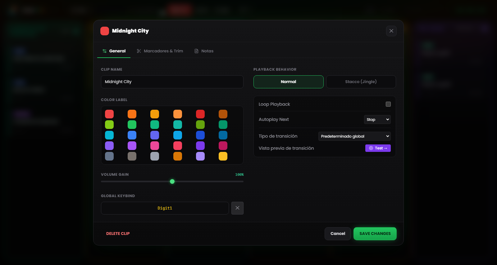
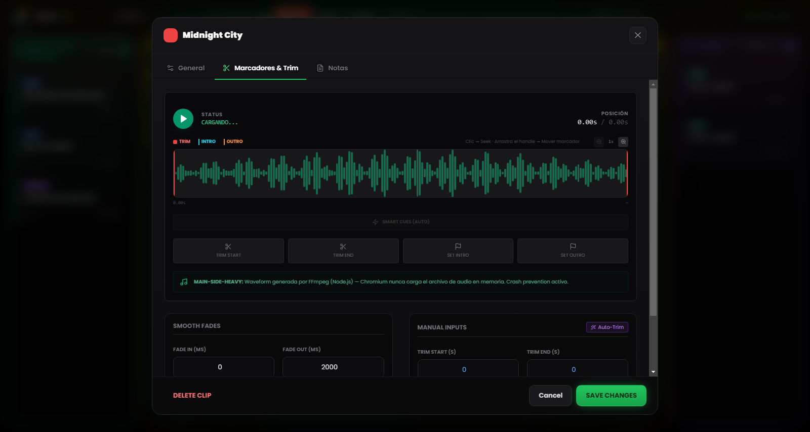

# Capítulo 5 — Propiedades del clip y Waveform Editor

---

Cada archivo de audio tiene su historia antes de llegar a la rejilla: grabaciones con segundos de silencio inicial, temas con colas interminables, entrevistas con el nivel demasiado bajo respecto al resto del show. En lugar de recurrir a un editor de audio externo cada vez que un archivo no está «listo para emisión», RLMP pone a tu disposición un panel de configuración para cada clip y un editor visual de la forma de onda con funciones de corte y marcado.

Todas las modificaciones hechas con estas herramientas son **no destructivas**: el archivo original en el disco permanece invariable. RLMP memoriza los ajustes en el archivo de proyecto `.lmp` y los aplica al vuelo durante la reproducción.

Para abrir los ajustes de un clip, haz **clic con el botón derecho** sobre la card.

---

## 5.1 Propiedades básicas

*Figura 5.1 — Los ajustes del clip: Clip Name, Color Label, Volume Gain, Playback Behavior, Next Action y asignación de teclas.*

### Nombre y apariencia

**Clip Name.** Puedes asignar un nombre personalizado al clip, independiente del nombre del archivo original. El nombre se muestra en la card de la rejilla. Usa nombres descriptivos y operativamente útiles durante el directo: «SINTONÍA DE APERTURA» es más legible que `sintonia_rev3_final_def.mp3` cuando tienes tres segundos para encontrar el clip correcto.

**Color Label.** Por defecto, el clip hereda el color de la columna a la que pertenece. Aquí puedes asignar un color específico para que destaque visualmente. Útil para marcar clips críticos (p. ej. la sintonía de cierre) o para diferenciar grupos temáticos dentro de la misma columna.

### Volume Gain

El slider de ganancia va del 0 % al 150 % y actúa como un pre-fader sobre el clip concreto, antes del Master Volume global.

El caso de uso más habitual es el ajuste de niveles: si tienes un vocal grabado con poca intensidad (p. ej. un mensaje de WhatsApp o una grabación telefónica), puedes llevarlo por encima del 100 % para acercarlo al volumen de las demás pistas. A la inversa, puedes bajar un clip especialmente «caliente» sin tocar el Master Volume.

---

## 5.2 El editor de la forma de onda

*Figura 5.2 — El editor de la forma de onda: maniguetas de Trim, marcadores de Intro y Outro, Auto-Trim, Smart Cues y fundidos.*

El editor visual es la función más potente del panel de configuración. Ocupa la zona central del panel y muestra la representación gráfica del audio del clip completo.

### Navegación en el editor

**Zoom horizontal.** Puedes ampliar la vista de la forma de onda desde 1× (vista completa) hasta 8×, con pasos intermedios (1×, 2×, 3×, 4×, 6×, 8×), mediante el slider de zoom o la rueda del ratón sobre el editor. Con zoom elevado, la vista se desplaza siguiendo la posición actual.

**Regla adaptativa.** El eje temporal en la parte superior del editor se adapta automáticamente al zoom: en vista completa muestra referencias espaciadas; con el zoom al máximo las densifica hasta los segundos.

**Playhead.** Durante la reproducción de vista previa, un indicador vertical blanco recorre en tiempo real la forma de onda, mostrando la posición actual. Un clic sobre la forma de onda mueve la reproducción a ese punto.

### Las cuatro maniguetas

En el editor hay cuatro **handles** arrastrables, cada uno con una función y un color precisos:

**Trim Start (manigueta roja, izquierda).** Define el punto de inicio efectivo del clip. Todo lo que quede a la izquierda se salta durante la reproducción. Arrástrala hacia la derecha para eliminar los silencios o las partes no deseadas del principio.

**Trim End (manigueta roja, derecha).** Define el punto de final efectivo. Todo lo que quede a la derecha se ignora. Arrástrala hacia la izquierda para acortar la cola. Trim Start y Trim End no pueden superponerse.

**Intro Marker (manigueta cian).** Marca el punto estructural en el que la melodía principal entra en el tema, tras la eventual introducción. Una vez fijado, en la card en reproducción aparecerá la cuenta atrás **INTRO: −MM:SS**.

**Outro Marker (manigueta naranja).** Marca el punto en el que empieza la cola del tema, normalmente el momento en el que empezar a hablar para rellenar la transición. En la card aparecerá la cuenta atrás **OUTRO IN: −MM:SS**. Si el valor resulta incoherente con el trim o con la duración, el software lo desactiva y te avisa.

Además del arrastre, cuatro botones *Set* fijan cada manigueta en la posición actual del playhead, para un marcado al vuelo mientras escuchas. Los valores siguen siendo modificables con precisión en sus respectivos campos.

### Auto-Trim (varita mágica)

El botón con el icono de la **varita mágica** inicia la detección automática del silencio mediante FFmpeg. El umbral no es fijo: el software estima primero el nivel medio del archivo y fija el umbral de silencio unos 25 dB por debajo de ese nivel (dentro de un intervalo de seguridad comprendido entre −55 y −20 dB; a falta de estimación, recurre a −40 dB). El Trim Start y el Trim End se fijan así automáticamente, eliminando silencios iniciales y colas mudas sin intervención manual.

Esta función es especialmente útil para las grabaciones vocales sin procesar: llamadas telefónicas, mensajes de audio, entrevistas grabadas en dispositivos móviles. Aplicar el Auto-Trim a toda la columna Voz antes de un show lleva menos de un minuto y mejora la limpieza de las transiciones.

> **Nota técnica.** El análisis se realiza en el Main Process mediante FFmpeg, sin cargar el archivo en memoria en el Renderer. En archivos de gran tamaño, el tiempo de análisis se mantiene en el orden de pocos segundos.

### Smart Cues (detección automática de los marcadores)

Junto al Auto-Trim, la función de **Smart Cues** propone automáticamente los marcadores de Intro y Outro. Usando un umbral más agresivo, localiza el punto en el que el audio alcanza la plena energía (Intro) y aquel en el que empieza el fundido final (Outro), colocando los dos marcadores sin tener que buscarlos de oído.

### Vista previa de la transición

Si existe un clip **siguiente** en la misma columna, el botón **«Test →»** reproduce los últimos segundos del clip actual y deja que se dispare la transición hacia el siguiente, directamente en el editor. Durante la vista previa un botón *Stop* interrumpe la prueba.

---

## 5.3 Comportamientos y automatización

### Playback Behavior (modo de superposición)

**Normal** — comportamiento por defecto. Cuando este clip arranca, interrumpe cualquier otro clip en reproducción de la misma columna (con fade out). Es el comportamiento correcto para canciones y bases: una canción excluye a las demás.

**Stacco (Jingle)** — el clip arranca sin interrumpir los demás. Tiene prioridad alta: silencia los otros assets de la columna y baja la música, pero no detiene nada. El caso de uso típico es un *station ID* («Estás escuchando…») que debe «cabalgar» sobre la intro de un tema, o un jingle breve sobre una base en loop.

### Next Action (automatización al final)

Define qué ocurre cuando el clip alcanza el punto de Trim End.

**Stop** — comportamiento por defecto para Canciones, Voz y Assets. El clip termina y se detiene.

**Play Next** — cuando el clip se acerca al final, arranca automáticamente el clip siguiente de la columna con la transición configurada. La insignia **NEXT** aparece en la card. Es el comportamiento por defecto de la columna Pre-Show y crea de hecho una lista automática: puedes configurarlo en varios clips consecutivos para construir bloques que fluyen sin interrupciones.

La reproducción en **loop** es una opción aparte: cuando está activa, el clip vuelve a empezar desde el principio (desde el Trim Start) sin solución de continuidad, y en la card aparece la insignia **LOOP**. Úsala para bases musicales, ambientes sonoros o sintonías de fondo que deban girar hasta que se detengan explícitamente. Los modos de transición —Crossfade, Segue, Gapless— se describen en el Capítulo 13.

---

## 5.4 Fundidos (Fade In y Fade Out)

El panel permite fijar, para cada clip, la duración de los fundidos de entrada y de salida. Los valores van de 0 a 60 000 milisegundos (60 segundos) y la curva aplicada es lineal.

**Fade In.** El tiempo que tarda el volumen en llegar al nivel máximo desde el arranque. Un valor de 2000 ms produce una subida gradual de dos segundos. Úsalo en las bases musicales que deben emerger con suavidad; manténlo en 0 para las voces y los efectos que deben oírse de inmediato.

**Fade Out.** El tiempo de fundido al cierre, tanto cuando se hace clic en un clip activo como en las transiciones. Valores típicos: 2000–3000 ms para las canciones, 500–1000 ms para las bases, 0 ms para las ráfagas secas.

Un fade out a 0 ms produce un cierre inmediato («hard cut»). En un tema musical en directo puede percibirse como un fallo técnico: valora con atención cuándo es apropiado.

---

## 5.5 Asignación de controles

Cada clip puede lanzarse también desde una tecla del teclado o desde un controlador MIDI.

**Global Keybind.** La tecla del teclado asignada al clip. Puedes fijarla desde el campo dedicado en los ajustes del clip (haz clic y pulsa la tecla deseada) o desde la ventana **Keybinds**, accesible desde el menú Herramientas. La insignia correspondiente aparece en la card. Si la tecla ya está asignada a otro clip, el software avisa del conflicto antes de sobrescribir.

**MIDI Bind.** La nota MIDI asignada (p. ej. `NOTE:60`). La asignación se hace mediante el modo **MIDI Learn** (véase el Capítulo 8), no tecleando el número a mano.

Los bindings de los clips se guardan en el archivo de proyecto: al llevar el proyecto a otro ordenador con el mismo controlador MIDI, los mapeos funcionarán sin reconfiguración.
