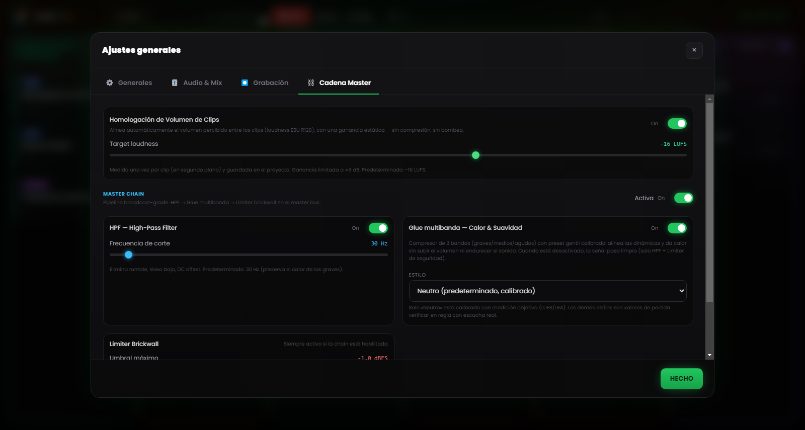

# Capítulo 6 — El motor de mezcla

---

El problema de fondo de la regia radiofónica manual es la multiplicación de las acciones simultáneas: arrancar un tema, bajar la música, hablar al micrófono, preparar el clip siguiente, no perder de vista el reloj. Cada operación de más es una oportunidad de error, en un contexto donde el error es público e inmediato.

El motor de mezcla de Runtime Live Machine Pro elimina la mayoría de estas acciones intermedias delegándolas al software. No se trata de automatización en el sentido de «el software hace las cosas por ti sin que lo sepas», sino de automatización de las reglas que tú mismo definirías si tuvieras suficientes manos para ejecutarlas todas.

---

## 6.1 La jerarquía de audio

El sistema de mezcla automática se basa en una **jerarquía de prioridad** entre los tipos de clip. La forma más inmediata de entenderla es imaginarla como una escala de «derecho a la palabra».

**Voz / Grabaciones — prioridad absoluta.**
Cuando un clip de voz está en reproducción, se mantiene en su volumen nominal y todo lo demás baja. Ninguna otra señal puede sobrescribir esta regla.

**Canciones del episodio.**
Ceden espacio a las Voces, pero mandan sobre las bases de los Assets. Cuando entra una canción, las bases musicales de los Assets se anulan (no se detienen: siguen girando en silencio, listas para el regreso). Es la Music Dominance, descrita más adelante.

**Show Assets, Jingle y Promo — las bases de servicio.**
Las bajan las Voces y las silencian las Canciones. Cuando un asset es un **Stacco** (ráfaga), en cambio, pasa a mandar él (véase §6.4).

**Efectos del pad FX.**
Los efectos de sonido quedan fuera de la jerarquía: suenan a su propio volumen, se superponen a lo que está en antena y no se silencian. Hay una sola cortesía hacia el habla: cuando una voz está activa, los efectos bajan a medio volumen (50 %) para no taparla y luego suben solos.

---

## 6.2 Ducking automático

El **ducking** es el mecanismo por el que una señal se baja cuando entra en reproducción una señal de prioridad superior.

El caso más habitual: una canción está sonando en plena dinámica; lanzas una entrevista pregrabada desde la columna Voz. En ese momento RLMP lleva la canción a cerca del **20 % del volumen** (una reducción de unos 14 dB) con un fundido suave de medio segundo, de modo que la voz ocupe el espacio sonoro de forma inteligible. En cuanto termina la entrevista, la canción vuelve a subir al volumen original con un fade in igual de fluido.

El operador no toca nada. El único gesto realizado ha sido un clic: arrancar la entrevista. La magnitud de la reducción y su rapidez son ajustables en los Ajustes (Capítulo 13).

---

## 6.3 Music Dominance: gestión inteligente de las bases

Un error de sonido clásico es el momento en el que una canción y una base musical (*bed*) se superponen: dos elementos rítmicos que chocan, dos bombos que no coinciden, el resultado es confuso.

RLMP gestiona este escenario con la **Music Dominance**.

**El escenario tipo.** Una base está girando en loop en la columna Assets, bajo la voz del conductor. El conductor lanza un tema desde la columna Canciones.

**Qué hace RLMP.** No detiene la base, porque detenerla exigiría luego reiniciarla a mano. En su lugar la lleva silenciosamente a **volumen cero**, manteniéndola en reproducción «en fantasma»: el archivo sigue corriendo, el loop continúa, pero no se oye nada.

**El resultado sonoro.** Solo se oye la canción. La base ha desaparecido sin que el operador haya hecho nada.

**El regreso.** Cuando la canción termina, la base reemerge con un fade in automático, retomando desde el punto en el que se encontraba en el loop. El flujo (base → canción → base) ocurre sin un solo clic adicional.

---

## 6.4 Stacchi: la excepción a la regla

El comportamiento **Stacco** (ráfaga; configurable en las propiedades de cada clip, véase el Capítulo 5) invierte temporalmente la jerarquía: el clip que lo lleva pasa a ser prioritario. Silencia los otros assets de su columna y baja la música, pero no detiene nada. El fundido aplicado es más rápido que el del ducking ordinario, para una entrada más percusiva y neta.

El uso típico es el *station ID* vocal («Estás escuchando…»): debe oírse con claridad mientras la base de debajo sigue girando. Para un resultado más cuidado, combina el Stacco con un fade in breve (300–500 ms): la entrada será suave, no brusca.

---

## 6.5 Homologación del volumen (loudness)

Los clips de procedencia distinta llegan casi siempre con niveles distintos: una sintonía masterizada como es debido, un vocal telefónico grabado bajo, un tema descargado con un volumen propio. Para evitar continuos ajustes manuales del Gain, RLMP aplica por defecto una **homologación del volumen** basada en el estándar de loudness EBU R128, con un objetivo de **−16 LUFS**.

En la práctica, el software evalúa la sonoridad percibida de cada clip y la acerca a una referencia común, de modo que canciones, voces y bases arranquen ya en un plano coherente. La función está activa por defecto y el valor objetivo es ajustable en los Ajustes → Master Chain.

---

## 6.6 Master Chain: la cadena de procesadores del master bus

*Figura 6.1 — La Master Chain: homologación del volumen (−16 LUFS), HPF a 30 Hz, glue multibanda y limiter brickwall.*

La señal combinada de todos los clips en reproducción, después del Master Volume, atraviesa una **cadena de procesadores** en el bus máster antes de llegar al dispositivo de salida. La cadena está activa por defecto y diseñada para un sonido broadcast-grade sin necesidad de configuración avanzada.

Comprende tres etapas en serie.

**High-Pass Filter (HPF) a 30 Hz.**
Elimina las frecuencias sub-graves inútiles que consumen headroom y pueden ensuciar los sistemas de difusión, con una pendiente suave. La frecuencia de corte es ajustable (20–200 Hz). Cuando se desactiva, la etapa se vuelve completamente transparente.

**Glue multibanda.**
No un solo compresor, sino tres compresores «suaves» que trabajan en paralelo sobre tres bandas de frecuencia (graves, medios, agudos), separadas por un crossover. Cada banda tiene umbrales y ratios calibrados para «pegar» la mezcla sin aplastarla y contener la varianza dinámica entre clips de nivel distinto. El estilo es seleccionable entre varios presets (Neutro, Rock, Jazz, Electrónico); el preset por defecto es Neutro.

**Limiter Brickwall.**
Umbral a −1 dBFS, con ratio de limitación elevado y reacción rapidísima. Garantiza que la señal nunca supere el nivel máximo permitido, previniendo la distorsión digital (clipping) pase lo que pase aguas arriba.

Toda la cadena, y cada etapa por separado, es configurable y desactivable desde los Ajustes → Master Chain, donde también hay un botón para restaurar los valores por defecto. En un contexto donde la señal ya la procesa un mixer hardware o una cadena externa, puedes desactivarla para evitar procesados dobles.
