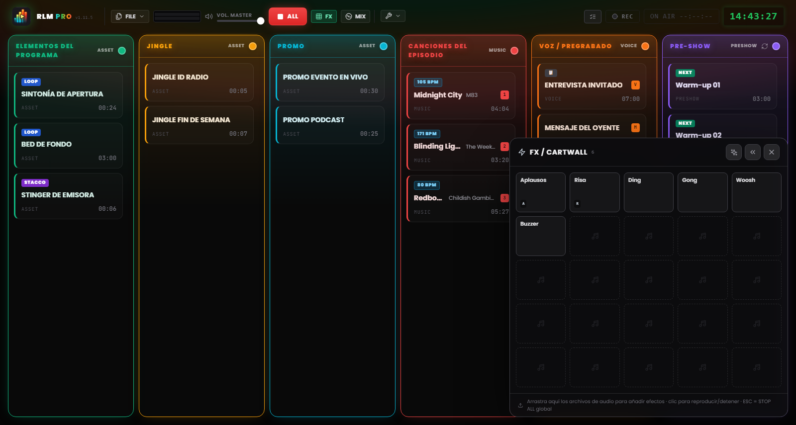
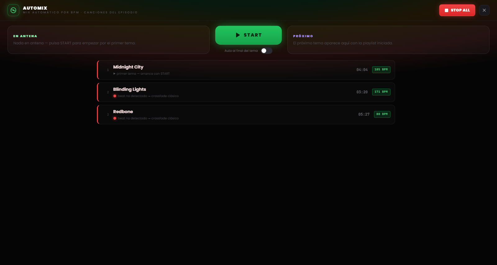

# Capítulo 7 — El pad FX y la vista Automix

---

Dos superficies de trabajo viven sobre la rejilla, invocables con una tecla y pensadas para dos momentos opuestos de la regia: el **pad FX**, para lanzar efectos y ráfagas a golpe seguro sin interrumpir nada, y la **vista Automix**, para gestionar el flujo musical como lo haría un DJ. Ninguna de las dos resta espacio a la rejilla: se abren cuando hacen falta y se cierran con un clic.

---

## 7.1 El pad FX: la jingle machine

*Figura 7.1 — El pad FX: la jingle machine 5×5 de los efectos de sonido, con lanzamiento superpuesto.*

Los efectos de sonido no tienen columna en la rejilla. Viven en el **pad FX**, un panel de rejilla de celdas (una *jingle machine*) que se abre desde el botón **FX** del encabezado y queda flotante en una esquina de la pantalla.

El pad es un **overlay no bloqueante**: no oscurece la board ni intercepta los clics directos en otro sitio. Puedes lanzar un efecto y, en el mismo instante, seguir operando sobre las columnas o los comandos del encabezado. Por esa razón la tecla `Esc` no cierra el pad: sigue siendo el comando de PARAR TODO, siempre disponible. El pad se cierra desde su botón de cierre o de nuevo desde el toggle FX.

### Cargar y lanzar los efectos

El pad nace con una rejilla de 25 celdas (5×5) y crece en filas cuando añades más efectos. Para llenarlo, **arrastra los archivos de audio directamente sobre las celdas** del pad, exactamente como harías con una columna de la rejilla.

Un clic en una celda **lanza el efecto**. Los efectos del pad son polifónicos y se superponen: varias celdas pueden sonar juntas, sobre cualquier cosa que esté en antena, sin detenerla. El comportamiento de audio es idéntico al de un clip normal: solo cambia la superficie de lanzamiento. Un contador junto al botón FX del encabezado indica cuántos efectos están sonando en ese momento.

### Configurar un efecto

Los efectos se configuran en dos niveles, pensados para dos necesidades distintas:

- **Ajustes rápidos** — el caso común para una jingle machine: nombre, color, volumen, loop. Bastan pocos segundos.
- **Ajustes completos** — la misma ventana de los clips de rejilla (editor de la forma de onda, trim, marcadores, fade, asignación de teclas), accesible desde la opción «Ajustes completos…» dentro de los rápidos.

### Posición del pad

El pad puede situarse en la esquina inferior izquierda o inferior derecha de la pantalla: la preferencia se fija con las flechas del propio pad y se recuerda entre sesiones. A la derecha cubre la NoteBoard y la última columna; elige el lado según cómo hayas dispuesto tu escaleta.

> **Nota.** En modo MIDI Learn, un clic en una celda del pad **selecciona** el efecto para la asignación en lugar de reproducirlo, así no mandas al aire un jingle mientras mapeas los controles (véase el Capítulo 8).

---

## 7.2 La vista Automix

*Figura 7.2 — La vista Automix: el deck de la columna Música, la compatibilidad BPM y el modo automático al final del tema.*

La **vista Automix** es el deck de la columna Música: una pantalla a todo campo, invocada desde el botón **MIX** del encabezado, que presenta la escaleta musical como una consola de DJ. Se abre sobre la board pero bajo el pad FX, así los efectos siguen siendo utilizables incluso con el Automix abierto. Como en el pad, `Esc` no la cierra: sigue siendo el comando de emergencia, y el botón PARAR TODO permanece accesible en el encabezado.

### El deck

En el centro encuentras el tema **en antena** y, a continuación, el **próximo** tema de la columna Música, con el tiempo restante. Desde aquí puedes arrancar una pista y gestionar el paso de un tema a otro con un solo comando: el botón grande de transición aplica el mismo crossfade que usarías desde la rejilla, pero con el cuidado añadido del enganche rítmico.

### Compatibilidad y transiciones beat-matched

Junto a cada tema, un **punto de compatibilidad** con el tema anterior indica su afinidad rítmica:

- **Verde** — los dos tempos se enganchan bien: la transición puede ser beat-matched.
- **Amarillo** — enganche posible pero con alguna reserva.
- **Rojo** — tempos demasiado distantes para un enganche limpio.

Cuando el enganche rítmico no es viable (BPM no detectado, beat incierto, tempos demasiado distintos), el software lo declara y recurre automáticamente a un **crossfade clásico**, sin sorpresas en directo.

### El modo automático

Al final de la vista hay un interruptor para la **automatización al final del tema**. Cuando está activo, RLMP arranca por su cuenta el paso al tema siguiente cuando la pista en antena se acerca al final.

Este modo es una excepción deliberada a la filosofía del software, que por decisión propia no automatiza el show. Por eso está **desactivado por defecto** y funciona **solo mientras la vista Automix está abierta**: cerrar la vista desactiva la automatización. Es la herramienta adecuada para un bloque musical continuo, la media hora de solo música antes de volver a la voz, no para todo el directo.
