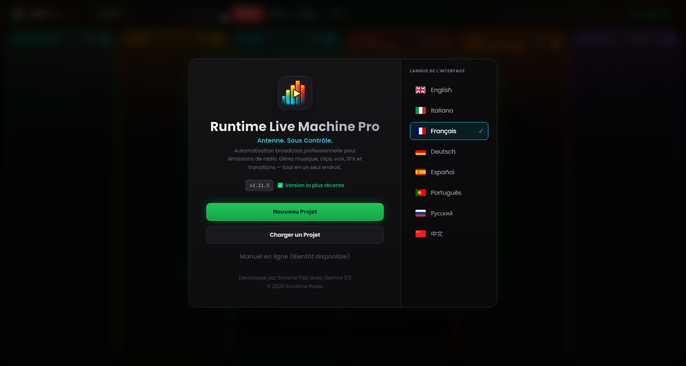

# Chapitre 2 — Installation et premier démarrage

---

L'installation de Runtime Live Machine Pro est conçue pour demander le minimum d'interaction : quelques clics, aucune configuration manuelle, aucun prérequis à installer séparément. Le moteur audio (FFmpeg) est intégré au paquet d'installation et ne réclame aucune intervention de votre part.

---

## 2.1 Configuration requise

Avant de commencer, vérifiez que votre ordinateur satisfait la configuration minimale. Les spécifications recommandées garantissent la meilleure expérience lors de sessions longues ou avec de nombreux clips chargés simultanément.

| | Minimum | Recommandé |
|---|---|---|
| **Système d'exploitation (Windows)** | Windows 10 64-bit | Windows 11 64-bit |
| **Système d'exploitation (macOS)** | macOS 11 Big Sur | macOS 13 Ventura ou ultérieur |
| **Système d'exploitation (Linux)** | Ubuntu 20.04 / Debian 11 | Ubuntu 22.04 LTS |
| **RAM** | 4 GB | 8 GB ou plus |
| **Espace disque** | 300 MB (application) | 1 GB + espace pour les fichiers audio |
| **CPU** | Tout dual-core moderne | Quad-core ou supérieur |

Le logiciel est optimisé pour Apple Silicon (M1, M2, M3) et tourne nativement sur les deux architectures macOS, sans émulation Rosetta.

Aucune carte son dédiée n'est requise : RLMP fonctionne avec n'importe quel périphérique audio reconnu par le système d'exploitation, de la carte son intégrée aux mixeurs USB professionnels comme le Rødecaster Pro ou le RØDECaster Duo.

---

## 2.2 Installation sous Windows

1. Téléchargez le fichier `Runtime-Live-Machine-Pro-1.11.5.exe` depuis le canal de distribution officiel.
2. Double-cliquez sur l'exécutable. L'installateur NSIS se lance et copie les fichiers dans les répertoires appropriés.
3. À la fin, un raccourci est créé sur le Bureau et dans le menu Démarrer.
4. L'application démarre automatiquement une fois l'installation terminée.

**Note sur Windows SmartScreen.** Comme le logiciel est mis à jour fréquemment, le certificat de signature numérique n'a peut-être pas encore accumulé la « réputation » suffisante pour la liste blanche automatique de SmartScreen. Si l'avertissement « Windows a protégé votre ordinateur » apparaît, cliquez sur *Informations complémentaires* puis sur *Exécuter quand même*. Le logiciel est exempt de malware ; les installateurs officiels sont publiés exclusivement via les canaux de distribution de l'auteur.

---

## 2.3 Installation sous macOS

1. Téléchargez le fichier `.dmg` depuis le canal officiel.
2. Ouvrez l'image disque et faites glisser l'icône de Runtime Live Machine Pro dans le dossier *Applications*.
3. Au premier démarrage, macOS peut afficher un avertissement Gatekeeper (« L'app ne peut pas être ouverte, car elle provient d'un développeur non identifié »). Pour continuer, ouvrez *Préférences Système* → *Sécurité et confidentialité* → *Général* et cliquez sur *Ouvrir quand même* à côté du nom de l'application.

À partir de macOS 15 (Sequoia), le chemin devient *Réglages Système* → *Confidentialité et sécurité* → faites défiler jusqu'à la section *Sécurité*.

> **Note.** L'application macOS n'est pas signée avec un certificat Apple Developer. Cela influe aussi sur la façon dont les mises à jour sont gérées, comme expliqué au Chapitre 12.

---

## 2.4 Installation sous Linux

Deux formats de distribution sont disponibles :

- **AppImage** — exécutable portable, sans installation. Rendez le fichier exécutable (`chmod +x`) et lancez-le directement.
- **Paquet .deb** — pour les distributions Debian/Ubuntu/Mint. Installez avec `sudo dpkg -i nomfichier.deb` ou ouvrez-le avec le gestionnaire de paquets graphique.

Sur certaines distributions, il peut être nécessaire d'installer le paquet `libasound2` pour la prise en charge audio ALSA. Consultez la documentation de votre distribution si l'application ne démarre pas.

---

## 2.5 L'écran d'accueil

*Figure 2.1 — L'écran d'accueil : identité du logiciel, état de la mise à jour, actions principales et sélecteur de langue.*

Au premier démarrage — et à chaque démarrage suivant, tant que vous n'ouvrez pas de projet — RLMP présente l'**écran d'accueil**, le point d'accès à toutes les opérations préliminaires. Le panneau se divise en deux zones.

**Zone de gauche — Identité et actions.**
Le logo du logiciel (les barres d'un VU meter avec le symbole de lecture) identifie la version Pro. Sous le titre et le slogan apparaît le numéro de version installée, accompagné de l'état du système de mise à jour :

- **« Version la plus récente »** (vert) — vous utilisez la dernière version disponible.
- **« Mise à jour disponible »** (ambre, clignotant) — c'est un bouton : cliquez dessus pour ouvrir la fenêtre de mise à jour (Chapitre 12).
- **« OFFLINE »** (rouge estompé) — impossible de contacter le service de mise à jour ; le logiciel fonctionne quand même.

Dessous se trouvent les actions principales :

- *Nouveau Projet* — crée une session vide, colonnes prêtes au chargement.
- *Charger un Projet* — ouvre un fichier `.lmp` existant. Avant de le rendre opérationnel, RLMP effectue un **contrôle d'intégrité** : il vérifie que chaque fichier audio référencé existe toujours au chemin mémorisé. Les fichiers manquants sont immédiatement signalés par une bordure rouge sur le clip correspondant.
- *Manuel en ligne* — l'entrée est présente mais actuellement désactivée : la documentation consultable depuis le logiciel arrivera dans une prochaine version, via le web.

**Zone de droite — Sélecteur de langue.**
RLMP prend en charge huit langues d'interface : anglais, italien, français, allemand, espagnol, portugais, russe et chinois simplifié. La langue active est mise en évidence par une bordure cyan et une coche. La sélection prend effet immédiatement et est mémorisée d'une session à l'autre.

---

## 2.6 Le premier démarrage : à quoi s'attendre

À la première ouverture d'un projet, vous remarquerez dans l'en-tête le logo avec le badge **PRO** au dégradé iridescent. Derrière l'interface, l'ouverture du projet lance le moteur audio en arrière-plan : FFmpeg s'initialise et le protocole de streaming `media://` se met à l'écoute, prêt à servir les fichiers depuis le disque sans les charger en mémoire.

Le logiciel démarre de préférence en mode plein écran. Si la fenêtre s'ouvrait redimensionnée, appuyez sur `F11` (Windows/Linux) ou `Ctrl+Cmd+F` (macOS) pour la passer en plein écran — condition optimale pour le travail de régie.

Le **minuteur On Air** dans l'en-tête reste à `--:--:--` tant que le premier clip de la session n'a pas été lancé. À partir de ce moment, il commence à compter le temps écoulé en direct : un repère utile pour ceux qui travaillent avec des conduites à durée fixe.
