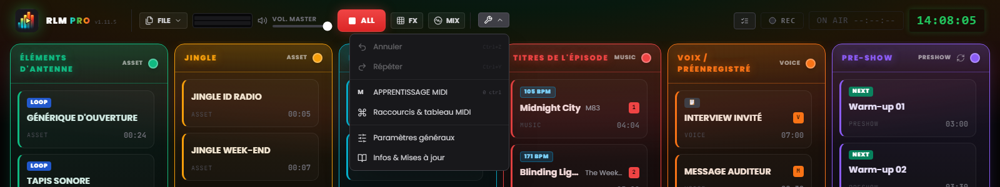
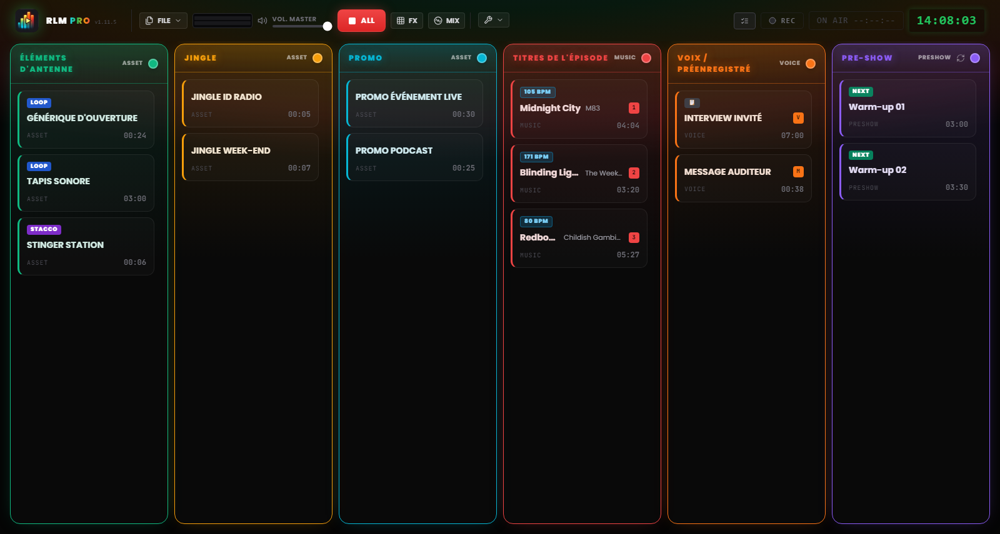

# Chapitre 3 — L'interface de travail

---

L'interface de Runtime Live Machine Pro est conçue pour le contexte opérationnel le plus exigeant : le direct. Chaque choix visuel — le thème sombre, le fort contraste, la taille des commandes — répond à une exigence fonctionnelle. Ce n'est pas de l'esthétique pour l'esthétique, mais de l'ergonomie.

Quand vous ouvrez un projet, l'écran se divise en deux zones distinctes : la **barre de contrôle** en haut, qui gère le projet et le système, et la **grille de régie** au centre, où se déroule le travail effectif.

---

## 3.1 La barre de contrôle (en-tête)

L'en-tête occupe toute la largeur de l'écran. De gauche à droite, il regroupe l'identité du logiciel, les commandes sur les fichiers, le monitoring et les commandes de transport, le menu des outils et les indicateurs de session.

### Identité

**Logo et badge PRO.** À gauche, le logo côtoie l'inscription **RLM PRO** — le mot « PRO » est rendu par un dégradé iridescent qui passe du cyan au vert, à l'ambre, au rouge. À côté, en caractères à chasse fixe, figure la version installée (`v1.11.5`). En passant la souris sur le logo apparaît le nom complet du logiciel avec le numéro de version.

### Menu Fichier

Le bouton **FILE** ouvre un menu regroupant les opérations sur les projets :

- *Nouveau Projet* — ouvre une session vide. En cas de modifications non enregistrées, le logiciel demande confirmation.
- *Enregistrer le projet* — enregistrement rapide sur le fichier `.lmp` courant. L'entrée se met en jaune lorsqu'il y a des modifications non enregistrées.
- *Enregistrer sous…* — ouvre toujours la boîte de dialogue, pour créer des versions progressives (ex. `Ep47_brouillon.lmp`, `Ep47_final.lmp`).
- *Charger un Projet* — ouvre un projet `.lmp` depuis le disque.
- *Importer playlist M3U* — importe une playlist au format M3U comme séquence de clips.
- *Exporter l'archive autonome* — crée une copie autonome du projet, fichiers audio inclus. Décrit au Chapitre 10.

### Monitoring et transport

**VU meter stéréo (L/R).** Deux barres horizontales affichent le niveau audio réel en sortie, après le Master Volume. L'échelle chromatique est intuitive : vert jusqu'à environ 85 % du parcours, puis jaune, enfin rouge à l'approche du fond d'échelle. Un rouge persistant signale un écrêtage (clipping) : baissez le niveau.

**Master Volume.** Le fader contrôle le volume général de sortie du logiciel, de 0 à 100 %. Il agit comme un fader master : ramené à zéro, aucun son ne sort, quel que soit l'état des clips individuels. Si vous avez mappé une commande MIDI sur le Master Volume, un petit badge en indique l'attribution.

**STOP ALL (bouton rouge « ALL »).** Arrête instantanément tous les clips actifs et remet à zéro les fondus en cours. C'est la commande d'urgence du système. La touche `Échap` du clavier exécute la même fonction quand l'application est au premier plan — même pendant que vous saisissez du texte dans un champ.

> **Note.** À la différence des versions précédentes, `Échap` n'est plus enregistrée comme raccourci global du système : elle agit quand RLMP est la fenêtre active. Ce choix permet aux boîtes de dialogue d'utiliser `Échap` pour se fermer sans arrêter le direct.

**FX.** Ouvre et ferme le pad FX, la *jingle machine* des effets (Chapitre 7). Un petit compteur indique combien d'effets sont en cours de lecture à cet instant.

**MIX.** Ouvre et ferme la vue Automix, le deck dédié à la colonne Musique (Chapitre 7).

### Outils

Le menu **Outils** (icône clé anglaise) regroupe :

- *Annuler* et *Répéter* — l'historique des modifications de la conduite (`Ctrl+Z` / `Ctrl+Y`).
- *Apprentissage MIDI* — active le mode d'apprentissage MIDI (Chapitre 8).
- *Raccourcis & tableau MIDI* — la fenêtre d'attribution des touches aux clips.
- *Paramètres généraux* — les préférences globales du logiciel (Chapitre 13).
- *Infos & Mises à jour* — version, crédits et vérification manuelle des mises à jour.

Juste sous le menu apparaît quelques instants l'indicateur *Auto-saved*, confirmant que le projet a été enregistré automatiquement.

*Figure 3.1 — La barre de contrôle et le menu Outils ouvert (Annuler/Répéter, Apprentissage MIDI, Raccourcis, Paramètres généraux, Infos).*

### Indicateurs de session

Sur la droite de l'en-tête prennent place le bouton du **Playout Log** (le registre chronologique des lancements, Chapitre 13), le bouton d'**Enregistrement** (Chapitre 9), le **minuteur On Air** (qui, en direct, affiche `ON AIR HH:MM:SS` sur fond rouge) et l'**horloge de studio** numérique au format 24 heures, synchronisée sur l'horloge système.

Dans la zone de l'en-tête peuvent aussi apparaître des notifications non intrusives (**toast**) relatives à des opérations terminées ou à des avertissements système. Contrairement aux boîtes de dialogue bloquantes, les toasts disparaissent d'eux-mêmes après quelques secondes et n'interrompent pas la lecture.

---

## 3.2 La grille à six colonnes

*Figure 3.2 — L'interface de travail : la grille à six colonnes avec les cartes audio.*

La grille est le centre opérationnel du logiciel : six colonnes verticales côte à côte, chacune avec son propre en-tête coloré et sa propre logique de comportement audio. Les effets sonores n'ont pas de colonne dans la grille : ils vivent dans le pad FX (Chapitre 7).

### En-têtes de colonne

Chaque en-tête indique le nom de la colonne, sa catégorie et fait office d'indicateur d'état. En conditions normales, il est statique et coloré dans la teinte caractéristique de la colonne. Quand le clip en lecture est le dernier disponible de la colonne, qu'il n'est pas en boucle et qu'il reste moins de **20 secondes** avant la fin, l'en-tête entre en alerte **DEAD AIR** : il pulse, vire à l'ambre, affiche une icône d'avertissement et le badge **END**. C'est l'anticipation qui vous laisse le temps de préparer la piste suivante avant le silence.

La couleur de chaque colonne est personnalisable : cliquez sur la pastille colorée de l'en-tête pour ouvrir une palette de **30 teintes**. Le choix est enregistré dans le fichier de projet.

Sur l'en-tête de la colonne **Pré-émission** apparaît en outre un bouton de **rotation** : quand il est actif, la file d'attente d'avant-direct insère automatiquement jingles et promos à intervalles réguliers (Chapitre 13).

### Les six colonnes

**Show Assets (Vert)**
Les éléments structurels de l'émission : génériques, bases musicales, ambiances (*bed*), stacchi institutionnels. Ils se comportent comme des éléments de second plan : ils cèdent de l'espace à l'arrivée de voix ou de morceaux, mais conservent leur rotation interne tant qu'ils ne sont pas arrêtés.

**Jingle (Ambre)** et **Promo (Cyan)**
Deux colonnes dédiées, respectivement, aux jingles identitaires et aux promos ou autopromotions. Sur le plan audio, elles se comportent exactement comme les Show Assets (elles appartiennent à la même famille), mais les garder séparées maintient la conduite ordonnée et lisible.

**Musiques de l'épisode (Rouge)**
La playlist musicale. Les clips de cette colonne participent activement au mixage automatique : ils sont baissés quand des voix jouent et, à leur tour, font taire les bases des Assets lorsqu'ils entrent en lecture (Chapitre 6). Sur les clips musicaux, le logiciel détecte automatiquement le **BPM**, affiché par un badge dédié.

**Voix / Enregistrements (Orange)**
Interviews, blocs parlés préenregistrés, messages vocaux. Cette colonne a la **priorité maximale** dans le système de mixage : quand un clip y est en lecture, tous les autres signaux sont baissés à un niveau d'arrière-plan.

**Pré-émission (Violet)**
La playlist d'échauffement avant le direct. Elle fonctionne comme une file musicale autonome, avec rotation optionnelle de jingles et de promos. Quand le direct proprement dit commence, cette colonne est en général vidée ou désactivée.

---

## 3.3 La carte audio (clip)

Chaque fichier audio importé se matérialise dans la grille sous forme de **carte** rectangulaire. La carte est l'unité opérationnelle du système : vous la voyez, vous la lancez, vous la configurez, vous la déplacez.

### Anatomie d'une carte

**Titre et artiste.** Le nom du fichier ou le nom personnalisé attribué dans les propriétés. Le titre personnalisé ne change que l'étiquette dans le logiciel ; le fichier original sur le disque reste intact. Pour les clips musicaux, le nom de l'artiste peut apparaître sous le titre.

**Minuteur.** Au repos, il affiche la durée totale du clip au format `MM:SS`. Pendant la lecture, il passe en **compte à rebours**, avec le préfixe négatif (ex. `−01:20`). Quand il reste moins de 15 secondes avant la fin, le minuteur devient **rouge**.

**Badges d'état.** De petites étiquettes communiquent immédiatement les propriétés configurées :

- **STACCO** — le clip est réglé pour se superposer aux autres sans les arrêter.
- **LOOP** — le clip repartira du début à la fin de la lecture.
- **NEXT** — à la fin de ce clip, le suivant de la colonne démarrera automatiquement.
- **▶ UP NEXT** — met en évidence quel clip sera le prochain à partir dans la séquence automatique.
- **### BPM** — le tempo détecté, sur les clips musicaux.
- **TRIM…** — analyse du silence en cours (Auto-Trim).
- **FADE OUT** — apparaît sur le clip sortant pendant un crossfade ou un fondu.
- **📋** — le clip a une note associée dans la NoteBoard (Chapitre 13).

**Attributions.** Si une touche du clavier est attribuée au clip, la lettre apparaît dans un badge à la couleur de la colonne ; s'il a un binding MIDI, apparaît l'étiquette `M` suivie du numéro de note (ex. `M60`).

**Repères de structure.** Si les marqueurs sont configurés, pendant la lecture apparaissent les comptes à rebours `INTRO: −MM:SS` (en cyan) et `OUTRO IN: −MM:SS` (en orange), jusqu'à l'avis `🚨 OUTRO` quand la coda a commencé.

**Indicateur de lecture.** Quand un clip est en lecture, la carte s'illumine : bordure verte, fond avec un halo lumineux, une pastille pulsante et le titre mis en évidence. La barre de progression défile sur le fond de la carte.

### Interaction avec les cartes

- **Clic gauche** — lance le clip s'il est à l'arrêt ; l'arrête (avec fondu de sortie) s'il est en lecture.
- **Ctrl + clic** (Windows/Linux) ou **Cmd + clic** (macOS) — sélectionne le clip sans le lancer. La bordure devient bleue. Utile pour la sélection multiple et la suppression groupée.
- **Touche Suppr** (ou *Delete* / *Backspace*) — supprime les clips sélectionnés de la grille. Si plusieurs clips sont sélectionnés, le logiciel demande confirmation.
- **Clic droit** — ouvre les **Paramètres du clip** : propriétés, éditeur de forme d'onde, notes (Chapitre 5).
- **Glisser-déposer** — faites glisser une carte pour la réorganiser dans la colonne ou la déplacer vers une autre. Un indicateur lumineux bleu montre la position d'insertion pendant le glissement.

### Carte en état d'erreur

Une carte portant l'indication **FICHIER MANQUANT** et la bordure rouge signale que le fichier audio référencé n'est plus accessible : il a été déplacé, renommé, ou se trouve sur un disque externe non connecté. Le clip n'est pas lisible tant que le fichier n'est pas redisponible à son chemin d'origine. La gestion des erreurs de chemin est traitée au Chapitre 14.
