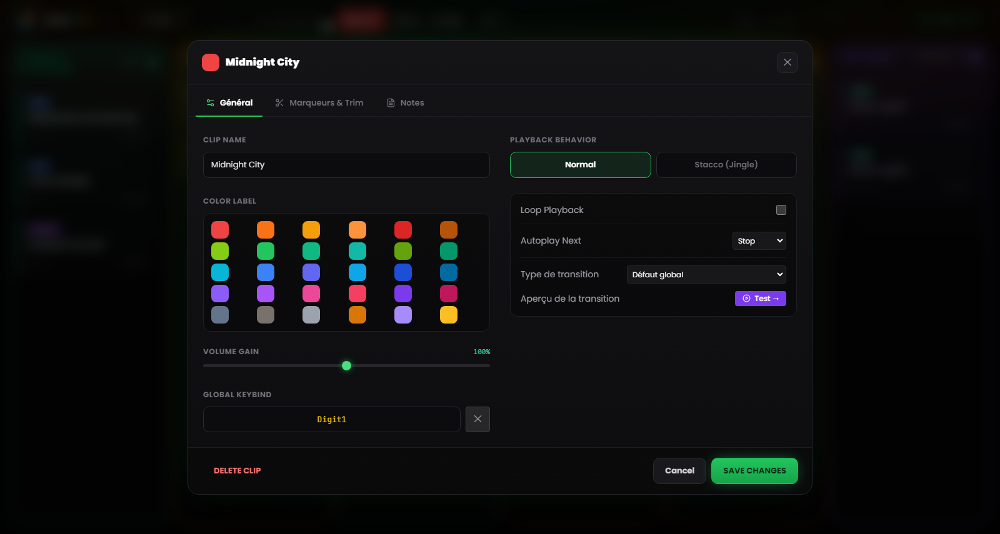
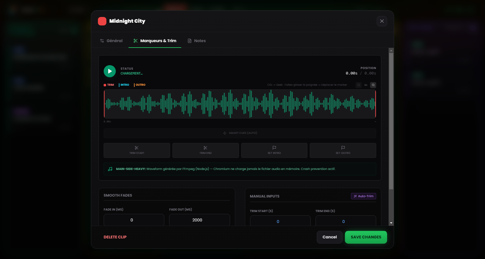

# Chapitre 5 — Propriétés du clip et Waveform Editor

---

Chaque fichier audio a son histoire avant d'arriver dans la grille : des enregistrements avec des secondes de silence initial, des morceaux aux codas interminables, des interviews au niveau trop bas par rapport au reste de l'émission. Plutôt que de recourir à un éditeur audio externe chaque fois qu'un fichier n'est pas « prêt pour l'antenne », RLMP met à disposition un panneau de configuration pour chaque clip et un éditeur visuel de forme d'onde doté de fonctions de coupe et de marquage.

Toutes les modifications apportées par ces outils sont **non destructives** : le fichier original sur le disque reste inchangé. RLMP mémorise les réglages dans le fichier de projet `.lmp` et les applique à la volée pendant la lecture.

Pour ouvrir les paramètres d'un clip, faites un **clic droit** sur la carte.

---

## 5.1 Propriétés de base

*Figure 5.1 — Les paramètres du clip : Clip Name, Color Label, Volume Gain, Playback Behavior, Autoplay Next et attribution des touches.*

### Nom et apparence

**Clip Name.** Vous pouvez attribuer un nom personnalisé au clip, indépendant du nom du fichier original. Le nom s'affiche sur la carte dans la grille. Employez des noms descriptifs et utiles à l'antenne : « GÉNÉRIQUE D'OUVERTURE » est plus lisible que `generique_rev3_final_def.mp3` quand vous avez trois secondes pour trouver le bon clip.

**Color Label.** Par défaut, le clip hérite de la couleur de sa colonne. Ici, vous pouvez lui attribuer une couleur spécifique pour le faire ressortir visuellement. Utile pour marquer des clips critiques (ex. le générique de clôture) ou pour différencier des groupes thématiques au sein d'une même colonne.

### Volume (Gain)

Le curseur de gain (Volume Gain) va de 0 % à 150 % et agit comme un pré-fader sur le clip précis, avant le Master Volume global.

Le cas d'usage le plus courant est l'alignement des niveaux : si vous avez une voix enregistrée à faible intensité (ex. un message WhatsApp ou un enregistrement téléphonique), vous pouvez la pousser au-delà de 100 % pour l'approcher du volume des autres pistes. À l'inverse, vous pouvez baisser un clip particulièrement « chaud » sans toucher au Master Volume.

---

## 5.2 L'éditeur de forme d'onde

*Figure 5.2 — L'éditeur de forme d'onde : poignées Trim Start/End, marqueurs Intro End et Outro Start, Auto-Trim, Smart Cues et fondus.*

L'éditeur visuel est la fonction la plus puissante du panneau de configuration. Il occupe la zone centrale du panneau et montre la représentation graphique de l'audio du clip entier.

### Navigation dans l'éditeur

**Zoom horizontal.** Vous pouvez agrandir la vue de la forme d'onde de 1× (vue complète) jusqu'à 8×, par paliers intermédiaires (1×, 2×, 3×, 4×, 6×, 8×), via le curseur de zoom ou la molette de la souris au-dessus de l'éditeur. À fort zoom, la vue défile en suivant la position courante.

**Règle adaptative.** L'axe temporel en haut de l'éditeur s'adapte automatiquement au zoom : en vue complète il affiche des repères espacés, au zoom maximal il les densifie jusqu'aux secondes.

**Playhead.** Pendant la lecture d'aperçu, un indicateur vertical blanc défile en temps réel le long de la forme d'onde, montrant la position courante. Un clic sur la forme d'onde déplace la lecture à cet endroit.

### Les quatre poignées

L'éditeur comporte quatre **poignées** déplaçables, chacune avec une fonction et une couleur précises :

**Trim Start (poignée rouge, à gauche).** Définit le point de début effectif du clip. Tout ce qui se trouve à gauche est ignoré pendant la lecture. Faites-la glisser vers la droite pour éliminer les silences ou les parties indésirables du début.

**Trim End (poignée rouge, à droite).** Définit le point de fin effectif. Tout ce qui se trouve à droite est ignoré. Faites-la glisser vers la gauche pour raccourcir la coda. Trim Start et Trim End ne peuvent pas se chevaucher.

**Intro End (poignée cyan).** Marque le point structurel où la mélodie principale entre dans le morceau, après l'éventuelle introduction. Une fois défini, le compte à rebours **INTRO: −MM:SS** apparaîtra sur la carte en lecture.

**Outro Start (poignée orange).** Marque le point où commence la coda du morceau, typiquement le moment où commencer à parler pour meubler la transition. Le compte à rebours **OUTRO IN: −MM:SS** apparaîtra sur la carte. Si la valeur est incohérente avec le trim ou avec la durée, le logiciel la désactive et vous en avertit.

Outre le glissement, quatre boutons *Set* placent chaque poignée à la position courante du playhead, pour un marquage à la volée pendant l'écoute. Les valeurs restent modifiables avec précision dans leurs champs respectifs.

### Auto-Trim (baguette magique)

Le bouton avec l'icône de la **baguette magique** lance la détection automatique du silence via FFmpeg. Le seuil n'est pas fixe : le logiciel estime d'abord le niveau moyen du fichier et fixe le seuil de silence à environ 25 dB sous ce niveau (dans une plage de sécurité comprise entre −55 et −20 dB ; à défaut d'estimation, il se rabat sur −40 dB). Le Trim Start et le Trim End sont ainsi placés automatiquement, éliminant silences initiaux et codas muettes sans intervention manuelle.

Cette fonction est particulièrement utile pour les enregistrements vocaux bruts : appels téléphoniques, messages audio, interviews captées sur mobile. Appliquer l'Auto-Trim à toute la colonne Voix avant une émission prend moins d'une minute et améliore la propreté des transitions.

> **Note technique.** L'analyse se déroule dans le Main Process via FFmpeg, sans charger le fichier en mémoire dans le Renderer. Sur les fichiers volumineux, le temps d'analyse reste de l'ordre de quelques secondes.

### Smart Cues (détection automatique des marqueurs)

À côté de l'Auto-Trim, la fonction **Smart Cues** propose automatiquement les marqueurs d'Intro et d'Outro. En utilisant un seuil plus agressif, elle repère le point où l'audio atteint sa pleine énergie (Intro) et celui où commence le fondu final (Outro), plaçant les deux marqueurs sans avoir à les chercher à l'oreille.

### Aperçu de la transition

S'il existe un clip **suivant** dans la même colonne, le bouton **« Test → »** rejoue les dernières secondes du clip courant et laisse la transition vers le suivant se déclencher, directement dans l'éditeur. Pendant l'aperçu, un bouton *Stop* interrompt l'essai.

---

## 5.3 Comportements et automatisation

### Behavior (Playback Behavior — mode de superposition)

**Normal** — comportement par défaut. Quand ce clip est lancé, il interrompt tout autre clip en lecture dans la même colonne (avec fondu de sortie). C'est le comportement correct pour les morceaux et les bases : un morceau exclut les autres.

**Stacco (Jingle)** — le clip est lancé sans interrompre les autres. Il a une priorité élevée : il fait taire les autres assets de la colonne et baisse la musique, mais n'arrête rien. Le cas d'usage typique est un *station ID* (« Vous écoutez… ») qui doit « chevaucher » l'intro d'un morceau, ou un jingle bref par-dessus une base en boucle.

### Next Action (Autoplay Next — automatisation en fin de clip)

Définit ce qui se passe quand le clip atteint le point de Trim End.

**Stop** — comportement par défaut pour Musiques, Voix et Assets. Le clip se termine et s'arrête.

**Play Next** — quand le clip approche de la fin, il lance automatiquement le clip suivant de la colonne avec la transition configurée. Le badge **NEXT** apparaît sur la carte. C'est le comportement par défaut de la colonne Pré-émission et cela crée de fait une playlist automatique : vous pouvez le configurer sur plusieurs clips consécutifs pour construire des blocs qui s'enchaînent sans interruption.

La lecture en **boucle** (Loop Playback) est une option à part : quand elle est active, le clip recommence depuis le début (depuis le Trim Start) sans transition, et le badge **LOOP** apparaît sur la carte. Utilisez-la pour les bases musicales, les ambiances sonores ou les génériques de fond qui doivent tourner tant qu'ils ne sont pas explicitement arrêtés. Les modes de transition — Crossfade, Segue, Gapless — sont décrits au Chapitre 13.

---

## 5.4 Fondus (Fade In et Fade Out)

Le panneau permet de définir, pour chaque clip, la durée des fondus en entrée et en sortie. Les valeurs vont de 0 à 60 000 millisecondes (60 secondes) et la courbe appliquée est linéaire.

**Fade In.** Le temps que met le volume à atteindre le niveau maximal depuis le démarrage. Une valeur de 2000 ms produit une montée progressive de deux secondes. Employez-le sur les bases musicales qui doivent émerger en douceur ; gardez-le à 0 pour les voix et les effets qui doivent s'entendre immédiatement.

**Fade Out.** Le temps de fondu à la fermeture — que ce soit en cliquant sur un clip actif ou lors des transitions. Valeurs typiques : 2000–3000 ms pour les morceaux, 500–1000 ms pour les bases, 0 ms pour les stacchi secs.

Un fondu de sortie à 0 ms produit une coupure immédiate (« hard cut »). Sur un morceau musical en direct, il peut être perçu comme une erreur technique : évaluez avec attention quand il est approprié.

---

## 5.5 Attribution des commandes

Chaque clip peut aussi être lancé depuis une touche du clavier ou un contrôleur MIDI.

**Global Keybind.** La touche du clavier attribuée au clip. Vous pouvez la définir depuis le champ dédié des paramètres du clip (cliquez et appuyez sur la touche voulue) ou depuis la fenêtre **Raccourcis & tableau MIDI** accessible dans le menu Outils. Le badge correspondant apparaît sur la carte. Si la touche est déjà attribuée à un autre clip, le logiciel signale le conflit avant d'écraser.

**MIDI Bind.** La note MIDI attribuée (ex. `NOTE:60`). L'attribution se fait via le mode **MIDI Learn** (voir Chapitre 8), non en saisissant le numéro à la main.

Les bindings des clips sont enregistrés dans le fichier de projet : en transportant le projet sur un autre ordinateur avec le même contrôleur MIDI, les mappings fonctionneront sans reconfiguration.
