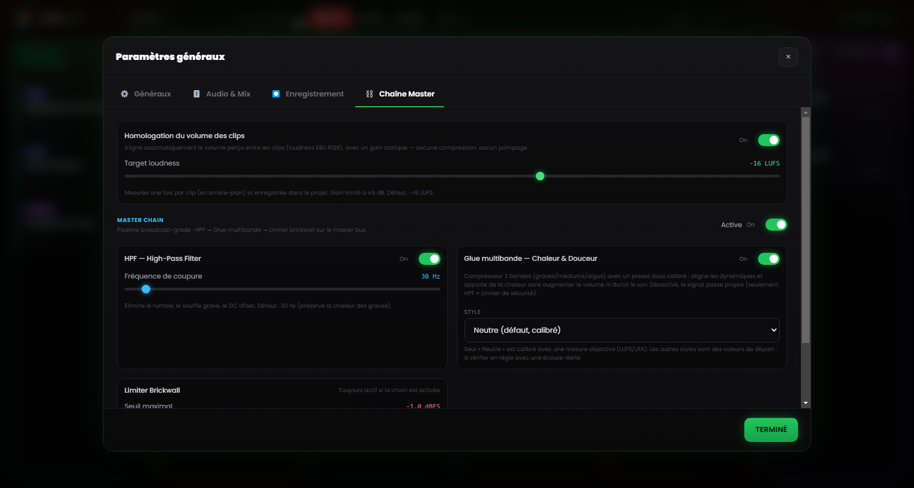

# Chapitre 6 — Le moteur de mixage

---

Le problème de fond de la régie radiophonique manuelle, c'est la multiplication des actions simultanées : lancer un morceau, baisser la musique, parler au micro, préparer le clip suivant, garder un œil sur l'horloge. Chaque opération de plus est une occasion d'erreur, dans un contexte où l'erreur est publique et immédiate.

Le moteur de mixage de Runtime Live Machine Pro élimine la plupart de ces actions intermédiaires en les déléguant au logiciel. Il ne s'agit pas d'automatisation au sens de « le logiciel fait les choses à votre place sans que vous le sachiez », mais de l'automatisation des règles que vous définiriez vous-même si vous aviez assez de mains pour toutes les exécuter.

---

## 6.1 La hiérarchie audio

Le système de mixage automatique repose sur une **hiérarchie de priorité** entre les types de clips. La façon la plus immédiate de la comprendre est de l'imaginer comme une échelle de « droit de parole ».

**Voix / Enregistrements — priorité absolue.**
Quand un clip voix est en lecture, il reste à son volume nominal et tout le reste baisse. Aucun autre signal ne peut passer outre cette règle.

**Musiques de l'épisode.**
Elles cèdent l'espace aux Voix, mais dominent les bases des Assets. Quand un morceau entre, les bases musicales des Assets s'annulent (elles ne s'arrêtent pas : elles continuent de tourner en silence, prêtes pour le retour). C'est la Music Dominance, décrite plus loin.

**Show Assets, Jingle et Promo — les bases de service.**
Elles sont baissées par les Voix et réduites au silence par les Musiques. Mais quand un asset est un **Stacco**, c'est lui qui prend le dessus (voir §6.4).

**Effets du pad FX.**
Les effets sonores restent hors de la hiérarchie : ils jouent à leur propre volume, se superposent à ce qui est à l'antenne et ne sont pas réduits au silence. Il y a une seule courtoisie envers la parole : quand une voix est active, les effets descendent à mi-volume (50 %) pour ne pas la couvrir, puis remontent d'eux-mêmes.

---

## 6.2 Ducking automatique

Le **ducking** est le mécanisme par lequel un signal est baissé quand un signal de priorité supérieure entre en lecture.

Le cas le plus courant : un morceau joue à pleine dynamique ; vous lancez une interview préenregistrée depuis la colonne Voix. À cet instant, RLMP amène le morceau à environ **20 % du volume** (une réduction d'environ 14 dB) avec un fondu doux d'une demi-seconde, de sorte que la voix occupe l'espace sonore de façon intelligible. Dès que l'interview se termine, le morceau remonte à son volume d'origine avec un fondu d'entrée tout aussi fluide.

L'opérateur ne touche à rien. Le seul geste accompli a été un clic : lancer l'interview. L'ampleur de la réduction et sa rapidité se règlent dans les Paramètres (Chapitre 13).

---

## 6.3 Music Dominance : gestion intelligente des bases

Une erreur sonore classique, c'est le moment où un morceau et une base musicale (*bed*) se superposent : deux éléments rythmiques qui s'entrechoquent, deux grosses caisses qui ne coïncident pas, un résultat confus.

RLMP gère ce scénario avec la **Music Dominance**.

**Le scénario type.** Une base tourne en boucle dans la colonne Assets, sous la voix de l'animateur. L'animateur lance un morceau depuis la colonne Musiques.

**Ce que fait RLMP.** Il n'arrête pas la base, car l'arrêter obligerait ensuite à la relancer à la main. Il l'amène plutôt en silence à **volume zéro**, en la gardant en lecture « en fantôme » : le fichier continue de défiler, la boucle continue, mais on n'entend rien.

**Le résultat sonore.** On n'entend que le morceau. La base a disparu sans que l'opérateur ait rien fait.

**Le retour.** Quand le morceau se termine, la base réémerge avec un fondu d'entrée automatique, reprenant au point où elle en était dans la boucle. Le flux (base → morceau → base) se déroule sans un seul clic supplémentaire.

---

## 6.4 Stacchi : l'exception à la règle

Le comportement **Stacco** (« coupe/transition brève » ; configurable dans les propriétés de chaque clip, voir Chapitre 5) renverse temporairement la hiérarchie : le clip qui le porte devient prioritaire. Il fait taire les autres assets de sa colonne et baisse la musique, mais n'arrête rien. Le fondu appliqué est plus rapide que celui du ducking ordinaire, pour une entrée plus percussive et nette.

L'usage typique est le *station ID* vocal (« Vous écoutez… ») : il doit s'entendre clairement, pendant que la base en dessous continue de tourner. Pour un résultat plus soigné, associez le Stacco à un fondu d'entrée bref (300–500 ms) : l'entrée sera douce, non brutale.

---

## 6.5 Homologation du volume (loudness)

Les clips de provenances différentes arrivent presque toujours à des niveaux différents : un générique bien masterisé, une voix téléphonique enregistrée trop bas, un morceau téléchargé à un volume qui lui est propre. Pour éviter des ajustements manuels continuels du Gain, RLMP applique par défaut une **homologation du volume** fondée sur la norme de loudness EBU R128, avec une cible de **−16 LUFS**.

En pratique, le logiciel évalue la sonorité perçue de chaque clip et la rapproche d'une référence commune, de sorte que morceaux, voix et bases partent déjà sur un plan cohérent. La fonction est active par défaut et la valeur cible se règle dans Paramètres → Master Chain.

---

## 6.6 Master Chain : la chaîne de processeurs sur le master bus

*Figure 6.1 — La Master Chain : homologation du volume (−16 LUFS), HPF à 30 Hz, glue multibande et limiter brickwall.*

Le signal combiné de tous les clips en lecture, après le Master Volume, traverse une **chaîne de processeurs** sur le bus master avant d'atteindre le périphérique de sortie. La chaîne est active par défaut et conçue pour un son broadcast-grade sans exiger de configuration avancée.

Elle comprend trois étages en série.

**High-Pass Filter (HPF) à 30 Hz.**
Élimine les fréquences sub-bass inutiles qui consomment du headroom et peuvent salir les systèmes de diffusion, avec une pente douce. La fréquence de coupure est réglable (20–200 Hz). Désactivé, l'étage devient complètement transparent.

**Glue multibande.**
Non pas un unique compresseur, mais trois compresseurs « doux » qui travaillent en parallèle sur trois bandes de fréquence (graves, médiums, aigus), séparées par un crossover. Chaque bande a des seuils et des ratios calibrés pour « coller » (Glue) le mix sans l'écraser, et contenir la variance dynamique entre clips de niveaux différents. Le style se choisit parmi quelques presets (Neutre, Rock, Jazz, Électronique) ; le preset par défaut est Neutre.

**Limiter brickwall.**
Seuil à −1 dBFS, avec un ratio de limitation élevé et une réaction très rapide. Il garantit que le signal ne dépasse jamais le niveau maximal autorisé, prévenant la distorsion numérique (clipping) quoi qu'il arrive en amont.

L'ensemble de la chaîne, et chaque étage individuel, se configure et se désactive depuis Paramètres → Master Chain, où vous trouvez aussi un bouton pour rétablir les valeurs par défaut. Dans un contexte où le signal est déjà traité par un mixeur matériel ou une chaîne externe, vous pouvez la désactiver pour éviter un double traitement.
