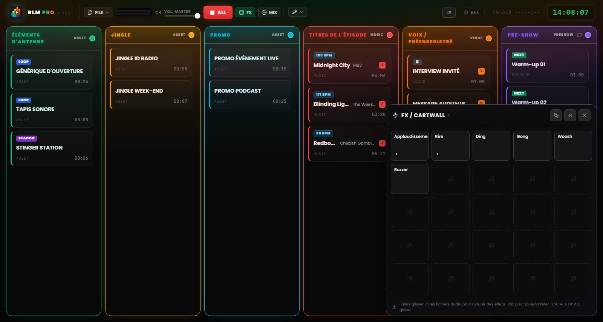
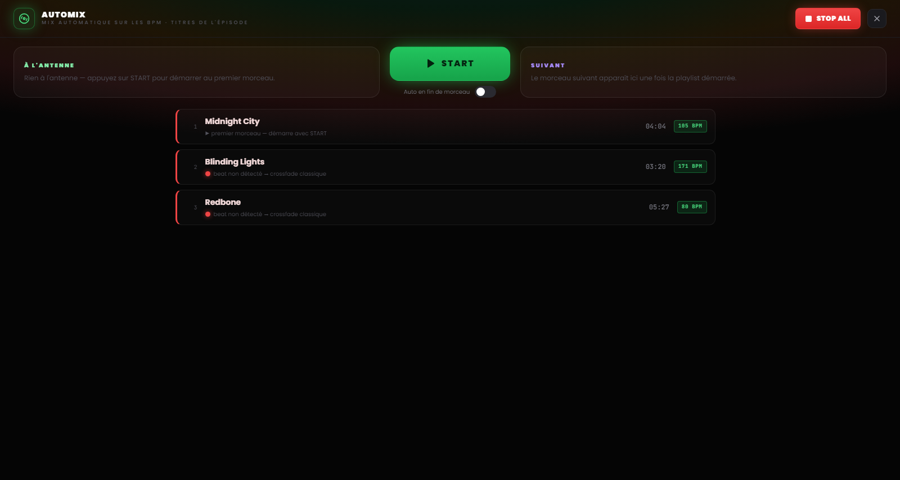

# Chapitre 7 — Le pad FX et la vue Automix

---

Deux surfaces de travail vivent au-dessus de la grille, rappelables d'une touche et pensées pour deux moments opposés de la régie : le **pad FX**, pour lancer effets et stacchi à coup sûr sans rien interrompre, et la **vue Automix**, pour gérer le flux musical comme le ferait un DJ. Aucune des deux ne prend d'espace à la grille : elles s'ouvrent quand on en a besoin et se ferment d'un clic.

---

## 7.1 Le pad FX : la jingle machine

*Figure 7.1 — Le pad FX : la jingle machine 5×5 des effets sonores, avec lancement superposé.*

Les effets sonores n'ont pas de colonne dans la grille. Ils vivent dans le **pad FX**, un panneau en grille de cellules (une *jingle machine*) qui s'ouvre depuis le bouton **FX** de l'en-tête et reste flottant dans un coin de l'écran.

Le pad est un **overlay non bloquant** : il n'obscurcit pas la board et n'intercepte pas les clics adressés ailleurs. Vous pouvez lancer un effet et, dans le même instant, continuer à opérer sur les colonnes ou sur les commandes de l'en-tête. Pour cette raison, la touche `Échap` ne ferme pas le pad : elle reste la commande de STOP ALL, toujours disponible. Le pad se ferme depuis son bouton de fermeture ou de nouveau depuis le toggle FX.

### Charger et lancer les effets

Le pad naît avec une grille de 25 cellules (5×5) et grandit en lignes quand vous ajoutez d'autres effets. Pour le peupler, **faites glisser les fichiers audio directement sur les cellules** du pad, exactement comme vous le feriez avec une colonne de la grille.

Un clic sur une cellule **lance l'effet**. Les effets du pad sont polyphoniques et se superposent : plusieurs cellules peuvent jouer ensemble, par-dessus tout ce qui est à l'antenne, sans l'arrêter. Le comportement audio est identique à celui d'un clip normal : seule change la surface de lancement. Un compteur à côté du bouton FX de l'en-tête indique combien d'effets jouent à cet instant.

### Configurer un effet

Les effets se configurent sur deux niveaux, pensés pour deux besoins différents :

- **Paramètres rapides** — le cas courant pour une jingle machine : nom, couleur, volume, boucle. Quelques secondes suffisent.
- **Paramètres complets** — la même fenêtre que les clips de la grille (éditeur de forme d'onde, trim, marqueurs, fade, attribution des touches), accessible depuis l'entrée « Paramètres complets… » au sein des paramètres rapides.

### Position du pad

Le pad peut se placer dans le coin en bas à gauche ou en bas à droite de l'écran : la préférence se règle avec les flèches du pad lui-même et elle est mémorisée d'une session à l'autre. À droite, il couvre la NoteBoard et la dernière colonne ; choisissez le côté selon la façon dont vous avez disposé votre conduite.

> **Note.** En mode MIDI Learn, un clic sur une cellule du pad **sélectionne** l'effet pour l'attribution au lieu de le jouer — ainsi vous ne diffusez pas un jingle pendant que vous mappez les commandes (voir Chapitre 8).

---

## 7.2 La vue Automix

*Figure 7.2 — La vue Automix : le deck de la colonne Musique, la compatibilité BPM et le mode automatique en fin de morceau.*

La **vue Automix** est le deck de la colonne Musique : un écran plein cadre, rappelé par le bouton **MIX** de l'en-tête, qui présente la conduite musicale comme une console de DJ. Elle s'ouvre au-dessus de la board mais sous le pad FX, ainsi les effets restent utilisables même quand l'Automix est ouvert. Comme pour le pad, `Échap` ne la ferme pas : elle reste la commande d'urgence, et le bouton STOP ALL demeure accessible dans l'en-tête.

### Le deck

Au centre se trouvent le morceau **à l'antenne** et, en file d'attente, le **prochain** morceau de la colonne Musique, avec le temps restant. De là, vous pouvez lancer une piste et gérer le passage d'un morceau à l'autre d'une seule commande : le gros bouton de transition applique le même crossfade que vous utiliseriez depuis la grille, mais avec l'attention en plus du calage rythmique.

### Compatibilité et transitions beat-matched

À côté de chaque morceau, une **pastille de compatibilité** avec le morceau précédent en indique l'affinité rythmique :

- **Vert** — les deux tempos se calent bien : la transition peut être beat-matched.
- **Jaune** — calage possible mais avec quelques réserves.
- **Rouge** — tempos trop éloignés pour un calage propre.

Quand le calage rythmique n'est pas praticable (BPM non détecté, beat incertain, tempos trop différents), le logiciel le déclare et se rabat automatiquement sur un **crossfade classique**, sans surprise en direct.

### Le mode automatique

En bas de la vue se trouve un interrupteur pour l'**automatisation en fin de morceau**. Quand il est actif, RLMP lance de lui-même le passage au morceau suivant lorsque la piste à l'antenne approche de la fin.

Ce mode est une exception délibérée à la philosophie du logiciel, qui par choix n'automatise pas l'émission. C'est pourquoi il est **désactivé par défaut** et ne fonctionne **que tant que la vue Automix est ouverte** : fermer la vue désactive l'automatisation. C'est l'outil qu'il faut pour un bloc musical continu, la demi-heure de musique seule avant de revenir en voix, non pour tout le direct.
