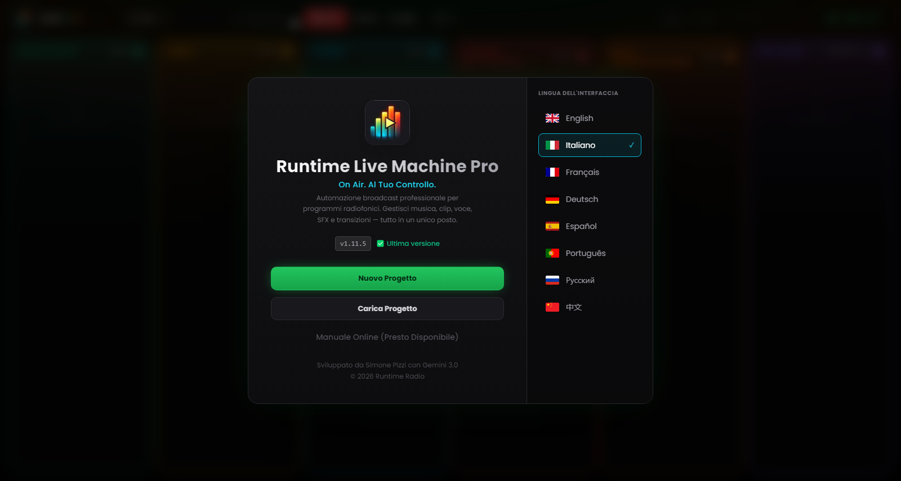

# Capitolo 2 — Installazione e primo avvio

---

L'installazione di Runtime Live Machine Pro è progettata per richiedere il minimo di interazione: pochi click, nessuna configurazione manuale, nessun prerequisito da installare separatamente. Il motore audio (FFmpeg) è integrato nel pacchetto di installazione e non richiede alcun intervento da parte tua.

---

## 2.1 Requisiti di sistema

Prima di procedere, verifica che il tuo computer soddisfi i requisiti minimi. Le specifiche consigliate garantiscono la migliore esperienza durante sessioni lunghe o con molte clip caricate simultaneamente.

| | Minimo | Consigliato |
|---|---|---|
| **Sistema operativo (Windows)** | Windows 10 64-bit | Windows 11 64-bit |
| **Sistema operativo (macOS)** | macOS 11 Big Sur, compilando dal sorgente | macOS 13 Ventura o successivi |
| **Sistema operativo (Linux)** | Ubuntu 20.04 / Debian 11 | Ubuntu 22.04 LTS |
| **RAM** | 4 GB | 8 GB o più |
| **Spazio su disco** | 300 MB (applicazione) | 1 GB + spazio per i file audio |
| **CPU** | Qualsiasi dual-core moderno | Quad-core o superiore |

Per Windows e Linux sono disponibili pacchetti pronti. Su macOS non esiste un installer ufficiale: il programma si compila dal sorgente (paragrafo 2.3).

Non è richiesta una scheda audio dedicata: RLMP funziona con qualsiasi periferica audio riconosciuta dal sistema operativo, dalla scheda audio integrata ai mixer USB professionali come il Rødecaster Pro o l'RØDECaster Duo.

---

## 2.2 Installazione su Windows

1. Scarica il file `Runtime-Live-Machine-Pro-1.15.33.exe` dalla pagina **Releases** del progetto su GitHub (`github.com/Pitz72/RRLMP/releases`).
2. Fai doppio click sull'eseguibile. L'installer NSIS si avvierà e copierà i file nelle directory appropriate.
3. Al termine, un collegamento verrà creato sul Desktop e nel menu Start.
4. L'applicazione si avvia automaticamente al completamento dell'installazione.

**Nota su Windows SmartScreen.** Gli installer non sono firmati con un certificato commerciale, quindi SmartScreen non li riconosce in automatico. Se compare l'avviso «Il PC è stato protetto da Windows», clicca su *Ulteriori informazioni* e poi su *Esegui comunque*. Il software è privo di malware; gli installer ufficiali sono pubblicati esclusivamente nella pagina Releases del progetto, e il codice sorgente è pubblico.

---

## 2.3 macOS: compilare dal sorgente

Per macOS non esiste un installer ufficiale. Runtime Live Machine Pro è software libero: chi ha un Mac può scaricare il codice sorgente e compilare il programma sul proprio computer.

1. Installa **Node.js 20** (e git, se vuoi clonare il repository).
2. Scarica il codice da `github.com/Pitz72/RRLMP`, con il pulsante *Code* oppure con `git clone`.
3. Nella cartella del progetto esegui, in ordine: `npm ci`, `npm run build:main`, `npm run build:preload`, `npx vite build` e `npx electron-builder --mac --publish never`.
4. Il file `.dmg` si trova nella cartella `builds/`: aprilo e trascina l'applicazione in *Applicazioni*.

Il pacchetto compilato così non è firmato: al primo avvio macOS mostra un avviso Gatekeeper. Fai clic destro sull'applicazione e scegli *Apri*, oppure consenti l'apertura da *Impostazioni di Sistema* → *Privacy e sicurezza*, nella sezione *Sicurezza*. Le istruzioni sempre aggiornate stanno nel file `CONTRIBUTING.md` del progetto.

> **Nota.** Un'applicazione compilata da sé segnala le nuove versioni ma non può installarle: per aggiornare si scarica il codice aggiornato e si ricompila (Capitolo 12). I progetti `.lmp` restano compatibili.

---

## 2.4 Installazione su Linux

Sono disponibili due formati di distribuzione:

- **AppImage** — eseguibile portabile, non richiede installazione. Rendi il file eseguibile (`chmod +x`) e avvialo direttamente.
- **Pacchetto .deb** — per distribuzioni Debian/Ubuntu/Mint. Installa con `sudo dpkg -i nomefile.deb` oppure aprilo con il gestore pacchetti grafico.

Su alcune distribuzioni potrebbe essere necessario installare il pacchetto `libasound2` per il supporto audio ALSA. Consulta la documentazione della tua distribuzione se l'applicazione non si avvia.

---

## 2.5 La schermata di benvenuto

*Figura 2.1 — La schermata di benvenuto: identità del software, stato dell'aggiornamento, azioni principali e tendina della lingua in alto a destra.*

Al primo avvio — e a ogni avvio successivo, finché non apri un progetto — RLMP presenta la **schermata di benvenuto**, il punto di accesso a tutte le operazioni preliminari. Al centro trovi identità del software e azioni; in alto a destra, la tendina della lingua.

**Identità e azioni.**
Il logo del software (le barre di un VU meter con il simbolo di play) identifica la versione Pro. Sotto il titolo e lo slogan compare il numero di versione installata, accompagnato dallo stato del sistema di aggiornamento:

- **«Aggiornato»** (verde) — stai usando l'ultima versione disponibile.
- **«Aggiornamento disponibile»** (ambra, lampeggiante) — è un pulsante: cliccalo per aprire la finestra di aggiornamento (Capitolo 12).
- **«OFFLINE»** (rosso tenue) — non è stato possibile contattare il servizio di aggiornamento; il software funziona ugualmente.

Sotto trovi le azioni principali:

- *Nuovo Progetto* — crea una sessione vuota con le colonne pronte al caricamento.
- *Carica Progetto* — apre un file `.lmp` esistente. Prima di renderlo operativo, RLMP esegue un **controllo di integrità**: verifica che ogni file audio referenziato esista ancora nel percorso memorizzato. I file mancanti vengono immediatamente segnalati con un bordo rosso sulla rispettiva clip.
- *Manuale Utente* — apre nel browser questo manuale in PDF, nella lingua dell'interfaccia (italiano o inglese). Serve una connessione a internet.
- *Guida Rapida* — una guida sintetica per iniziare, che si apre dentro il software e si consulta anche offline.

**Lingua (in alto a destra).**
RLMP supporta due lingue dell'interfaccia: Inglese e Italiano. La tendina in alto a destra mostra bandiera e nome della lingua attiva: cliccala e scegli l'altra. La selezione ha effetto immediato e viene memorizzata tra una sessione e l'altra.

---

## 2.6 Il primo avvio: cosa aspettarsi

Alla prima apertura di un progetto, noterai nell'header il logo con il badge **PRO** dal gradiente iridescente. Dietro l'interfaccia, l'apertura del progetto avvia il motore audio in background: FFmpeg viene inizializzato e il protocollo di streaming `media://` si mette in ascolto, pronto a servire i file dal disco senza caricarli in memoria.

Il software si avvia preferibilmente in modalità a tutto schermo. Se la finestra dovesse aprirsi ridimensionata, premi `F11` (Windows/Linux) o `Ctrl+Cmd+F` (macOS) per portarla a schermo intero — condizione ottimale per il lavoro di regia.

Il **Timer On Air** nell'header rimarrà a `--:--:--` finché non viene lanciata la prima clip della sessione. Da quel momento inizierà a contare il tempo trascorso in diretta: un riferimento utile per chi lavora con scalette a tempo fisso.
