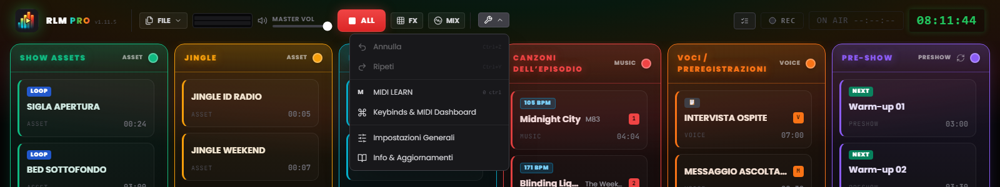
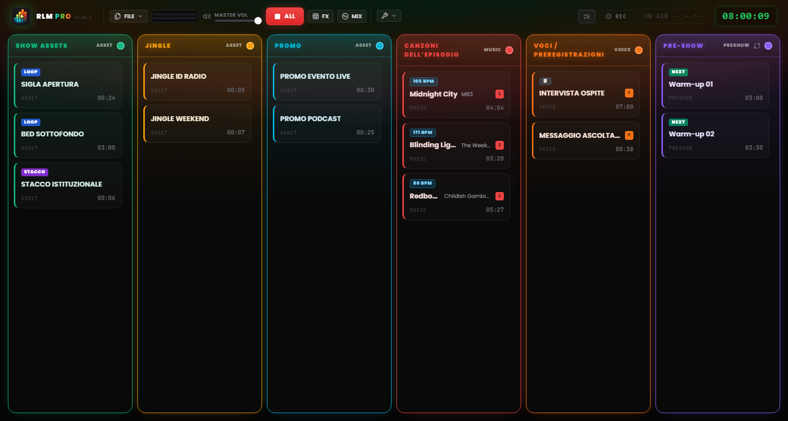

# Capitolo 3 — L'interfaccia di lavoro

---

L'interfaccia di Runtime Live Machine Pro è costruita per il contesto operativo più esigente: la diretta. Ogni scelta visiva — il tema scuro, l'alto contrasto, le dimensioni dei controlli — risponde a un requisito funzionale. Non è estetica per l'estetica, ma ergonomia.

Quando apri un progetto, lo schermo si divide in due zone distinte: la **Barra di Controllo** in alto, che gestisce il progetto e il sistema, e la **Griglia di Regia** centrale, dove si svolge il lavoro effettivo.

---

## 3.1 La Barra di Controllo (Header)

L'header occupa l'intera larghezza dello schermo. Procedendo da sinistra a destra, raccoglie l'identità del software, i comandi sui file, il monitoraggio e i controlli di trasporto, il menu degli strumenti e gli indicatori di sessione.

### Identità

**Logo e badge PRO.** A sinistra, il logo affianca la scritta **RLM PRO** — la parola «PRO» è resa con un gradiente iridescente che passa dal ciano al verde, all'ambra, al rosso. Accanto, in caratteri monospazio, è riportata la versione installata (`v1.11.5`). Passando il mouse sul logo compare il nome completo del software con il numero di versione.

### Menu File

Il pulsante **FILE** apre un menu con le operazioni sui progetti:

- *Nuovo Progetto* — apre una sessione vuota. Se ci sono modifiche non salvate, il software chiede conferma.
- *Salva Progetto* — salvataggio rapido sul file `.lmp` corrente. La voce si evidenzia in giallo quando ci sono modifiche non salvate.
- *Salva Come…* — apre sempre la finestra di dialogo, per creare versioni progressive (es. `Ep47_bozza.lmp`, `Ep47_finale.lmp`).
- *Carica Progetto* — apre un progetto `.lmp` dal disco.
- *Importa M3U* — importa una playlist in formato M3U come sequenza di clip.
- *Esporta Archivio* — crea una copia autocontenuta del progetto, comprensiva dei file audio. Descritto nel Capitolo 10.

### Monitoraggio e trasporto

**VU Meter stereo (L/R).** Due barre orizzontali mostrano il livello audio reale in uscita dopo il Master Volume. La scala cromatica è intuitiva: verde fino a circa l'85% del percorso, poi giallo, infine rosso in prossimità del fondo scala. Il rosso persistente segnala clipping: riduci il livello.

**Master Volume.** Il fader controlla il volume generale di uscita del software, da 0 a 100%. Agisce come un fader master: portato a zero, nessun suono esce, indipendentemente dallo stato delle singole clip. Se hai mappato un controllo MIDI sul Master Volume, un piccolo badge ne mostra l'assegnazione.

**STOP ALL (pulsante rosso «ALL»).** Ferma istantaneamente tutte le clip attive e azzera i fade in corso. È il comando di emergenza del sistema. Il tasto `Esc` sulla tastiera esegue la stessa funzione quando l'applicazione è a fuoco — anche mentre stai scrivendo in un campo di testo.

> **Nota.** A differenza delle versioni precedenti, `Esc` non è più registrato come scorciatoia globale di sistema: agisce quando RLMP è la finestra attiva. Questa scelta consente alle finestre di dialogo di usare `Esc` per chiudersi senza fermare la diretta.

**FX.** Apre e chiude il pad FX, la *jingle machine* degli effetti (Capitolo 7). Un piccolo contatore segnala quanti effetti sono in riproduzione in quel momento.

**MIX.** Apre e chiude la vista Automix, il deck dedicato alla colonna Musica (Capitolo 7).

### Strumenti

Il menu **Strumenti** (icona a chiave inglese) raccoglie:

- *Annulla* e *Ripeti* — la cronologia delle modifiche alla scaletta (`Ctrl+Z` / `Ctrl+Y`).
- *MIDI Learn* — attiva la modalità di apprendimento MIDI (Capitolo 8).
- *Keybinds* — la finestra di assegnazione dei tasti alle clip.
- *Impostazioni* — le preferenze globali del software (Capitolo 13).
- *Info* — versione, crediti e controllo manuale degli aggiornamenti.

Poco sotto il menu compare per qualche istante l'indicatore *Auto-saved*, a conferma che il progetto è stato salvato automaticamente.

*Figura 3.1 — La Barra di Controllo e il menu Strumenti aperto (Annulla/Ripeti, MIDI Learn, Keybinds, Impostazioni Generali, Info).*

### Indicatori di sessione

Sul lato destro dell'header trovano posto il pulsante del **Playout Log** (il registro cronologico dei lanci, Capitolo 13), il pulsante di **Registrazione** (Capitolo 9), il **Timer On Air** (che quando è in diretta mostra `ON AIR HH:MM:SS` su fondo rosso) e l'**orologio di studio** digitale in formato 24 ore, sincronizzato con l'orologio di sistema.

Nell'area dell'header possono comparire inoltre notifiche non intrusive (**toast**) relative a operazioni completate o avvisi di sistema. A differenza dei dialog bloccanti, i toast scompaiono da soli dopo pochi secondi e non interrompono la riproduzione.

---

## 3.2 La griglia a sei colonne

*Figura 3.2 — L'interfaccia di lavoro: la griglia a sei colonne con le card audio.*

La griglia è il centro operativo del software: sei colonne verticali affiancate, ciascuna con una propria intestazione cromatica e una propria logica di comportamento audio. Gli effetti sonori non hanno una colonna in griglia: vivono nel pad FX (Capitolo 7).

### Intestazioni di colonna

Ogni intestazione riporta il nome della colonna, la sua tipologia e funge da indicatore di stato. In condizioni normali è statica e colorata nel tono caratteristico della colonna. Quando la clip in riproduzione è l'ultima disponibile della colonna, non è in loop e mancano meno di **20 secondi** alla fine, l'intestazione entra in allarme **DEAD AIR**: pulsa, vira all'ambra, mostra un'icona di avviso e il badge **END**. È l'anticipo che ti dà il tempo di preparare la traccia successiva prima del silenzio.

Il colore di ogni colonna è personalizzabile: clicca sul pallino colorato nell'intestazione per aprire una palette di **30 tinte**. La scelta viene salvata nel file di progetto.

Sull'intestazione della colonna **Pre-Show** compare inoltre un pulsante di **rotazione**: quando è attivo, la coda pre-diretta inserisce automaticamente jingle e promo a intervalli regolari (Capitolo 13).

### Le sei colonne

**Show Assets (Verde)**
Gli elementi strutturali dello show: sigle, basi musicali, sottofondi (*bed*), stacchi istituzionali. Si comportano come elementi di secondo piano: cedono spazio quando sopraggiungono voci o canzoni, ma mantengono la rotazione interna finché non vengono fermate.

**Jingle (Ambra)** e **Promo (Ciano)**
Due colonne dedicate, rispettivamente, ai jingle identificativi e alle promo o autopromozioni. Sul piano audio si comportano esattamente come gli Show Assets (appartengono alla stessa famiglia), ma tenerle separate mantiene la scaletta ordinata e leggibile.

**Canzoni dell'episodio (Rosso)**
La playlist musicale. Le clip di questa colonna partecipano attivamente al mixaggio automatico: vengono abbassate quando suonano le voci e, a loro volta, silenziano le basi degli Assets quando entrano in riproduzione (Capitolo 6). Sulle clip musicali il software rileva automaticamente il **BPM**, mostrato con un apposito badge.

**Voci / Preregistrazioni (Arancione)**
Interviste, blocchi parlati preregistrati, messaggi vocali. Questa colonna ha la **priorità massima** nel sistema di mixaggio: quando una clip qui è in riproduzione, tutti gli altri segnali vengono abbassati a un livello di sottofondo.

**Pre-Show (Viola)**
La playlist di riscaldamento pre-diretta. Funziona come una coda musicale autonoma, con rotazione opzionale di jingle e promo. Quando inizia la diretta vera e propria, questa colonna viene tipicamente svuotata o disattivata.

---

## 3.3 La Card Audio (Clip)

Ogni file audio importato si materializza nella griglia come una **card** rettangolare. La card è l'unità operativa del sistema: la vedi, la lanci, la configuri, la sposti.

### Anatomia di una card

**Titolo e artista.** Il nome del file o il nome personalizzato assegnato nelle proprietà. Il titolo personalizzato cambia solo l'etichetta nel software; il file originale sul disco rimane intatto. Per le clip musicali, sotto il titolo può comparire il nome dell'artista.

**Timer.** A riposo, mostra la durata totale della clip nel formato `MM:SS`. Durante la riproduzione passa al **conto alla rovescia**, con il prefisso negativo (es. `−01:20`). Quando mancano meno di 15 secondi alla fine, il timer diventa **rosso**.

**Badge di stato.** Piccole etichette comunicano in modo immediato le proprietà configurate:

- **STACCO** — la clip è impostata per sovrapporsi alle altre senza fermarle.
- **LOOP** — la clip ripartirà dall'inizio al termine della riproduzione.
- **NEXT** — al termine di questa clip partirà automaticamente la successiva nella colonna.
- **▶ UP NEXT** — evidenzia quale clip sarà la prossima a partire nella sequenza automatica.
- **### BPM** — il tempo rilevato, sulle clip musicali.
- **TRIM…** — analisi del silenzio in corso (Auto-Trim).
- **FADE OUT** — appare sulla clip uscente durante un crossfade o una dissolvenza.
- **📋** — la clip ha una nota associata nella NoteBoard (Capitolo 13).

**Assegnazioni.** Se la clip ha un tasto della tastiera assegnato, la lettera compare in un badge dal colore della colonna; se ha un binding MIDI, compare l'etichetta `M` seguita dal numero di nota (es. `M60`).

**Cue di struttura.** Se sono configurati i marker, durante la riproduzione compaiono i conti alla rovescia `INTRO: −MM:SS` (in ciano) e `OUTRO IN: −MM:SS` (in arancione), fino all'avviso `🚨 OUTRO` quando la coda è iniziata.

**Indicatore di riproduzione.** Quando una clip è in play, la card si accende: bordo verde, sfondo con un alone luminoso, un pallino pulsante e il titolo evidenziato. La barra di avanzamento scorre sullo sfondo della card.

### Interazione con le card

- **Click sinistro** — avvia la clip se è ferma; la ferma (con fade out) se è in riproduzione.
- **Ctrl + Click** (Windows/Linux) o **Cmd + Click** (macOS) — seleziona la clip senza avviarla. Il bordo diventa blu. Utile per la selezione multipla e la cancellazione in blocco.
- **Tasto Canc** (o *Delete* / *Backspace*) — cancella le clip selezionate dalla griglia. Se sono selezionate più clip, il software chiede conferma.
- **Tasto destro** — apre le **Impostazioni della clip**: proprietà, editor della forma d'onda, note (Capitolo 5).
- **Drag & Drop** — trascina una card per riordinarla all'interno della colonna o spostarla in un'altra. Un indicatore luminoso blu mostra la posizione di inserimento durante il trascinamento.

### Card in stato di errore

Una card con l'indicazione **FILE MANCANTE** e il bordo rosso segnala che il file audio referenziato non è più raggiungibile: è stato spostato, rinominato o si trova su un disco esterno non collegato. La clip non è riproducibile finché il file non torna disponibile nel percorso originale. La gestione degli errori di percorso è trattata nel Capitolo 14.
