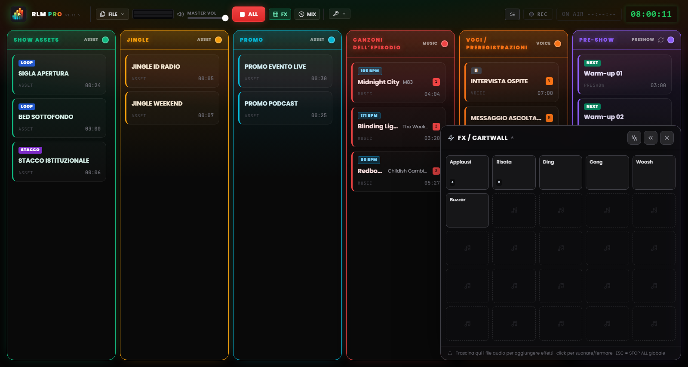
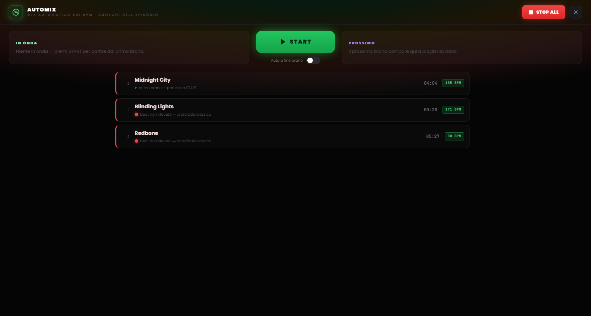

# Capitolo 7 — Il Pad FX e la vista Automix

---

Due superfici di lavoro vivono sopra la griglia, richiamabili con un tasto e pensate per due momenti opposti della regia: il **pad FX**, per lanciare effetti e stacchi a colpo sicuro senza interrompere nulla, e la **vista Automix**, per gestire il flusso musicale come farebbe un DJ. Nessuna delle due sottrae spazio alla griglia: si aprono quando servono e si chiudono con un click.

---

## 7.1 Il pad FX: la jingle machine

*Figura 7.1 — Il pad FX: la jingle machine 5×5 degli effetti sonori, con lancio a sovrapposizione.*

Gli effetti sonori non hanno una colonna nella griglia. Vivono nel **pad FX**, un pannello a griglia di celle (una *jingle machine*) che si apre dal pulsante **FX** nell'header e resta flottante in un angolo dello schermo.

Il pad è un **overlay non bloccante**: non oscura la board e non intercetta i click diretti altrove. Puoi lanciare un effetto e, nello stesso istante, continuare a operare sulle colonne o sui comandi dell'header. Per questa ragione il tasto `Esc` non chiude il pad: resta il comando di STOP ALL, sempre disponibile. Il pad si chiude dal suo pulsante di chiusura o di nuovo dal toggle FX.

### Caricare e lanciare gli effetti

Il pad nasce con una griglia di 25 celle (5×5) e cresce in righe quando aggiungi altri effetti. Per popolarlo, **trascina i file audio direttamente sulle celle** del pad, esattamente come faresti con una colonna della griglia.

Un click su una cella **lancia l'effetto**. Gli effetti del pad sono polifonici e si sovrappongono: più celle possono suonare insieme, sopra qualsiasi cosa sia in onda, senza fermarla. Il comportamento audio è identico a quello di una clip normale: cambia soltanto la superficie di lancio. Un contatore accanto al pulsante FX nell'header indica quanti effetti stanno suonando in quel momento.

### Configurare un effetto

Gli effetti si configurano su due livelli, pensati per due esigenze diverse:

- **Impostazioni rapide** — il caso comune per una jingle machine: nome, colore, volume, loop. Bastano pochi secondi.
- **Impostazioni complete** — la stessa finestra delle clip di griglia (editor della forma d'onda, trim, marker, fade, assegnazione tasti), raggiungibile dalla voce «Impostazioni complete…» all'interno delle rapide.

### Posizione del pad

Il pad può stare nell'angolo in basso a sinistra o in basso a destra dello schermo: la preferenza si imposta con le frecce sul pad stesso e viene ricordata tra le sessioni. A destra copre la NoteBoard e l'ultima colonna; scegli il lato in base a come hai disposto la tua scaletta.

> **Nota.** In modalità MIDI Learn, un click su una cella del pad **seleziona** l'effetto per l'assegnazione invece di suonarlo — così non mandi in onda un jingle mentre stai mappando i controlli (vedi Capitolo 8).

---

## 7.2 La vista Automix

*Figura 7.2 — La vista Automix: il deck della colonna Musica, la compatibilità BPM e la modalità automatica a fine brano.*

La **vista Automix** è il deck della colonna Musica: una schermata a tutto campo, richiamata dal pulsante **MIX** nell'header, che presenta la scaletta musicale come una console da DJ. Si apre sopra la board ma sotto il pad FX, così gli effetti restano utilizzabili anche mentre l'Automix è aperto. Come per il pad, `Esc` non la chiude: resta il comando di emergenza, e il pulsante STOP ALL rimane raggiungibile nell'header.

### Il deck

Al centro trovi il brano **in onda** e, in coda, il **prossimo** brano della colonna Musica, con il tempo rimanente. Da qui puoi far partire una traccia e gestire il passaggio da un brano all'altro con un solo comando: il pulsantone di transizione applica lo stesso crossfade che useresti dalla griglia, ma con l'attenzione in più dell'aggancio ritmico.

### Compatibilità e transizioni beat-matched

Accanto a ogni brano, un **pallino di compatibilità** con il brano precedente ne indica l'affinità ritmica:

- **Verde** — i due tempi si agganciano bene: la transizione può essere beat-matched.
- **Giallo** — aggancio possibile ma con qualche riserva.
- **Rosso** — tempi troppo distanti per un aggancio pulito.

Quando l'aggancio ritmico non è praticabile (BPM non rilevato, beat incerto, tempi troppo diversi), il software lo dichiara e ripiega automaticamente su un **crossfade classico**, senza sorprese in diretta.

### La modalità automatica

In fondo alla vista c'è un interruttore per l'**automazione a fine brano**. Quando è attivo, RLMP fa partire da solo il passaggio al brano successivo quando la traccia in onda si avvicina alla fine.

Questa modalità è un'eccezione deliberata alla filosofia del software, che per scelta non automatizza lo show. Per questo è **disattivata di default** e funziona **solo mentre la vista Automix è aperta**: chiudere la vista disattiva l'automazione. È lo strumento giusto per un blocco musicale continuo, la mezz'ora di sola musica prima di rientrare in voce, non per l'intera diretta.
