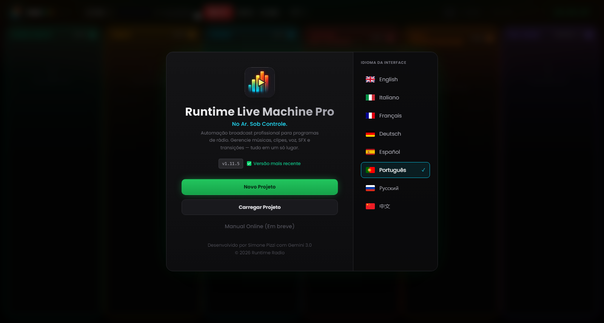

# Capítulo 2 — Instalação e primeiro arranque

---

A instalação do Runtime Live Machine Pro foi pensada para exigir o mínimo de interação possível: poucos cliques, nenhuma configuração manual, nenhum pré-requisito a instalar à parte. O motor de áudio (FFmpeg) já vem integrado no pacote de instalação e não exige qualquer intervenção da sua parte.

---

## 2.1 Requisitos de sistema

Antes de avançar, verifique se o seu computador cumpre os requisitos mínimos. As especificações recomendadas dão a melhor experiência em sessões longas ou com muitas clips carregadas ao mesmo tempo.

| | Mínimo | Recomendado |
|---|---|---|
| **Sistema operativo (Windows)** | Windows 10 64-bit | Windows 11 64-bit |
| **Sistema operativo (macOS)** | macOS 11 Big Sur | macOS 13 Ventura ou posterior |
| **Sistema operativo (Linux)** | Ubuntu 20.04 / Debian 11 | Ubuntu 22.04 LTS |
| **RAM** | 4 GB | 8 GB ou mais |
| **Espaço em disco** | 300 MB (aplicação) | 1 GB + espaço para os ficheiros de áudio |
| **CPU** | Qualquer dual-core moderno | Quad-core ou superior |

O software está otimizado para Apple Silicon (M1, M2, M3) e corre de forma nativa em ambas as arquiteturas do macOS, sem recorrer à emulação Rosetta.

Não precisa de uma placa de som dedicada: o RLMP funciona com qualquer dispositivo de áudio reconhecido pelo sistema operativo, desde a placa integrada até mixers USB profissionais como o Rødecaster Pro ou o RØDECaster Duo.

---

## 2.2 Instalação em Windows

1. Descarregue o ficheiro `Runtime-Live-Machine-Pro-1.15.10.exe` a partir do canal de distribuição oficial.
2. Faça duplo clique no executável. O instalador NSIS arranca e copia os ficheiros para as diretorias apropriadas.
3. No final, é criado um atalho no Ambiente de Trabalho e no menu Iniciar.
4. A aplicação arranca automaticamente ao concluir a instalação.

**Nota sobre o Windows SmartScreen.** Como o software é atualizado com frequência, o certificado de assinatura digital pode ainda não ter reunido «reputação» suficiente para entrar na whitelist automática do SmartScreen. Se aparecer o aviso «O PC foi protegido pelo Windows», clique em *Mais informações* e depois em *Executar mesmo assim*. O software está livre de malware: os instaladores oficiais são publicados exclusivamente através dos canais de distribuição do autor.

---

## 2.3 Instalação em macOS

1. Descarregue o ficheiro `.dmg` a partir do canal oficial.
2. Abra a imagem de disco e arraste o ícone do Runtime Live Machine Pro para a pasta *Aplicações*.
3. No primeiro arranque, o macOS pode mostrar um aviso do Gatekeeper («A aplicação não pode ser aberta porque provém de um programador não identificado»). Para continuar, abra *Preferências do Sistema* → *Segurança e Privacidade* → *Geral* e clique em *Abrir mesmo assim* junto ao nome da aplicação.

A partir do macOS 15 (Sequoia), o caminho passa a ser *Definições do Sistema* → *Privacidade e Segurança*, descendo até à secção *Segurança*.

> **Nota.** A aplicação macOS não está assinada com um certificado Apple Developer. Isto influencia também a forma como as atualizações são geridas, como se explica no Capítulo 12.

---

## 2.4 Instalação em Linux

Estão disponíveis dois formatos de distribuição:

- **AppImage** — executável portátil, não requer instalação. Torne o ficheiro executável (`chmod +x`) e execute-o diretamente.
- **Pacote .deb** — para distribuições Debian/Ubuntu/Mint. Instale com `sudo dpkg -i nomeficheiro.deb` ou abra-o com o gestor de pacotes gráfico.

Nalgumas distribuições, pode ser preciso instalar o pacote `libasound2` para ter suporte de áudio ALSA. Se a aplicação não arrancar, consulte a documentação da sua distribuição.

---

## 2.5 O ecrã de boas-vindas

*Figura 2.1 — O ecrã de boas-vindas: identidade do software, estado da atualização, ações principais e seletor de idioma.*

No primeiro arranque, e em cada arranque seguinte enquanto não abrir um projeto, o RLMP apresenta o **ecrã de boas-vindas**, o ponto de acesso a todas as operações preliminares. O painel divide-se em duas zonas.

**Zona esquerda — Identidade e ações.**
O logótipo do software (as barras de um VU meter com o símbolo de play) identifica a versão Pro. Por baixo do título e do slogan aparece o número de versão instalada, acompanhado do estado do sistema de atualização:

- **«Versão mais recente»** (verde) — está a usar a última versão disponível.
- **«Atualização disponível»** (âmbar, a piscar) — é um botão: clique nele para abrir a janela de atualização (Capítulo 12).
- **«OFFLINE»** (vermelho ténue) — não foi possível contactar o serviço de atualização; o software funciona na mesma.

Por baixo encontra as ações principais:

- *Novo Projeto* — cria uma sessão vazia, já com as colunas prontas para o carregamento.
- *Carregar Projeto* — abre um ficheiro `.lmp` existente. Antes de o tornar operacional, o RLMP faz uma **verificação de integridade**: confirma que cada ficheiro de áudio referenciado ainda existe no caminho guardado. Os que faltarem são de imediato assinalados com um contorno vermelho na respetiva clip.
- *Manual* — está presente, mas por enquanto desativada: a documentação consultável a partir do software só chega numa próxima versão, via web.

**Zona direita — Seletor de idioma.**
O RLMP suporta oito idiomas de interface: inglês, italiano, francês, alemão, espanhol, português, russo e chinês simplificado. O idioma ativo aparece realçado com um contorno ciano e uma marca de seleção. A escolha tem efeito imediato e fica memorizada de uma sessão para a seguinte.

---

## 2.6 O primeiro arranque: o que esperar

Ao abrir um projeto pela primeira vez, repare no cabeçalho: o logótipo traz o badge **PRO** com gradiente iridescente. Por trás da interface, abrir o projeto arranca o motor de áudio em segundo plano — o FFmpeg é inicializado e o protocolo de streaming `media://` fica à escuta, pronto a servir os ficheiros do disco sem os carregar em memória.

De preferência, o software arranca em modo de ecrã inteiro. Se a janela abrir redimensionada, prima `F11` (Windows/Linux) ou `Ctrl+Cmd+F` (macOS) para passar a ecrã inteiro, a condição ideal para trabalhar em regia.

O **Timer On Air** no cabeçalho fica em `--:--:--` até ser lançada a primeira clip da sessão. A partir daí, começa a contar o tempo em direto: uma referência útil para quem trabalha com alinhamentos de tempo fixo.
