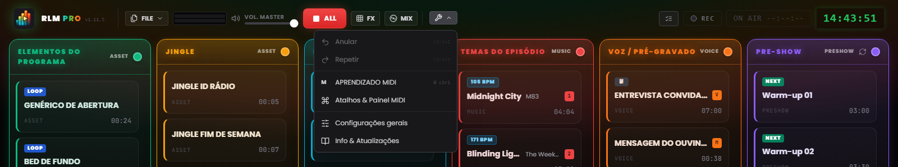
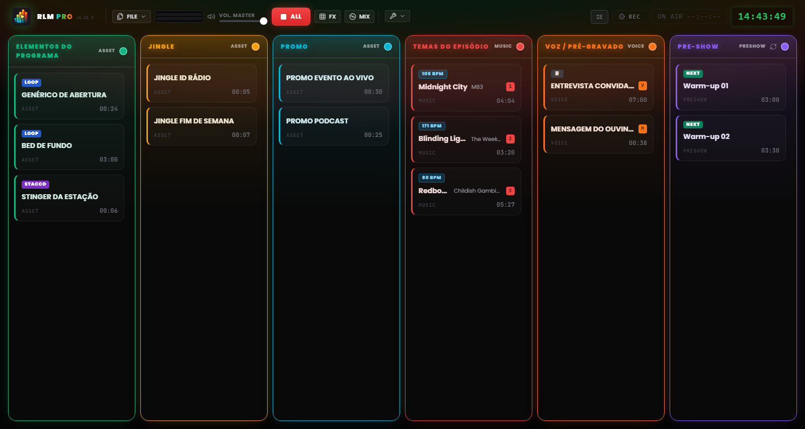

# Capítulo 3 — A interface de trabalho

---

A interface do Runtime Live Machine Pro foi pensada para o contexto operacional mais exigente que existe: o direto. Cada escolha visual, do tema escuro ao alto contraste, passando pelo tamanho dos controlos, responde a um requisito funcional. Não é estética pela estética: é ergonomia.

Ao abrir um projeto, o ecrã divide-se em duas zonas distintas: a **Barra de Controlo** em cima, que gere o projeto e o sistema, e a **Grelha de Regia** ao centro, onde decorre o trabalho propriamente dito.

---

## 3.1 A Barra de Controlo (Cabeçalho)

O cabeçalho ocupa toda a largura do ecrã e, da esquerda para a direita, reúne a identidade do software, os comandos sobre ficheiros, a monitorização e os controlos de transporte, o menu de ferramentas e os indicadores de sessão.

### Identidade

**Logótipo e badge PRO.** À esquerda, o logótipo surge junto da inscrição **RLM PRO**: a palavra «PRO» aparece com um gradiente iridescente que passa do ciano ao verde, ao âmbar, ao vermelho. Ao lado, em carateres monoespaçados, lê-se a versão instalada (`v1.11.5`). Ao passar o rato sobre o logótipo, aparece o nome completo do software com o número de versão.

### Menu Ficheiro

O botão **FICHEIRO** abre um menu com as operações sobre projetos:

- *Novo Projeto* — abre uma sessão vazia. Se houver alterações não guardadas, o software pede confirmação.
- *Guardar Projeto* — gravação rápida no ficheiro `.lmp` atual. A opção fica realçada a amarelo quando há alterações não guardadas.
- *Guardar Como…* — abre sempre a caixa de diálogo, para criar versões progressivas (ex. `Ep47_rascunho.lmp`, `Ep47_final.lmp`).
- *Carregar Projeto* — abre um projeto `.lmp` do disco.
- *Importar M3U* — importa uma playlist em formato M3U como sequência de clips.
- *Exportar Arquivo* — cria uma cópia autocontida do projeto, incluindo os ficheiros de áudio. Descrito no Capítulo 10.

### Monitorização e transporte

**VU Meter estéreo (L/R).** Duas barras horizontais mostram o nível real de áudio à saída, já depois do Master Volume. A escala cromática é intuitiva: verde até cerca de 85% do percurso, depois amarelo e, por fim, vermelho perto do fundo de escala. Se o vermelho persistir, há clipping: reduza o nível.

**Master Volume.** O fader controla o volume geral de saída do software, de 0 a 100%, e funciona como um fader master: levado a zero, não sai som nenhum, seja qual for o estado das clips individuais. Se tiver um controlo MIDI mapeado no Master Volume, um pequeno badge mostra a atribuição.

**STOP ALL (botão vermelho «ALL»).** Pára de imediato todas as clips ativas e cancela os fades em curso. É o comando de emergência do sistema. A tecla `Esc` do teclado faz o mesmo quando a aplicação está em foco, mesmo que esteja a escrever num campo de texto nesse momento.

> **Nota.** Ao contrário das versões anteriores, o `Esc` já não está registado como atalho global do sistema: atua quando o RLMP é a janela ativa. Esta opção permite às caixas de diálogo usarem o `Esc` para fechar sem parar o direto.

**FX.** Abre e fecha o pad FX, a *jingle machine* dos efeitos (Capítulo 7). Um pequeno contador mostra quantos efeitos estão a tocar naquele momento.

**MIX.** Abre e fecha a vista Automix, o deck dedicado à coluna Música (Capítulo 7).

### Ferramentas

O menu **Ferramentas** (ícone de chave-inglesa) reúne:

- *Anular* e *Repetir* — o histórico das alterações ao alinhamento (`Ctrl+Z` / `Ctrl+Y`).
- *MIDI Learn* — ativa o modo de aprendizagem MIDI (Capítulo 8).
- *Keybinds* — a janela de atribuição de teclas às clips.
- *Definições* — as preferências globais do software (Capítulo 13).
- *Info* — versão, créditos e verificação manual das atualizações.

Logo abaixo do menu, aparece por instantes o indicador *Auto-saved*, confirmando que o projeto foi guardado automaticamente.

*Figura 3.1 — A Barra de Controlo e o menu Ferramentas aberto (Anular/Repetir, MIDI Learn, Keybinds, Definições gerais, Info).*

### Indicadores de sessão

No lado direito do cabeçalho ficam o botão do **Playout Log** (o registo cronológico dos disparos, Capítulo 13), o botão de **Gravação** (Capítulo 9), o **Timer On Air** (que, em direto, mostra `ON AIR HH:MM:SS` sobre fundo vermelho) e o **relógio de estúdio** digital em formato de 24 horas, sincronizado com o relógio do sistema.

Na área do cabeçalho podem ainda surgir notificações não intrusivas, os **toast**, relativas a operações concluídas ou a avisos do sistema. Ao contrário das caixas de diálogo bloqueantes, estas desaparecem sozinhas passados alguns segundos e não interrompem a reprodução.

---

## 3.2 A grelha de seis colunas

*Figura 3.2 — A interface de trabalho: a grelha de seis colunas com as cards de áudio.*

A grelha é o centro operacional do software: seis colunas verticais lado a lado, cada qual com o seu cabeçalho cromático e a sua própria lógica de comportamento de áudio. Os efeitos sonoros não têm coluna na grelha, vivem no pad FX (Capítulo 7).

### Cabeçalhos de coluna

Cada cabeçalho indica o nome da coluna, o seu tipo, e funciona como indicador de estado. Em condições normais está estático e colorido no tom caraterístico da coluna. Mas quando a clip em reprodução é a última disponível da coluna, não está em loop e faltam menos de **20 segundos** para o fim, o cabeçalho entra em alarme **DEAD AIR**: pulsa, muda para âmbar, mostra um ícone de aviso e o badge **END**. É a antecipação que dá tempo para preparar a faixa seguinte antes do silêncio.

A cor de cada coluna pode ser personalizada: basta clicar no círculo colorido do cabeçalho para abrir uma paleta de **30 tons**. A escolha fica guardada no ficheiro de projeto.

No cabeçalho da coluna **Pré-Show** há ainda um botão de **rotação**: quando ativo, a fila de pré-direto insere automaticamente jingles e promos a intervalos regulares (Capítulo 13).

### As seis colunas

**Show Assets (Verde)**
Os elementos estruturais do show: genéricos, bases musicais, fundos (*bed*), separadores institucionais. Comportam-se como elementos de segundo plano, cedendo espaço quando chegam vozes ou canções, mas mantendo a rotação interna enquanto não forem parados.

**Jingle (Âmbar)** e **Promo (Ciano)**
Duas colunas dedicadas, respetivamente, aos jingles identificativos e às promos ou autopromoções. No plano do áudio comportam-se exatamente como os Show Assets, já que pertencem à mesma família, mas separá-las mantém o alinhamento ordenado e legível.

**Músicas do episódio (Vermelho)**
A playlist musical. As clips desta coluna participam ativamente na mistura automática: descem de volume quando tocam as vozes e, por sua vez, silenciam as bases dos Assets ao entrarem em reprodução (Capítulo 6). Nas clips musicais, o software deteta automaticamente o **BPM**, mostrado com um badge próprio.

**Voz / Gravações (Laranja)**
Entrevistas, blocos falados pré-gravados, mensagens de voz. Esta coluna tem **prioridade máxima** no sistema de mistura: enquanto aqui houver uma clip em reprodução, todos os outros sinais descem para um nível de fundo.

**Pré-Show (Roxo)**
A playlist de aquecimento antes do direto. Funciona como uma fila musical autónoma, com rotação opcional de jingles e promos. Quando o direto propriamente dito começa, esta coluna costuma ser esvaziada ou desativada.

---

## 3.3 A Card de Áudio (Clip)

Cada ficheiro de áudio importado materializa-se na grelha como uma **card** retangular, a unidade operacional do sistema: vê-se, dispara-se, configura-se, move-se.

### Anatomia de uma card

**Título e artista.** O nome do ficheiro ou o nome personalizado atribuído nas propriedades. O título personalizado só muda a etiqueta no software: o ficheiro original no disco fica intacto. Nas clips musicais, por baixo do título pode aparecer o nome do artista.

**Timer.** Em repouso, mostra a duração total da clip no formato `MM:SS`. Durante a reprodução passa à **contagem decrescente**, com o prefixo negativo (ex. `−01:20`). Quando faltam menos de 15 segundos para o fim, o timer fica **vermelho**.

**Badges de estado.** Pequenas etiquetas comunicam de forma imediata as propriedades configuradas:

- **STACCO** — a clip está definida para se sobrepor às outras sem as parar.
- **LOOP** — a clip recomeça do início ao terminar a reprodução.
- **NEXT** — no fim desta clip arranca automaticamente a seguinte na coluna.
- **▶ UP NEXT** — realça qual será a próxima clip a arrancar na sequência automática.
- **### BPM** — o tempo detetado, nas clips musicais.
- **TRIM…** — análise do silêncio em curso (Auto-Trim).
- **FADE OUT** — surge na clip cessante durante um crossfade ou uma dissolvência.
- **📋** — a clip tem uma nota associada na NoteBoard (Capítulo 13).

**Atribuições.** Se a clip tiver uma tecla do teclado atribuída, a letra surge num badge da cor da coluna; se tiver um binding MIDI, surge a etiqueta `M` seguida do número da nota (ex. `M60`).

**Cues de estrutura.** Se estiverem configurados os marcadores, durante a reprodução surgem as contagens decrescentes `INTRO: −MM:SS` (em ciano) e `OUTRO IN: −MM:SS` (em laranja), até ao aviso `🚨 OUTRO` quando a cauda começou.

**Indicador de reprodução.** Quando uma clip está em play, a card acende-se: contorno verde, fundo com halo luminoso, um círculo pulsante e o título realçado. A barra de progresso corre no fundo da card.

### Interação com as cards

- **Clique esquerdo** — inicia a clip se estiver parada; pára-a (com fade out) se estiver em reprodução.
- **Ctrl + Clique** (Windows/Linux) ou **Cmd + Clique** (macOS) — seleciona a clip sem a iniciar. O contorno fica azul. Útil para a seleção múltipla e a eliminação em bloco.
- **Tecla Del** (ou *Delete* / *Backspace*) — elimina as clips selecionadas da grelha. Se estiverem selecionadas várias clips, o software pede confirmação.
- **Clique direito** — abre as **Definições da clip**: propriedades, editor da forma de onda, notas (Capítulo 5).
- **Drag & Drop** — arraste uma card para a reordenar dentro da coluna ou movê-la para outra. Um indicador luminoso azul mostra a posição de inserção durante o arrasto.

### Card em estado de erro

Uma card com a indicação **FICHEIRO EM FALTA** e o contorno vermelho assinala que o ficheiro de áudio referenciado já não está acessível: foi movido, renomeado, ou está num disco externo desligado. A clip não é reproduzível enquanto o ficheiro não voltar a estar disponível no caminho original. A gestão dos erros de caminho é tratada no Capítulo 14.
