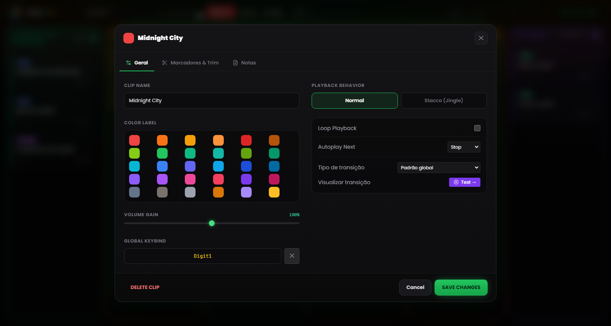
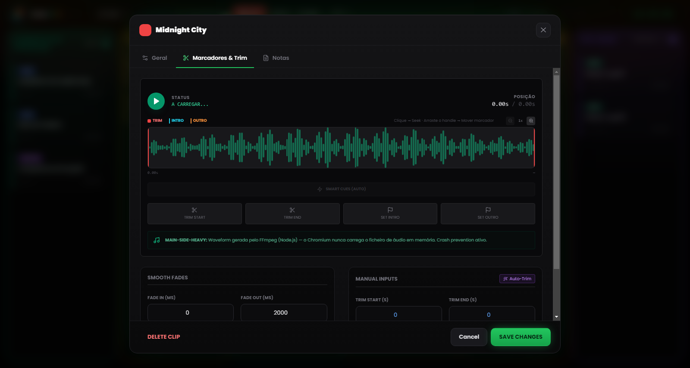

# Capítulo 5 — Propriedades da clip e Waveform Editor

---

Cada ficheiro de áudio tem uma história antes de chegar à grelha: gravações com segundos de silêncio no início, faixas com caudas intermináveis, entrevistas com o nível demasiado baixo em relação ao resto do show. Em vez de recorrer a um editor de áudio externo sempre que um ficheiro não está «pronto a emitir», o RLMP oferece um painel de configuração para cada clip e um editor visual da forma de onda com funções de corte e marcação.

Todas as alterações feitas através destas ferramentas são **não destrutivas**: o ficheiro original no disco mantém-se inalterado. O RLMP guarda as definições no ficheiro de projeto `.lmp` e aplica-as em tempo real durante a reprodução.

Para abrir as definições de uma clip, basta fazer **clique com o botão direito** na card.

---

## 5.1 Propriedades básicas

*Figura 5.1 — As definições da clip: Clip Name, Color Label, Volume Gain, Playback Behavior, Next Action e atribuição de teclas.*

### Nome e aparência

**Clip Name.** Pode atribuir à clip um nome personalizado, independente do nome do ficheiro original, que é depois mostrado na card, na grelha. Vale a pena usar nomes descritivos e úteis do ponto de vista operacional durante o direto: «GENÉRICO DE ABERTURA» lê-se muito mais depressa do que `generico_rev3_final_def.mp3` quando só tem três segundos para encontrar a clip certa.

**Color Label.** Por predefinição, a clip herda a cor da coluna a que pertence, mas aqui pode atribuir-lhe uma cor específica para a destacar visualmente. É útil para marcar clips críticas (por exemplo, o genérico de encerramento) ou para diferenciar grupos temáticos dentro da mesma coluna.

### Volume (Gain)

O slider de **Volume Gain** vai de 0% a 150% e funciona como um pré-fader da clip específica, antes do Master Volume global.

O uso mais comum é o alinhamento dos níveis: se tiver uma voz gravada com pouca intensidade (por exemplo, uma mensagem de WhatsApp ou uma gravação telefónica), pode levá-la acima dos 100% para se aproximar do volume das outras faixas. Ao contrário, uma clip particularmente «quente» pode ser baixada sem tocar no Master Volume.

---

## 5.2 O editor da forma de onda

*Figura 5.2 — O editor da forma de onda: handles de Trim, marcadores de Intro e Outro, Auto-Trim, Smart Cues e dissolvências.*

O editor visual é a função mais poderosa do painel de configuração: ocupa a zona central e mostra a representação gráfica do áudio de toda a clip.

### Navegação no editor

**Zoom horizontal.** A vista da forma de onda pode ser ampliada de 1× (vista completa) até 8×, com passos intermédios (1×, 2×, 3×, 4×, 6×, 8×), através do slider de zoom ou da roda do rato sobre o editor. Com zoom elevado, a vista desliza acompanhando a posição atual.

**Régua adaptativa.** O eixo temporal na parte superior do editor adapta-se automaticamente ao zoom: em vista completa mostra referências esparsas; em zoom máximo, densifica-as até aos segundos.

**Playhead.** Durante a reprodução de pré-visualização, um indicador vertical branco percorre em tempo real a forma de onda, mostrando a posição atual. Um clique na forma de onda leva a reprodução até esse ponto.

### Os quatro handles

O editor tem quatro **handles** arrastáveis, cada um com a sua função e a sua cor:

**Trim Start (handle vermelho, à esquerda).** Define o ponto de início efetivo da clip: tudo o que está à esquerda é saltado durante a reprodução. Arraste-o para a direita para eliminar silêncios ou partes indesejadas do início.

**Trim End (handle vermelho, à direita).** Define o ponto de fim efetivo: tudo o que está à direita é ignorado. Arraste-o para a esquerda para encurtar a cauda. Trim Start e Trim End não se podem sobrepor.

**Intro End (marcador ciano).** Assinala o ponto estrutural em que a melodia principal entra na faixa, depois da eventual introdução. Uma vez definido, surge na card em reprodução a contagem decrescente **INTRO: −MM:SS**.

**Outro Start (marcador laranja).** Assinala o ponto em que começa a cauda da faixa, normalmente o momento certo para começar a falar e preencher a transição. Na card surge a contagem decrescente **OUTRO IN: −MM:SS**. Se o valor não bater certo com o trim ou com a duração, o software desativa-o e avisa.

Para além do arrasto, há quatro botões *Set* que colocam cada handle na posição atual do playhead, permitindo marcar em tempo real durante a escuta. Os valores continuam ajustáveis com precisão nos respetivos campos.

### Auto-Trim (varinha mágica)

O botão com o ícone de **varinha mágica** ativa a deteção automática do silêncio via FFmpeg. O limiar não é fixo: o software estima primeiro o nível médio do ficheiro e define o limiar de silêncio cerca de 25 dB abaixo desse nível (dentro de um intervalo de segurança entre −55 e −20 dB; na falta de estimativa, recorre a −40 dB). O Trim Start e o Trim End ficam assim definidos automaticamente, eliminando silêncios iniciais e caudas mudas sem intervenção manual.

Esta função é particularmente útil em gravações de voz não tratadas: chamadas telefónicas, mensagens de áudio, entrevistas gravadas em dispositivos móveis. Aplicar o Auto-Trim a toda a coluna Voz antes de um show demora menos de um minuto, e as transições ficam bem mais limpas.

> **Nota técnica.** A análise decorre no Main Process através do FFmpeg, sem carregar o ficheiro em memória no Renderer. Em ficheiros de grandes dimensões, o tempo de análise mantém-se na ordem de poucos segundos.

### Smart Cues (deteção automática dos marcadores)

Ao lado do Auto-Trim está a função **Smart Cues**, que propõe automaticamente os marcadores de Intro e Outro. Com um limiar mais agressivo, identifica o ponto em que o áudio atinge a energia plena (Intro) e aquele em que começa a dissolvência final (Outro), posicionando os dois marcadores sem que seja preciso procurá-los de ouvido.

### Pré-visualização da transição

Se existir uma clip **seguinte** na mesma coluna, o botão **«Test →»** reproduz os últimos segundos da clip atual e deixa disparar a transição rumo à seguinte, diretamente no editor. Durante a pré-visualização, um botão *Stop* interrompe o teste.

---

## 5.3 Comportamentos e automação

### Playback Behavior (modo de sobreposição)

**Normal** — comportamento predefinido. Ao iniciar-se, esta clip interrompe qualquer outra que esteja a reproduzir na mesma coluna (com fade out). É o comportamento certo para canções e bases: uma canção exclui as outras.

**Stacco (separador; Jingle)** — a clip inicia-se sem interromper as outras. Tem prioridade alta: silencia os outros assets da coluna e baixa a música, mas não pára nada. É o caso típico de um *station ID* («Está a ouvir…») que precisa de «cavalgar» a intro de uma faixa, ou de um jingle curto sobre uma base em loop.

### Next Action (automação no final)

Define o que acontece quando a clip chega ao ponto de Trim End.

**Stop** — comportamento predefinido para Músicas, Voz e Assets. A clip termina e pára, sem mais.

**Play Next** — perto do fim, a clip inicia automaticamente a seguinte na coluna, já com a transição configurada, e o badge **NEXT** aparece na card. É o comportamento predefinido da coluna Pré-Show e cria, na prática, uma playlist automática: pode configurá-lo em várias clips seguidas para montar blocos que fluem sem interrupções.

A reprodução em **Loop Playback** é uma opção à parte: quando ativa, a clip recomeça do início (do Trim Start) sem quebra, e na card aparece o badge **LOOP**. Use-a para bases musicais, ambientes sonoros ou genéricos de fundo que devem rodar até serem parados de propósito. Os modos de transição, Crossfade, Segue e Gapless, estão descritos no Capítulo 13.

---

## 5.4 Dissolvências (Fade In e Fade Out)

Para cada clip, o painel permite definir a duração das dissolvências de entrada e de saída. Os valores vão de 0 a 60.000 milissegundos (60 segundos) e a curva aplicada é linear.

**Fade In.** O tempo que o volume demora a atingir o nível máximo a partir do arranque. Um valor de 2000 ms dá uma subida gradual de dois segundos. Use-o nas bases musicais que devem emergir suavemente, e mantenha-o a 0 nas vozes e efeitos que precisam de ser ouvidos de imediato.

**Fade Out.** O tempo de dissolvência no fecho, quer ao clicar numa clip ativa, quer nas transições. Valores típicos: 2000 a 3000 ms para canções, 500 a 1000 ms para bases, 0 ms para separadores secos.

Um fade out a 0 ms dá um fecho imediato, um «hard cut». Numa faixa musical em direto, isso pode soar a erro técnico: convém avaliar bem quando é apropriado.

---

## 5.5 Atribuição de controlos

Cada clip também pode ser lançada a partir de uma tecla do teclado ou de um controlador MIDI.

**Global Keybind.** A tecla do teclado atribuída à clip. Pode ser definida no campo dedicado das definições da clip (clique e prima a tecla desejada) ou na janela **Keybinds**, acessível pelo menu Ferramentas. O badge correspondente aparece na card. Se a tecla já estiver atribuída a outra clip, o software assinala o conflito antes de a sobrepor.

**MIDI Bind.** A nota MIDI atribuída (ex. `NOTE:60`). A atribuição faz-se através do modo **MIDI Learn** (ver Capítulo 8), e não digitando o número à mão.

Os bindings das clips ficam guardados no ficheiro de projeto: ao levar o projeto para outro computador com o mesmo controlador MIDI, os mapeamentos funcionam sem qualquer reconfiguração.
