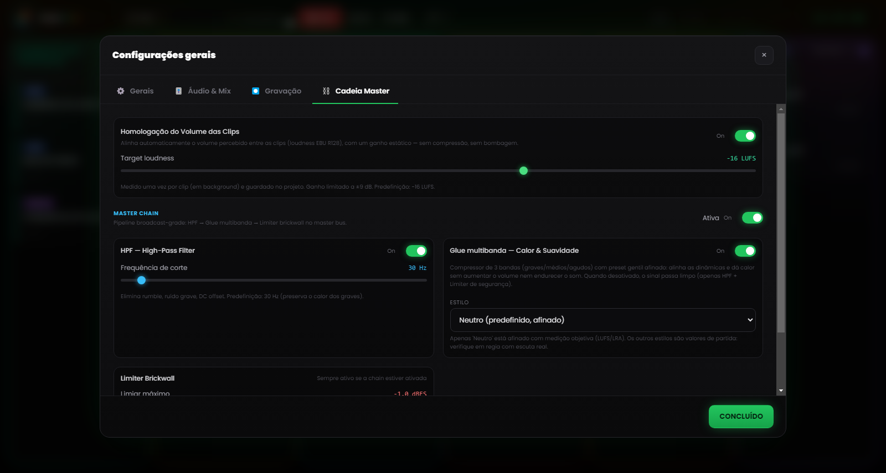

# Capítulo 6 — O motor de mistura

---

Numa regia radiofónica manual, o problema de fundo é sempre o mesmo: ações demasiadas a acontecer ao mesmo tempo. Iniciar uma faixa, baixar a música, falar ao microfone, preparar a clip seguinte, sem nunca perder o relógio de vista. E cada operação extra é uma nova oportunidade de errar, num contexto em que o erro é público e imediato.

O motor de mistura do Runtime Live Machine Pro elimina grande parte destas ações intermédias, delegando-as ao software. Não se trata de automação no sentido de «o software faz as coisas sem que o operador dê por isso», mas antes de automatizar as regras que o próprio operador aplicaria se tivesse mãos suficientes para as executar todas ao mesmo tempo.

---

## 6.1 A hierarquia de áudio

O sistema de mistura automática assenta numa **hierarquia de prioridade** entre os tipos de clip. A forma mais simples de a entender é imaginá-la como uma escala de «direito de palavra».

**Voz / Gravações — prioridade absoluta.**
Quando uma clip de voz está em reprodução, mantém-se no seu volume nominal e tudo o resto baixa. Nenhum outro sinal pode sobrepor-se a esta regra.

**Músicas do episódio.**
Cedem espaço à Voz, mas comandam sobre as bases dos Assets. Quando entra uma canção, as bases musicais dos Assets vão a zero (não param: continuam a rodar em silêncio, prontas para o regresso). É a Music Dominance, descrita mais adiante.

**Show Assets, Jingle e Promo — as bases de serviço.**
São baixados pela Voz e silenciados pelas Músicas. Quando um asset é um **Stacco** (separador), porém, é ele a comandar (ver §6.4).

**Efeitos do pad FX.**
Os efeitos sonoros ficam fora da hierarquia: tocam no seu próprio volume, sobrepõem-se ao que está no ar e não são silenciados. Há uma única cortesia para com a fala: quando uma voz está ativa, os efeitos descem a meio volume (50%) para não a taparem, e depois voltam a subir sozinhos.

---

## 6.2 Ducking automático

O **ducking** é o mecanismo pelo qual um sinal é baixado quando um sinal de prioridade superior entra em reprodução.

Veja o caso mais comum: uma canção está a tocar em plena dinâmica e alguém lança uma entrevista pré-gravada a partir da coluna Voz. Nesse instante, o RLMP leva a canção a cerca de **20% do volume** (uma redução de cerca de 14 dB) com uma dissolvência suave de meio segundo, para que a voz ocupe o espaço sonoro de forma inteligível. Assim que a entrevista termina, a canção sobe outra vez ao volume original, com um fade in igualmente fluido.

O operador não toca em nada: o único gesto foi iniciar a entrevista. A intensidade da redução e a sua rapidez regulam-se nas Definições (Capítulo 13).

---

## 6.3 Music Dominance: gestão inteligente das bases

Há um erro sonoro clássico que se repete sempre: o momento em que uma canção e uma base musical (*bed*) se sobrepõem, dois elementos rítmicos que se chocam, dois kick drum que não coincidem, e o resultado é confuso.

O RLMP resolve este cenário com a **Music Dominance**.

**O cenário-tipo.** Uma base está a rodar em loop na coluna Assets, por baixo da voz do apresentador, que lança uma faixa a partir da coluna Músicas.

**O que o RLMP faz.** Não pára a base — pará-la obrigaria depois a reiniciá-la à mão. Em vez disso, leva-a silenciosamente a **volume zero**, mantendo-a em reprodução «fantasma»: o ficheiro continua a correr, o loop continua, só que não se ouve nada.

**O resultado sonoro.** Ouve-se apenas a canção; a base desapareceu sem que o operador tenha feito nada.

**O regresso.** Quando a canção termina, a base reemerge com um fade in automático, retomando do ponto em que ficara no loop. Todo o percurso (base → canção → base) acontece sem mais nenhum clique.

---

## 6.4 Stacchi: a exceção à regra

O comportamento **Stacco** (separador; configurável nas propriedades de cada clip, ver Capítulo 5) inverte temporariamente a hierarquia: a clip que o tem passa a ser prioritária. Silencia os outros assets da sua coluna e baixa a música, mas não pára nada. A dissolvência aplicada é mais rápida do que a do ducking normal, o que dá uma entrada mais percussiva e nítida.

O uso típico é o *station ID* vocal («Está a ouvir…»), que tem de se ouvir claramente enquanto a base por baixo continua a rodar. Para um resultado mais cuidado, combine o Stacco com um fade in curto (300–500 ms), assim a entrada fica suave em vez de brusca.

---

## 6.5 Homologação do volume (loudness)

Clips de proveniência diferente chegam quase sempre com níveis diferentes: um genérico bem masterizado, uma voz telefónica gravada baixinho, uma faixa transferida a um volume só seu. Para evitar ajustes manuais constantes do Gain, o RLMP aplica por predefinição uma **homologação do volume** baseada na norma de loudness EBU R128, com um alvo de **−16 LUFS**.

Na prática, o software avalia a sonoridade percebida de cada clip e aproxima-a de uma referência comum, de modo que canções, vozes e bases partam já num plano coerente. A função está ativa por predefinição, e o valor-alvo regula-se nas Definições → Master Chain.

---

## 6.6 Master Chain: a cadeia de processadores no master bus

*Figura 6.1 — A Master Chain: homologação do volume (−16 LUFS), HPF a 30 Hz, multiband glue e limiter brickwall.*

O sinal combinado de todas as clips em reprodução, depois do Master Volume, atravessa uma **cadeia de processadores** no master bus antes de chegar ao dispositivo de saída. Está ativa por predefinição e foi concebida para um som broadcast-grade sem exigir configuração avançada.

Compreende três andares em série.

**High-Pass Filter (HPF) a 30 Hz.**
Elimina, com um declive suave, as frequências sub-bass inúteis que consomem headroom e podem sujar os sistemas de difusão. A frequência de corte regula-se entre 20 e 200 Hz; quando desativado, o andar torna-se completamente transparente.

**Multiband glue.**
Aqui não há um único compressor, mas três compressores «suaves» a trabalhar em paralelo sobre três bandas de frequência (graves, médios, agudos), separadas por um crossover. Cada banda tem limiares e rácios calibrados para «colar» a mistura sem a esmagar, contendo a variância dinâmica entre clips de nível diferente. O estilo escolhe-se entre alguns presets (Neutro, Rock, Jazz, Eletrónico); o predefinido é Neutro.

**Limiter Brickwall.**
Limiar a −1 dBFS, rácio de limitação elevado e reação rapidíssima: garante que o sinal nunca ultrapassa o nível máximo permitido, evitando a distorção digital (clipping) aconteça o que acontecer a montante.

Toda a cadeia, e cada andar em separado, é configurável e pode ser desativada nas Definições → Master Chain, onde há também um botão para repor os valores predefinidos. Se o sinal já for processado por um mixer de hardware ou por uma cadeia externa, convém desativá-la para evitar processamento duplo.
