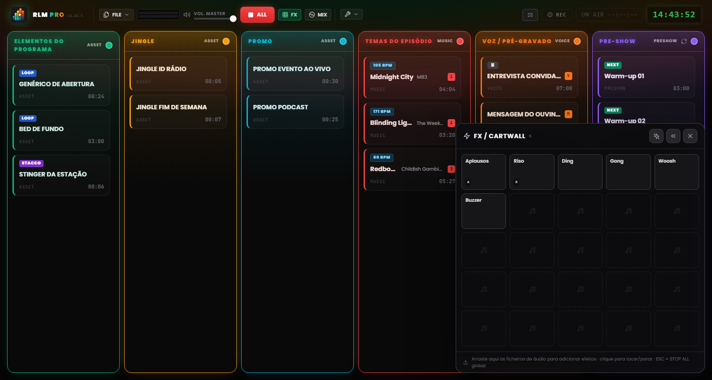
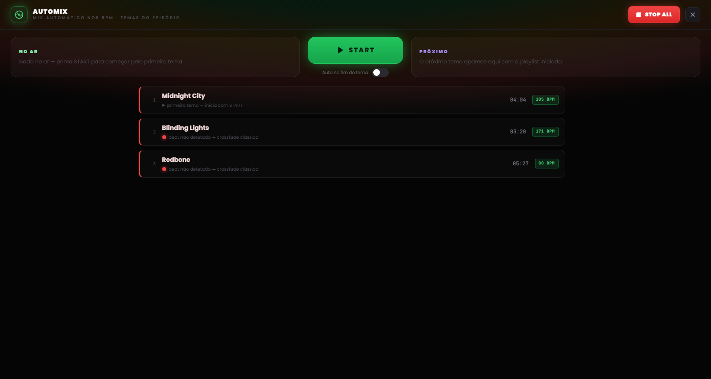

# Capítulo 7 — O Pad FX e a vista Automix

---

Há duas superfícies de trabalho por cima da grelha, chamáveis com uma tecla e pensadas para dois momentos opostos da regia: o **pad FX**, para disparar efeitos e separadores a golpe certo sem interromper nada, e a **vista Automix**, para gerir o fluxo musical como faria um DJ. Nenhuma das duas rouba espaço à grelha; abrem-se quando são precisas e fecham-se com um clique.

---

## 7.1 O pad FX: a jingle machine

*Figura 7.1 — O pad FX: a jingle machine 5×5 dos efeitos sonoros, com disparo em sobreposição.*

Os efeitos sonoros não têm coluna própria na grelha. Vivem no **pad FX**, um painel em grelha de células (uma *jingle machine*) que se abre a partir do botão **FX** no cabeçalho e fica flutuante num canto do ecrã.

O pad é um **overlay não bloqueante**: não obscurece o painel nem interceta os cliques dirigidos a outro lado. É possível disparar um efeito e, no mesmo instante, continuar a operar sobre as colunas ou sobre os comandos do cabeçalho. Por isso a tecla `Esc` não fecha o pad, que continua reservado ao comando de STOP ALL, sempre disponível. O pad fecha-se pelo próprio botão de fecho ou de novo pelo toggle FX.

### Carregar e disparar os efeitos

O pad nasce com uma grelha de 25 células (5×5) e cresce em linhas à medida que se adicionam mais efeitos. Para o preencher, **arraste os ficheiros de áudio diretamente para as células** do pad, tal como faria com uma coluna da grelha.

Um clique numa célula **dispara o efeito**. Os efeitos do pad são polifónicos e sobrepõem-se: várias células podem tocar em conjunto, por cima de tudo o que está no ar, sem o parar. O comportamento de áudio é idêntico ao de uma clip normal, muda apenas a superfície de disparo. Junto ao botão FX no cabeçalho, um contador indica quantos efeitos estão a tocar naquele momento.

### Configurar um efeito

Os efeitos configuram-se em dois níveis, pensados para duas necessidades diferentes:

- **Definições rápidas** — o caso comum para uma jingle machine: nome, cor, volume, loop. Bastam poucos segundos.
- **Definições completas** — a mesma janela das clips da grelha (editor da forma de onda, trim, marcadores, fade, atribuição de teclas), acessível pela opção «Definições completas…» dentro das rápidas.

### Posição do pad

O pad pode ficar no canto inferior esquerdo ou no inferior direito do ecrã. A preferência define-se com as setas no próprio pad e fica memorizada entre sessões. À direita cobre a NoteBoard e a última coluna, por isso vale a pena escolher o lado consoante a forma como dispôs o seu alinhamento.

> **Nota.** Em modo MIDI Learn, um clique numa célula do pad **seleciona** o efeito para a atribuição em vez de o tocar — assim não coloca um jingle no ar enquanto está a mapear os controlos (ver Capítulo 8).

---

## 7.2 A vista Automix

*Figura 7.2 — A vista Automix: o deck da coluna Música, a compatibilidade de BPM e o modo automático no fim da faixa.*

A **vista Automix** é o deck da coluna Música: um ecrã a toda a largura, chamado a partir do botão **MIX** no cabeçalho, que apresenta o alinhamento musical como uma consola de DJ. Abre-se por cima do painel, mas por baixo do pad FX, de modo que os efeitos continuem utilizáveis mesmo com a Automix aberta. Tal como no pad, o `Esc` não a fecha, pois continua a ser o comando de emergência, e o botão STOP ALL mantém-se acessível no cabeçalho.

### O deck

Ao centro fica a faixa **no ar** e, em fila, a **próxima** faixa da coluna Música, com o tempo restante. A partir daqui é possível fazer arrancar uma faixa e gerir a passagem de uma para a outra com um único comando: o grande botão de transição aplica o mesmo crossfade que se usaria a partir da grelha, mas com o cuidado adicional do engate rítmico.

### Compatibilidade e transições beat-matched

Junto a cada faixa, um **ponto de compatibilidade** com a faixa anterior indica a sua afinidade rítmica:

- **Verde** — os dois tempos engatam bem: a transição pode ser beat-matched.
- **Amarelo** — engate possível mas com algumas reservas.
- **Vermelho** — tempos demasiado distantes para um engate limpo.

Quando o engate rítmico não é praticável (BPM não detetado, beat incerto, tempos demasiado diferentes), o software avisa e recorre automaticamente a um **crossfade clássico**, sem surpresas em direto.

### O modo automático

No fundo da vista há um interruptor para a **automação no fim da faixa**. Estando ativo, o RLMP faz arrancar sozinho a passagem à faixa seguinte quando a que está no ar se aproxima do fim.

Este modo é uma exceção deliberada à filosofia do software, que por opção não automatiza o show. Por isso vem **desativado por predefinição** e só funciona **enquanto a vista Automix está aberta**: fechar a vista desativa a automação de imediato. É a ferramenta certa para um bloco musical contínuo, a meia hora de só música antes de voltar à voz, e não para o direto inteiro.
