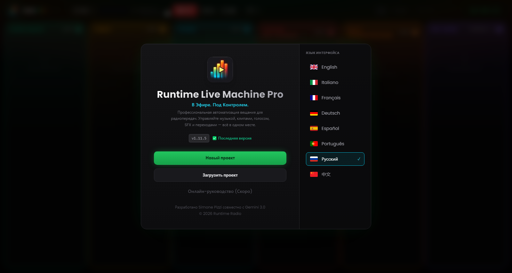

# Глава 2 — Установка и первый запуск

---

Установка Runtime Live Machine Pro требует минимум действий: несколько нажатий, никакой ручной настройки, никаких предварительных компонентов, которые нужно ставить отдельно. Аудиодвижок (FFmpeg) встроен в установочный пакет и не требует от вас никакого вмешательства.

---

## 2.1 Системные требования

Прежде чем продолжить, убедитесь, что компьютер отвечает минимальным требованиям. Рекомендуемые характеристики обеспечивают наилучшую работу в долгих сессиях или при большом числе одновременно загруженных клипов.

| | Минимум | Рекомендуется |
|---|---|---|
| **Операционная система (Windows)** | Windows 10 64-bit | Windows 11 64-bit |
| **Операционная система (macOS)** | macOS 11 Big Sur | macOS 13 Ventura или новее |
| **Операционная система (Linux)** | Ubuntu 20.04 / Debian 11 | Ubuntu 22.04 LTS |
| **RAM** | 4 GB | 8 GB или больше |
| **Место на диске** | 300 MB (приложение) | 1 GB + место под аудиофайлы |
| **CPU** | Любой современный dual-core | Quad-core или выше |

Программа оптимизирована под Apple Silicon (M1, M2, M3) и работает нативно на обеих архитектурах macOS без эмуляции Rosetta.

Отдельная звуковая карта не требуется: RLMP работает с любым аудиоустройством, распознанным операционной системой, — от встроенной звуковой карты до профессиональных USB-микшеров вроде Rødecaster Pro или RØDECaster Duo.

---

## 2.2 Установка в Windows

1. Скачайте файл `Runtime-Live-Machine-Pro-1.11.5.exe` из официального канала распространения.
2. Дважды щёлкните по исполняемому файлу. Установщик NSIS запустится и скопирует файлы в нужные каталоги.
3. По завершении на рабочем столе и в меню «Пуск» появится ярлык программы.
4. Приложение запустится автоматически по окончании установки.

**О Windows SmartScreen.** Программа обновляется часто, и сертификат цифровой подписи может ещё не набрать достаточной «репутации» для автоматического белого списка SmartScreen. Если появится предупреждение «Система Windows защитила ваш компьютер», нажмите *Подробнее*, затем *Выполнить в любом случае*. Вредоносного кода программа не содержит; официальные установщики публикуются исключительно через каналы распространения автора.

---

## 2.3 Установка в macOS

1. Скачайте файл `.dmg` из официального канала.
2. Откройте образ и перетащите значок Runtime Live Machine Pro в папку *Программы*.
3. При первом запуске macOS может показать предупреждение Gatekeeper («Приложение не может быть открыто, так как получено от неустановленного разработчика»). Чтобы продолжить, откройте *Системные настройки* → *Защита и безопасность* → *Основные* и нажмите *Открыть всё равно* рядом с именем приложения.

Начиная с macOS 15 (Sequoia), путь такой: *Системные настройки* → *Конфиденциальность и безопасность* → прокрутите до раздела *Безопасность*.

> **Примечание.** Приложение macOS не подписано сертификатом Apple Developer. Это сказывается и на том, как обрабатываются обновления, — подробнее в Главе 12.

---

## 2.4 Установка в Linux

Доступны два формата распространения:

- **AppImage** — портативный исполняемый файл, установка не нужна. Сделайте файл исполняемым (`chmod +x`) и запустите напрямую.
- **Пакет .deb** — для дистрибутивов Debian/Ubuntu/Mint. Установите командой `sudo dpkg -i nomefile.deb` или откройте его графическим менеджером пакетов.

В некоторых дистрибутивах может понадобиться пакет `libasound2` для поддержки звука ALSA. Если приложение не запускается, обратитесь к документации своего дистрибутива.

---

## 2.5 Экран приветствия

*Рисунок 2.1 — Экран приветствия: идентичность программы, статус обновления, основные действия и выбор языка.*

При первом запуске — и при каждом последующем, пока не открыт проект, — RLMP показывает **экран приветствия**, точку входа ко всем предварительным операциям. Панель разделена на две зоны.

**Левая зона — идентичность и действия.**
Логотип программы (полоски VU meter со значком воспроизведения) обозначает версию Pro. Под названием и слоганом показан номер установленной версии, а рядом — статус системы обновлений:

- **«Последняя версия»** (зелёный) — установлена самая свежая доступная версия.
- **«Доступно обновление»** (янтарный, мигающий) — это кнопка: нажмите её, чтобы открыть окно обновления (Глава 12).
- **«OFFLINE»** (приглушённый красный) — не удалось связаться со службой обновлений; программа при этом работает как обычно.

Ниже расположены основные действия:

- *Новый проект* — создаёт пустую сессию с колонками, готовыми к загрузке.
- *Загрузить проект* — открывает существующий файл `.lmp`. Прежде чем сделать его рабочим, RLMP выполняет **проверку целостности**: убеждается, что каждый упомянутый аудиофайл по-прежнему лежит по сохранённому пути. Отсутствующие файлы сразу отмечаются красной рамкой на соответствующем клипе.
- *Руководство* — пункт присутствует, но пока отключён: документация, доступная внутри программы, появится в одной из следующих версий через веб.

**Правая зона — выбор языка.**
RLMP поддерживает восемь языков интерфейса: английский, итальянский, французский, немецкий, испанский, португальский, русский и упрощённый китайский. Активный язык выделен голубой рамкой и галочкой. Выбор применяется немедленно и запоминается между сессиями.

---

## 2.6 Первый запуск: чего ожидать

При первом открытии проекта в шапке появится логотип с бейджем **PRO** переливающегося градиента. За кулисами интерфейса открытие проекта запускает аудиодвижок в фоне: FFmpeg инициализируется, а потоковый протокол `media://` начинает слушать, готовый подавать файлы с диска без загрузки в память.

Программа предпочтительно запускается в полноэкранном режиме. Если окно вдруг откроется уменьшенным, нажмите `F11` (Windows/Linux) или `Ctrl+Cmd+F` (macOS), чтобы развернуть его на весь экран, — оптимальное условие для работы за пультом.

**Таймер On Air** в шапке останется на `--:--:--`, пока не будет запущен первый клип сессии. С этого момента он начнёт отсчитывать время в эфире — полезный ориентир для тех, кто работает по плейлисту с фиксированным таймингом.
