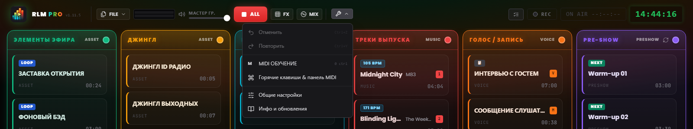
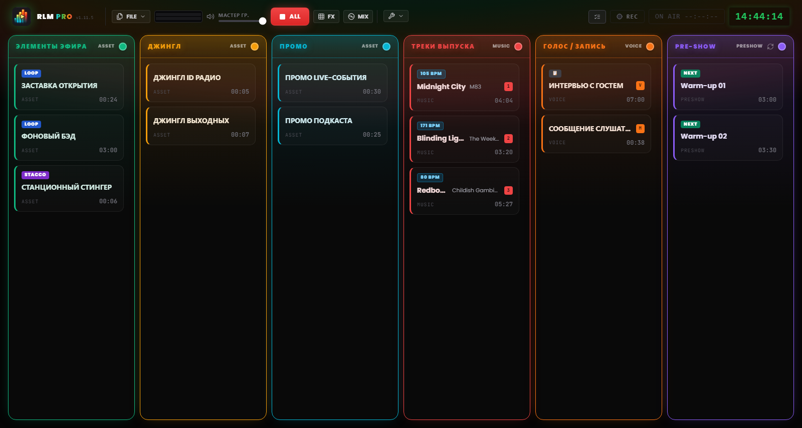

# Глава 3 — Рабочий интерфейс

---

Интерфейс Runtime Live Machine Pro построен под самый требовательный рабочий контекст — прямой эфир. Каждое визуальное решение — тёмная тема, высокий контраст, размеры элементов управления — отвечает функциональному требованию. Это не эстетика ради эстетики, а эргономика.

Когда вы открываете проект, экран делится на две отдельные зоны: **Панель управления** вверху, отвечающая за проект и систему, и центральную **эфирную сетку**, где идёт собственно работа.

---

## 3.1 Панель управления (шапка)

Шапка занимает всю ширину экрана. Слева направо в ней размещены идентичность программы, команды над файлами, мониторинг и элементы транспорта, меню инструментов и индикаторы сессии.

### Идентичность

**Логотип и бейдж PRO.** Слева логотип соседствует с надписью **RLM PRO**: слово «PRO» передано переливающимся градиентом от голубого к зелёному, янтарному и красному. Рядом моноширинным шрифтом указана установленная версия (`v1.15.10`). При наведении курсора на логотип появляется полное название программы с номером версии.

### Меню «Файл»

Кнопка **FILE** открывает меню с операциями над проектами:

- *Новый проект* — открывает пустую сессию. При наличии несохранённых изменений программа запрашивает подтверждение.
- *Сохранить проект* — быстрое сохранение в текущий файл `.lmp`. Пункт подсвечивается жёлтым, когда есть несохранённые изменения.
- *Сохранить как…* — всегда открывает диалоговое окно, чтобы можно было создавать последовательные версии (напр. `Ep47_bozza.lmp`, `Ep47_finale.lmp`).
- *Экспорт проекта с аудио* — консолидирует весь звук внутри проекта (подпапка `audio/`) и перенаправляет на него клипы, так что оригиналы можно безопасно удалить. Описано в Главе 10.
- *Загрузить проект* — открывает проект `.lmp` с диска.
- *Импорт M3U* — импортирует плейлист в формате M3U как последовательность клипов.

### Мониторинг и транспорт

**VU meter стерео (L/R).** Две горизонтальные полосы показывают реальный уровень звука на выходе после Master Volume. Цветовая шкала интуитивна: зелёный примерно до 85% пути, затем жёлтый, наконец красный у конца шкалы. Постоянный красный означает клиппинг — уменьшите уровень.

**Master Volume.** Фейдер управляет общей громкостью выхода программы, от 0 до 100%. Он действует как мастер-фейдер: сведённый в ноль, он не выпускает наружу ни звука, независимо от состояния отдельных клипов. Если на Master Volume назначен MIDI-контроль, небольшой бейдж показывает эту привязку.

**STOP ALL (красная кнопка «ALL»).** Мгновенно останавливает все активные клипы и обнуляет текущие fade. Это аварийная команда системы. Клавиша `Esc` выполняет ту же функцию, когда приложение в фокусе, — даже пока вы печатаете в текстовом поле.

> **Примечание.** В отличие от прежних версий, `Esc` больше не зарегистрирован как глобальная системная горячая клавиша: он действует, когда RLMP — активное окно. Это решение позволяет диалоговым окнам использовать `Esc` для закрытия, не останавливая эфир.

**FX.** Открывает и закрывает pad FX, *jingle machine* эффектов (Глава 7). Небольшой счётчик показывает, сколько эффектов воспроизводится в данный момент.

**MIX.** Открывает и закрывает вид Automix, дек для колонки «Музыка» (Глава 7).

### Инструменты

Меню **Инструменты** (значок гаечного ключа) собирает:

- *Отменить* и *Повторить* — история изменений плейлиста (`Ctrl+Z` / `Ctrl+Y`).
- *MIDI Learn* — включает режим обучения MIDI (Глава 8).
- *Горячие клавиши* — окно назначения клавиш клипам.
- *Настройки* — глобальные параметры программы (Глава 13).
- *Инфо* — версия, титры и ручная проверка обновлений.

Чуть ниже меню на несколько мгновений появляется индикатор *Auto-saved*, подтверждающий, что проект сохранён автоматически.

*Рисунок 3.1 — Панель управления и открытое меню «Инструменты» (Отменить/Повторить, MIDI Learn, Горячие клавиши, Общие настройки, Инфо).*

### Индикаторы сессии

В правой части шапки размещены кнопка **Playout Log** (хронологический журнал запусков, Глава 13), кнопка **записи** (Глава 9), **таймер On Air** (который в эфире показывает `ON AIR HH:MM:SS` на красном фоне) и цифровые **студийные часы** в 24-часовом формате, синхронизированные с системными.

В области шапки могут также появляться ненавязчивые уведомления (**toast**) о завершённых операциях или системных предупреждениях. В отличие от блокирующих диалогов, toast исчезают сами через несколько секунд и не прерывают воспроизведение.

---

## 3.2 Сетка из шести колонок

*Рисунок 3.2 — Рабочий интерфейс: сетка из шести колонок с аудиокарточками.*

Сетка — операционный центр программы: шесть вертикальных колонок бок о бок, у каждой свой цветной заголовок и своя логика звукового поведения. У звуковых эффектов нет колонки в сетке: они живут в pad FX (Глава 7).

### Заголовки колонок

Каждый заголовок несёт имя колонки, её тип и одновременно служит индикатором состояния. В обычных условиях он статичен, окрашен в характерный тон колонки. Когда воспроизводимый клип — последний доступный в колонке, не в loop, и до конца остаётся менее **20 секунд**, заголовок переходит в тревогу **DEAD AIR**: пульсирует, отдаёт в янтарный, показывает значок предупреждения и бейдж **END**. Это заблаговременный сигнал, дающий время подготовить следующую дорожку до наступления тишины.

Цвет каждой колонки настраивается: щёлкните по цветному кружку в заголовке, чтобы открыть палитру из **30 оттенков**. Выбор сохраняется в файле проекта.

Когда колонка содержит хотя бы один клип, в её заголовке появляется значок **корзины**: команда **Очистить колонку** одним махом удаляет все клипы этой колонки. Для безопасности она всегда запрашивает подтверждение, указывая, сколько клипов будет удалено, и операция обратима через *Отменить* (`Ctrl+Z`). На пустых колонках значок не появляется.

На заголовке колонки **Pre-Show** есть, кроме того, кнопка **ротации**: когда она активна, предэфирная очередь автоматически вставляет джинглы и промо через равные промежутки (Глава 13).

### Шесть колонок

**Show Assets (зелёный)**
Структурные элементы эфира: заставки, музыкальные подложки, фоны (*bed*), институциональные отбивки. Ведут себя как элементы второго плана: уступают место, когда вступают голоса или песни, но сохраняют внутреннюю ротацию, пока их не остановят.

**Jingle (янтарный)** и **Promo (голубой)**
Две колонки, отведённые соответственно опознавательным джинглам и промо или автопромо. В звуковом плане они ведут себя ровно так же, как Show Assets — относятся к тому же семейству, — но разделение колонок сохраняет плейлист упорядоченным и читаемым.

**Музыка выпуска (красный)**
Музыкальный плейлист. Клипы этой колонки активно участвуют в автоматическом микшировании: их приглушают, когда звучат голоса, и они, в свою очередь, заглушают подложки Assets, когда сами выходят в воспроизведение (Глава 6). На музыкальных клипах программа автоматически определяет **BPM**, показываемый специальным бейджем.

**Голос / Записи (оранжевый)**
Интервью, заранее записанные речевые блоки, голосовые сообщения. Эта колонка обладает **максимальным приоритетом** в системе микширования: пока здесь воспроизводится клип, все остальные сигналы приглушаются до фонового уровня.

**Pre-Show (фиолетовый)**
Плейлист предэфирного разогрева. Работает как самостоятельная музыкальная очередь с опциональной ротацией джинглов и промо. С началом самого эфира эту колонку обычно очищают или отключают.

---

## 3.3 Аудиокарточка (клип)

Каждый импортированный аудиофайл материализуется в сетке как прямоугольная **карточка**. Карточка — операционная единица системы: вы её видите, запускаете, настраиваете, перемещаете.

### Устройство карточки

**Название и исполнитель.** Имя файла или заданное в свойствах пользовательское имя. Пользовательское имя меняет только подпись в программе; исходный файл на диске остаётся нетронутым. Для музыкальных клипов под названием может появляться имя исполнителя.

**Таймер.** В покое показывает полную длительность клипа в формате `MM:SS`. Во время воспроизведения переходит в **обратный отсчёт** с отрицательным знаком (напр. `−01:20`). Когда до конца остаётся менее 15 секунд, таймер становится **красным**.

**Бейджи состояния.** Небольшие метки сразу сообщают о заданных свойствах:

- **STACCO** — клип настроен на наложение поверх других без их остановки.
- **LOOP** — клип начнётся заново по окончании воспроизведения.
- **NEXT** — по завершении этого клипа автоматически запустится следующий в колонке.
- **▶ UP NEXT** — показывает, какой клип будет следующим в автоматической последовательности.
- **### BPM** — определённый темп, на музыкальных клипах, на флуоресцентно-жёлтом бейдже высокой видимости.
- **I ##s** — у клипа задана точка Intro (Глава 5): бейдж, голубого цвета, показывает её длительность в секундах и виден всегда, даже когда клип остановлен.
- **TRIM…** — идёт анализ тишины (Auto-Trim).
- **FADE OUT** — появляется на уходящем клипе во время crossfade или затухания.
- **📋** — у клипа есть заметка в NoteBoard (Глава 13).

**Назначения.** Если клипу назначена клавиша, буква появляется в бейдже цвета колонки; если есть MIDI-привязка, показывается метка `M` с номером ноты (напр. `M60`).

**Структурные метки.** Если настроены маркеры, во время воспроизведения появляются обратные отсчёты `INTRO: −MM:SS` (голубым) и `OUTRO IN: −MM:SS` (оранжевым), вплоть до сигнала `🚨 OUTRO`, когда начинается концовка.

**Индикатор воспроизведения.** Когда клип играет, карточка загорается: зелёная рамка, фон со светящимся ореолом, пульсирующий кружок и подсвеченное название. По фону карточки бежит полоса прогресса.

### Взаимодействие с карточками

- **Левый щелчок** — запускает клип, если он остановлен; останавливает (с fade out), если играет.
- **Ctrl + щелчок** (Windows/Linux) или **Cmd + щелчок** (macOS) — выделяет клип, не запуская его. Рамка становится синей. Удобно для множественного выбора и групповой очистки.
- **Клавиша Del** (или *Delete* / *Backspace*) — удаляет выделенные клипы из сетки. Если выделено несколько клипов, программа запрашивает подтверждение.
- **Правый щелчок** — открывает **настройки клипа**: свойства, редактор формы волны, заметки (Глава 5).
- **Drag & Drop** — перетащите карточку, чтобы переставить её внутри колонки или переместить в другую. Светящийся синий индикатор показывает точку вставки во время перетаскивания.

### Карточка в состоянии ошибки

Карточка с надписью **ФАЙЛ ОТСУТСТВУЕТ** и красной рамкой означает, что упомянутый аудиофайл больше недоступен: он перемещён, переименован или лежит на неподключённом внешнем диске. Клип нельзя воспроизвести, пока файл не станет снова доступен по исходному пути. Обработка ошибок пути рассмотрена в Главе 14.
