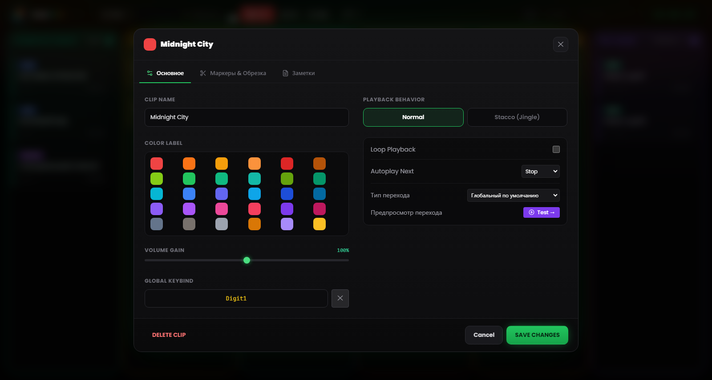
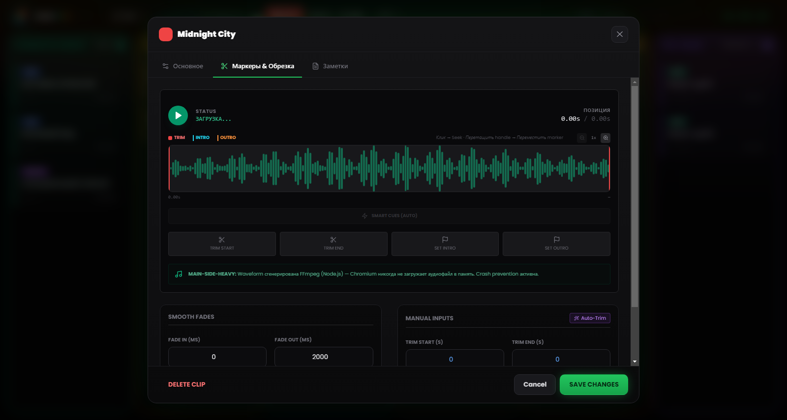

# Глава 5 — Свойства клипа и Waveform Editor

---

У каждого аудиофайла своя история до попадания в сетку: записи с секундами тишины в начале, дорожки с бесконечными концовками, интервью с уровнем слишком тихим относительно всего эфира. Не нужно всякий раз, когда файл ещё не «готов к эфиру», открывать внешний аудиоредактор — RLMP предлагает панель настройки для каждого клипа и визуальный редактор формы волны с функциями обрезки и разметки.

Все изменения, внесённые этими инструментами, **неразрушающие**: исходный файл на диске остаётся неизменным. RLMP хранит настройки в файле проекта `.lmp` и применяет их на лету во время воспроизведения.

Чтобы открыть настройки клипа, щёлкните по карточке **правой кнопкой**.

---

## 5.1 Базовые свойства

*Рисунок 5.1 — Настройки клипа: имя, цветовая метка, Volume Gain, поведение, Next Action и назначение клавиш.*

### Имя и внешний вид

**Clip Name.** Клипу можно задать пользовательское имя, независимое от имени исходного файла. Имя отображается на карточке в сетке. Используйте описательные и удобные в эфире названия: «ОТКРЫВАЮЩАЯ ЗАСТАВКА» читается легче, чем `sigla_rev3_finale_def.mp3`, когда на поиск нужного клипа у вас три секунды.

**Color Label.** По умолчанию клип наследует цвет своей колонки. Здесь можно задать отдельный цвет, чтобы визуально выделить клип, — полезно для пометки критичных клипов (например, закрывающей заставки) или для различения тематических групп внутри одной колонки.

### Громкость (Volume Gain)

Ползунок усиления идёт от 0% до 150% и действует как пре-фейдер конкретного клипа, до глобального Master Volume.

Самый частый случай применения — выравнивание уровней: голосовую запись, сделанную тихо (например, сообщение из WhatsApp или запись телефонного разговора), можно поднять выше 100%, приблизив к громкости остальных дорожек. И наоборот: особенно «горячий» клип можно приглушить, не трогая Master Volume.

---

## 5.2 Редактор формы волны

*Рисунок 5.2 — Редактор формы волны: маркеры Trim, маркеры Intro и Outro, Auto-Trim, Smart Cues и затухания.*

Визуальный редактор — самая мощная функция панели настройки. Он занимает центральную зону панели и показывает графическое представление звука всего клипа.

### Навигация в редакторе

**Горизонтальный масштаб.** Вид формы волны можно увеличить от 1× (полный вид) до 8×, с промежуточными шагами (1×, 2×, 3×, 4×, 6×, 8×), с помощью ползунка масштаба или колеса мыши над редактором. При большом масштабе вид следует за текущей позицией.

**Адаптивная шкала.** Временна́я ось в верхней части редактора автоматически подстраивается под масштаб: при полном виде показывает редкие отметки, при максимальном сгущает их вплоть до секунд.

**Playhead.** Во время предпрослушивания вертикальный белый индикатор бежит в реальном времени вдоль формы волны, показывая текущую позицию. Щелчок по форме волны переносит воспроизведение в эту точку.

### Четыре маркера-манипулятора

В редакторе есть четыре перетаскиваемых **манипулятора**, у каждого своя функция и точный цвет:

**Trim Start (красный маркер, слева).** Задаёт реальную точку начала клипа: всё, что находится левее, при воспроизведении пропускается. Тащите его вправо, чтобы убрать тишину или нежелательные части в начале.

**Trim End (красный маркер, справа).** Задаёт реальную точку конца: всё, что находится правее, игнорируется. Тащите его влево, чтобы укоротить концовку. Trim Start и Trim End не могут перекрываться.

**Intro Marker (голубой маркер).** Отмечает структурную точку, где основная мелодия вступает в дорожку, после возможного вступления. После установки на воспроизводимой карточке появится обратный отсчёт **INTRO: −MM:SS**.

**Outro Marker (оранжевый маркер).** Отмечает точку начала концовки дорожки — обычно момент, когда пора начинать говорить, заполняя переход. На карточке появится обратный отсчёт **OUTRO IN: −MM:SS**. Если значение оказывается несогласованным с обрезкой или длительностью, программа отключает его и предупреждает вас.

Помимо перетаскивания, четыре кнопки *Set* устанавливают каждый маркер в текущую позицию playhead — для разметки на лету во время прослушивания. Значения остаются доступными для точной правки в соответствующих полях.

### Auto-Trim (волшебная палочка)

Кнопка со значком **волшебной палочки** запускает автоматическое обнаружение тишины через FFmpeg. Порог здесь не фиксирован: программа сначала оценивает средний уровень файла и выставляет порог тишины примерно на 25 dB ниже этого уровня (в пределах безопасного диапазона от −55 до −20 dB; при отсутствии оценки — откат к −40 dB). Trim Start и Trim End устанавливаются автоматически, убирая начальную тишину и немые концовки без ручного вмешательства.

Эта функция особенно полезна для необработанных голосовых записей: телефонных звонков, аудиосообщений, интервью, записанных на мобильные устройства. Применить Auto-Trim ко всей колонке «Голос» перед эфиром — дело меньше минуты, а переходы становятся заметно чище.

> **Техническое примечание.** Анализ идёт в Main Process через FFmpeg, без загрузки файла в память Renderer. На больших файлах время анализа остаётся в пределах нескольких секунд.

### Smart Cues (автоматическое обнаружение маркеров)

Рядом с Auto-Trim функция **Smart Cues** автоматически предлагает маркеры Intro и Outro. Используя более агрессивный порог, она находит точку, где звук достигает полной энергии (Intro), и точку, где начинается финальное затухание (Outro), расставляя оба маркера без необходимости искать их на слух.

### Предпросмотр перехода

Если в той же колонке есть **следующий** клип, кнопка **«Test →»** воспроизводит последние секунды текущего клипа и даёт сработать переходу к следующему прямо в редакторе. Во время предпросмотра кнопка *Stop* прерывает проверку.

---

## 5.3 Поведение и автоматизация

### Playback Behavior (режим наложения)

**Normal** — поведение по умолчанию. Когда этот клип запускается, он прерывает любой другой воспроизводимый клип в той же колонке (с fade out). Это правильное поведение для песен и подложек: одна песня исключает другие.

**Stacco (отбивка, Jingle)** — клип запускается, не прерывая другие. Имеет высокий приоритет: заглушает прочие элементы колонки и приглушает музыку, но ничего не останавливает. Типичный случай — *station ID* («Вы слушаете…»), который должен «прокатиться» поверх интро дорожки, или короткий джингл поверх зацикленной подложки.

### Next Action (автоматизация в конце)

Определяет, что происходит, когда клип достигает точки Trim End.

**Stop** — поведение по умолчанию для «Музыки», «Голоса» и Assets. Клип заканчивается и останавливается.

**Play Next** — когда клип приближается к концу, он автоматически запускает следующий клип в колонке с настроенным переходом. На карточке появляется бейдж **NEXT**. Это поведение по умолчанию для колонки Pre-Show, и оно фактически создаёт автоматический плейлист: его можно настроить на несколько подряд идущих клипов, чтобы собирать блоки, которые проигрываются без перерыва.

Воспроизведение в **loop** — отдельная опция (Loop Playback): когда она активна, клип начинается заново (с Trim Start) без разрыва, и на карточке появляется бейдж **LOOP**. Используйте её для музыкальных подложек, звуковых сред или фоновых заставок, которые должны крутиться, пока их явно не остановят. Режимы перехода — Crossfade, Segue, Gapless — описаны в Главе 13.

---

## 5.4 Затухания (Fade In и Fade Out)

Панель позволяет задать для отдельного клипа длительность затуханий на входе и выходе. Значения идут от 0 до 60 000 миллисекунд (60 секунд), применяемая кривая линейная.

**Fade In.** Время, за которое громкость поднимается до максимума от старта. Значение 2000 ms даёт плавный подъём в две секунды. Используйте его на музыкальных подложках, которые должны мягко проявляться; держите на 0 для голосов и эффектов, которые должны быть слышны сразу.

**Fade Out.** Время затухания при закрытии — как при щелчке по активному клипу, так и в переходах. Типичные значения: 2000–3000 ms для песен, 500–1000 ms для подложек, 0 ms для резких отбивок.

Fade out на 0 ms даёт мгновенное завершение («hard cut»). На музыкальной дорожке в эфире это может восприниматься как техническая ошибка — внимательно оценивайте, когда это уместно.

---

## 5.5 Назначение управления

Каждый клип можно запустить также клавишей или MIDI-контроллером.

**Global Keybind.** Клавиша, назначенная клипу. Задать её можно в специальном поле в настройках клипа (щёлкните и нажмите нужную клавишу) либо в окне **Горячие клавиши**, доступном из меню «Инструменты». Соответствующий бейдж появляется на карточке. Если клавиша уже назначена другому клипу, программа сообщает о конфликте, прежде чем перезаписать.

**MIDI Bind.** Назначенная MIDI-нота (напр. `NOTE:60`). Назначение выполняется через режим **MIDI Learn** (см. Главу 8), а не набором номера вручную.

Привязки клипов сохраняются в файле проекта: при переносе проекта на другой компьютер с тем же MIDI-контроллером они заработают без перенастройки.
