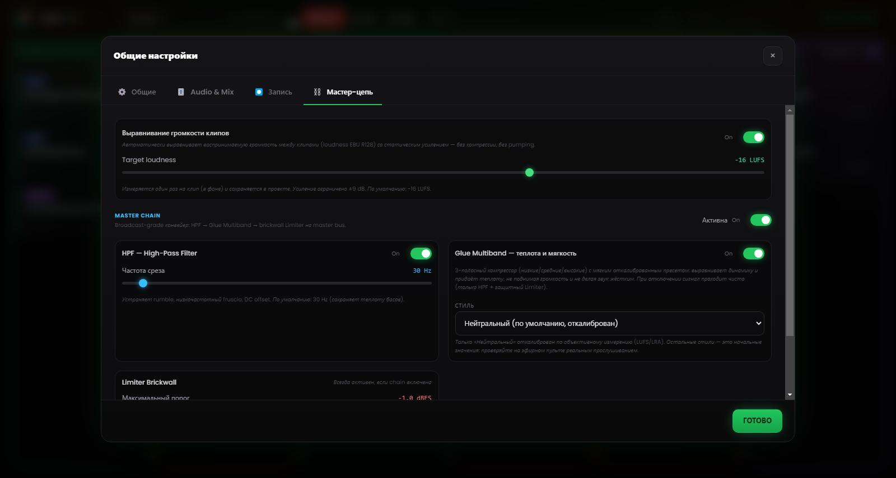

# Глава 6 — Движок микширования

---

Коренная проблема ручной радиорежиссуры — умножение одновременных действий: запустить дорожку, приглушить музыку, сказать что-то в микрофон, подготовить следующий клип, следить за часами. Каждое лишнее действие — это шанс на ошибку, а в эфире ошибка публична и мгновенна.

Движок микширования Runtime Live Machine Pro берёт большинство этих промежуточных действий на себя. Речь не об автоматизации в смысле «программа делает всё за тебя, а ты и не заметишь», а об автоматизации тех правил, которые вы сами применяли бы, будь у вас достаточно рук, чтобы успевать всё сразу.

---

## 6.1 Аудиоиерархия

Система автоматического микширования основана на **иерархии приоритетов** между типами клипов. Проще всего представить её как лестницу «право голоса».

**Голос / Записи — абсолютный приоритет.**
Когда воспроизводится голосовой клип, он остаётся на своей номинальной громкости, а всё остальное приглушается. Никакой другой сигнал не может перекрыть это правило.

**Музыка выпуска.**
Уступает место «Голосу», но главенствует над подложками Assets. Когда вступает песня, музыкальные подложки Assets обнуляются (не останавливаются: продолжают крутиться в тишине, готовые вернуться). Это Music Dominance, описанная далее.

**Show Assets, Jingle и Promo — служебные подложки.**
Приглушаются «Голосом» и заглушаются «Музыкой». Но когда элемент — это **Stacco** (отбивка), уже он берёт управление на себя (см. §6.4).

**Эффекты pad FX.**
Звуковые эффекты остаются вне иерархии: звучат на своей громкости, накладываются на то, что в эфире, и не заглушаются. Есть лишь одна уступка речи: когда активен голос, эффекты опускаются до половины громкости (50%), чтобы не перекрывать её, а затем сами возвращаются.

---

## 6.2 Автоматический ducking

**Ducking** — механизм, при котором сигнал приглушается, когда в воспроизведение вступает сигнал более высокого приоритета.

Самый частый случай: песня играет в полную силу, и вы запускаете заранее записанное интервью из колонки «Голос / Записи». В этот момент RLMP снижает песню примерно до **20% громкости** (около 14 dB) с мягким затуханием длиной в полсекунды — так, чтобы голос звучал внятно и не терялся в общем звуке. Как только интервью заканчивается, песня возвращается к исходной громкости с таким же плавным fade in.

Оператор ничего не трогает. Единственный совершённый жест — один щелчок: запустить интервью. Величину снижения и его скорость можно настроить в Настройках (Глава 13).

---

## 6.3 Music Dominance: умное управление подложками

Классическая звуковая ошибка — момент, когда песня и музыкальная подложка (*bed*) накладываются друг на друга: два ритмических рисунка сталкиваются, две бочки не совпадают, и в итоге получается каша.

Для таких случаев в RLMP есть **Music Dominance**.

**Типовой сценарий.** Подложка крутится в loop в колонке Assets, под голосом ведущего. Ведущий запускает дорожку из колонки «Музыка».

**Что делает RLMP.** Подложка не останавливается — иначе её пришлось бы перезапускать вручную. Вместо этого RLMP тихо сводит её к **нулевой громкости**, оставляя играть «призраком»: файл идёт дальше, loop продолжается, но ничего не слышно.

**Звуковой результат.** Слышна только песня. Подложка исчезла без единого действия оператора.

**Возвращение.** Когда песня заканчивается, подложка вновь проявляется с автоматическим fade in, продолжая с той точки, где находилась в loop. Поток (подложка → песня → подложка) происходит без единого лишнего щелчка.

---

## 6.4 Stacco: исключение из правила

Поведение **Stacco** (отбивка; настраивается в свойствах каждого клипа, см. Главу 5) временно переворачивает иерархию: клип с этим свойством сам становится приоритетным. Он заглушает прочие элементы своей колонки и приглушает музыку, но ничего не останавливает. Затухание при этом быстрее, чем при обычном ducking, — ради более резкого и чёткого входа.

Типичное применение — голосовой *station ID* («Вы слушаете…»): он должен звучать отчётливо, пока подложка под ним продолжает крутиться. Для более аккуратного результата сочетайте Stacco с коротким fade in (300–500 мс): тогда вход получится мягким, а не резким.

---

## 6.5 Выравнивание громкости (loudness)

Клипы разного происхождения почти всегда приходят с разными уровнями: заставка, сведённая как надо; тихо записанный телефонный голос; скачанная дорожка со своей собственной громкостью. Чтобы не подстраивать Gain вручную на каждом шагу, RLMP по умолчанию применяет **выравнивание громкости** по стандарту loudness EBU R128 с целевым значением **−16 LUFS**.

На практике программа оценивает воспринимаемую громкость каждого клипа и приближает её к общему ориентиру, чтобы песни, голоса и подложки стартовали уже на согласованном уровне. Функция активна по умолчанию, а целевое значение регулируется в Настройки → Мастер-цепь.

---

## 6.6 Мастер-цепь: цепочка процессоров на мастер-шине

*Рисунок 6.1 — Мастер-цепь: выравнивание громкости (−16 LUFS), HPF на 30 Hz, multiband glue и brickwall limiter.*

Совокупный сигнал всех воспроизводимых клипов, пройдя Master Volume, направляется через **цепочку процессоров** на мастер-шине, прежде чем достичь устройства вывода. Цепочка активна по умолчанию и рассчитана на broadcast-звучание без необходимости в тонкой настройке.

Она включает три последовательных ступени.

**High-Pass Filter (HPF) на 30 Hz.**
С мягким наклоном убирает бесполезные суббасовые частоты, которые съедают headroom и могут загрязнять системы звукоусиления. Частота среза регулируется (20–200 Hz); в выключенном состоянии ступень становится полностью прозрачной.

**Multiband glue.**
Это не один компрессор, а три «мягких» компрессора, работающих параллельно на трёх частотных полосах — низких, средних и высоких, — разделённых кроссовером. У каждой полосы свои откалиброванные пороги и коэффициенты: так микс «склеивается», не теряя объёма, а разброс динамики между клипами разного уровня сглаживается. Стиль выбирается из нескольких пресетов (Нейтральный, Rock, Jazz, Electronic); по умолчанию — Нейтральный.

**Brickwall limiter.**
Порог на −1 dBFS, высокий коэффициент ограничения, очень быстрая реакция. Лимитер гарантирует, что сигнал никогда не превысит максимально допустимый уровень, и защищает от цифровых искажений (клиппинга), что бы ни происходило выше по цепи.

Всю цепочку и каждую отдельную ступень можно настроить и отключить в Настройки → Мастер-цепь, где есть также кнопка сброса к значениям по умолчанию. Если сигнал уже обрабатывается аппаратным микшером или внешней цепочкой, здесь её стоит отключить, чтобы избежать двойной обработки.
