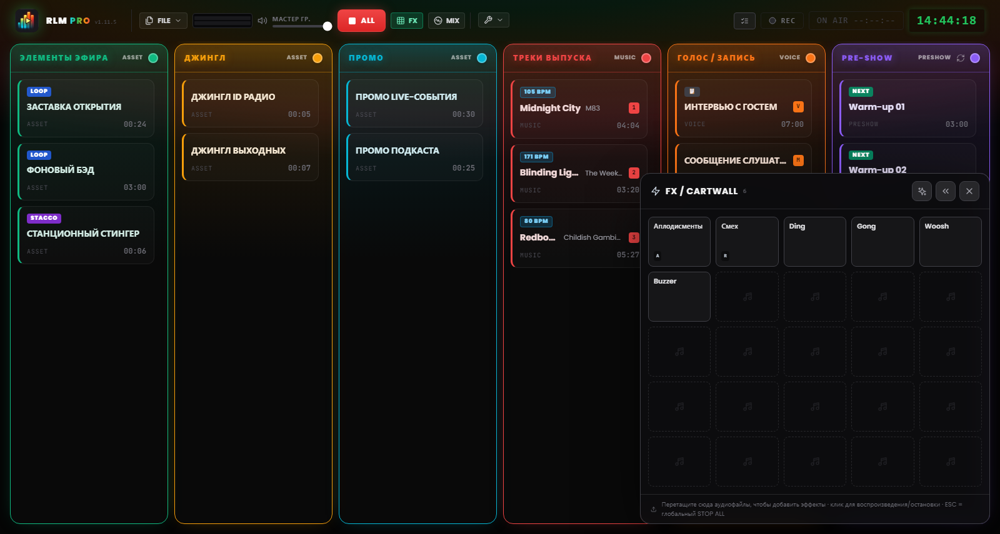
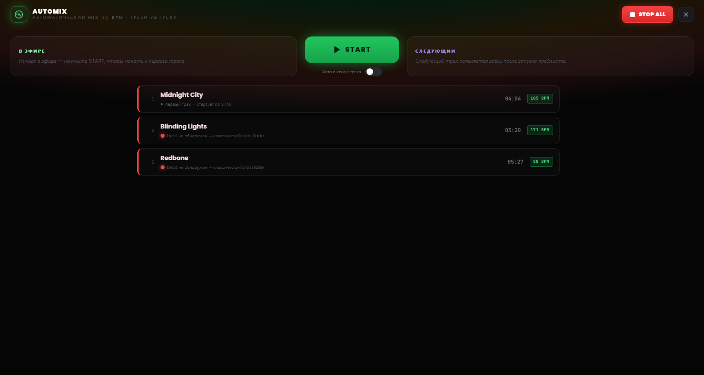

# Глава 7 — Pad FX и вид Automix

---

Над сеткой живут две рабочие поверхности, вызываемые клавишей и рассчитанные на два противоположных момента режиссуры: **pad FX** — чтобы наверняка запускать эффекты и отбивки, ничего не прерывая, и **вид Automix** — чтобы вести музыкальный поток так, как это делал бы диджей. Ни одна из них не отнимает места у сетки: они открываются, когда нужны, и закрываются одним щелчком.

---

## 7.1 Pad FX: jingle machine

*Рисунок 7.1 — Pad FX: jingle machine 5×5 звуковых эффектов с запуском с наложением.*

У звуковых эффектов нет колонки в сетке. Они живут в **pad FX** — панели-сетке из ячеек (*jingle machine*), которая открывается кнопкой **FX** в шапке и остаётся плавающей в углу экрана.

Pad — это **неблокирующий оверлей**: он не затемняет пульт и не перехватывает щелчки в других местах. Можно запустить эффект и в тот же миг продолжать работать с колонками или командами шапки. По этой причине клавиша `Esc` не закрывает pad: она остаётся командой STOP ALL, всегда доступной. Pad закрывается своей кнопкой закрытия или снова переключателем FX.

### Загрузка и запуск эффектов

Pad создаётся с сеткой из 25 ячеек (5×5) и растёт рядами, когда вы добавляете новые эффекты. Чтобы наполнить его, **перетаскивайте аудиофайлы прямо на ячейки** pad — ровно так же, как на колонку сетки.

Щелчок по ячейке **запускает эффект**. Эффекты pad полифоничны и накладываются: несколько ячеек могут звучать вместе, поверх чего угодно в эфире, не останавливая его. Звуковое поведение идентично обычному клипу: меняется только поверхность запуска. Счётчик рядом с кнопкой FX в шапке показывает, сколько эффектов звучит в данный момент.

### Настройка эффекта

Эффекты настраиваются на двух уровнях, рассчитанных на две разные потребности:

- **Быстрые настройки** — обычный случай для jingle machine: имя, цвет, громкость, loop. Хватает нескольких секунд.
- **Полные настройки** — то же окно, что у клипов сетки (редактор формы волны, trim, маркеры, fade, назначение клавиш), доступное через пункт «Полные настройки…» внутри быстрых.

### Расположение pad

Pad может находиться в левом или правом нижнем углу экрана: предпочтение задаётся стрелками на самом pad и запоминается между сессиями. Справа он перекрывает NoteBoard и последнюю колонку; выбирайте сторону в зависимости от того, как выстроен ваш плейлист.

> **Примечание.** В режиме MIDI Learn щелчок по ячейке pad **выбирает** эффект для назначения, а не проигрывает его — чтобы вы не выпустили джингл в эфир, пока настраиваете управление (см. Главу 8).

---

## 7.2 Вид Automix

*Рисунок 7.2 — Вид Automix: дек колонки «Музыка», совместимость BPM и автоматический режим в конце дорожки.*

**Вид Automix** — это дек колонки «Музыка»: полноэкранный экран, вызываемый кнопкой **MIX** в шапке, который представляет музыкальный плейлист как диджейскую консоль. Он открывается над пультом, но под pad FX, поэтому эффекты остаются доступными и при открытом Automix. Как и для pad, `Esc` его не закрывает: остаётся аварийная команда, а кнопка STOP ALL доступна в шапке.

### Дек

В центре — дорожка **в эфире** и, в очереди, **следующая** дорожка колонки «Музыка», с оставшимся временем. Отсюда можно запустить дорожку и управлять переходом от одной к другой одной командой: большая кнопка перехода применяет тот же crossfade, что и с сетки, но с дополнительным вниманием к ритмической стыковке.

### Совместимость и beat-matched переходы

Рядом с каждой дорожкой **кружок совместимости** с предыдущей указывает их ритмическое сходство:

- **Зелёный** — темпы хорошо стыкуются: переход может быть beat-matched.
- **Жёлтый** — стыковка возможна, но с оговорками.
- **Красный** — темпы слишком далеки для чистой стыковки.

Когда ритмическая стыковка неосуществима (BPM не определён, бит неуверенный, темпы слишком разные), программа объявляет об этом и автоматически откатывается к **классическому crossfade**, без сюрпризов в эфире.

### Автоматический режим

Внизу вида есть переключатель **автоматизации в конце дорожки**. Когда он активен, RLMP сам запускает переход к следующей дорожке, когда играющая приближается к концу.

Этот режим — намеренное исключение из философии программы, которая принципиально не автоматизирует эфир. Поэтому он **отключён по умолчанию** и работает **только пока открыт вид Automix**: закрытие вида отключает автоматизацию. Это подходящий инструмент для непрерывного музыкального блока — получаса чистой музыки перед возвращением к голосу, — но не для всего эфира.
