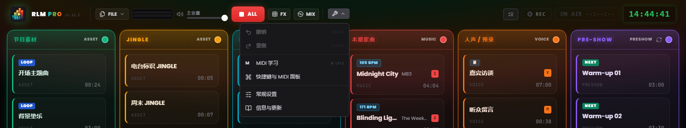
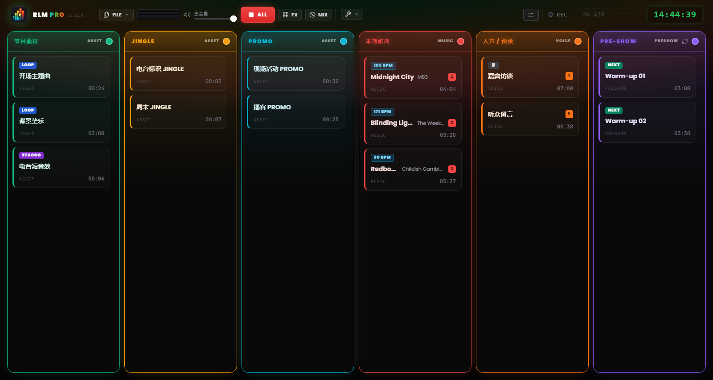

# 第 3 章 — 工作界面

---

Runtime Live Machine Pro 的界面是为最苛刻的场景设计的：直播。深色主题、高对比度、控件尺寸——每一处视觉选择背后都有一个功能上的理由，不是为了好看，而是人机工程学。

打开项目后，屏幕分为两块：顶部的**控制栏**管项目与系统，中部的**导播网格**是实际工作发生的地方。

---

## 3.1 控制栏（页眉）

页眉横贯整个屏幕宽度，自左向右依次是软件标识、文件命令、监听与传输控件、工具菜单、会话指示器。

### 标识

**Logo 与 PRO 徽标。** 左侧是 logo，紧挨着 **RLM PRO** 字样——「PRO」以虹彩渐变呈现，从青色过渡到绿色、琥珀色，再到红色。旁边用等宽字体标出已安装的版本号（`v1.15.10`）。鼠标移到 logo 上会显示软件全名及版本号。

### 文件菜单

**FILE** 按钮打开一个菜单，包含针对项目的操作：

- *新建项目* — 打开一个空会话。若有未保存的更改，软件会请求确认。
- *保存项目* — 对当前 `.lmp` 文件的快速保存。当有未保存的更改时，该项会以黄色高亮。
- *另存为…* — 始终打开对话框，用于创建递进的版本（例如 `Ep47_bozza.lmp`、`Ep47_finale.lmp`）。
- *导出项目含音频* — 把所有音频合并进项目内部（`audio/` 子文件夹）并将片段重新指向那里，这样你就能安全地删除原始文件。详见第 10 章。
- *加载项目* — 从磁盘打开一个 `.lmp` 项目。
- *导入 M3U* — 将 M3U 格式的播放列表作为一串片段导入。

### 监听与传输

**立体声 VU Meter（L/R）。** 两条水平表条显示经主音量处理后实际输出的电平。配色很直观：约到 85% 之前是绿色，之后转黄，接近满刻度变红。持续的红色意味着 clipping（削波），需要降低电平。

**主音量。** 推子控制软件总输出音量，范围 0 到 100%，相当于一个总闸：拉到零，无论各片段处于什么状态都不会出声。若某个 MIDI 控制已映射到主音量，旁边会有一个小徽标显示分配情况。

**STOP ALL（红色「ALL」按钮）。** 瞬时停止所有活动片段，清零进行中的淡变，是系统的紧急命令。应用处于焦点时，键盘上的 `Esc` 键效果相同，哪怕光标正停在文本框里。

> **注意。** 与先前版本不同，`Esc` 不再是系统级全局快捷键，只在 RLMP 为活动窗口时生效。这样一来，对话框可以用 `Esc` 关闭而不会打断直播。

**FX。** 打开和关闭 pad FX，即效果的 *jingle machine*（第 7 章）。一个小计数器显示此刻正在播放的效果数量。

**MIX。** 打开和关闭 Automix 视图，即 Music 列的专属 deck（第 7 章）。

### 工具

**工具**菜单（扳手图标）包含：

- *撤销* 与 *重做* — 播出单更改的历史记录（`Ctrl+Z` / `Ctrl+Y`）。
- *MIDI Learn* — 启用 MIDI 学习模式（第 8 章）。
- *Keybinds* — 为片段分配按键的窗口。
- *设置* — 软件的全局偏好（第 13 章）。
- *信息* — 版本、致谢、手动检查更新。

菜单下方会短暂弹出 *Auto-saved* 指示器，确认项目已自动保存。

*图 3.1 — 控制栏与打开的工具菜单（撤销/重做、MIDI Learn、Keybinds、常规设置、信息）。*

### 会话指示器

页眉右侧依次是 **Playout Log** 按钮（触发的时间顺序记录，第 13 章）、**录制**按钮（第 9 章）、**On Air 计时器**（直播时以红底显示 `ON AIR HH:MM:SS`），以及一个与系统时钟同步的 24 小时制数字**演播室时钟**。

页眉区域偶尔会出现不打扰人的通知（**toast**），提示操作完成或系统警示。它跟阻断式对话框不同，几秒后会自行消失，不会打断播放。

---

## 3.2 六列网格

*图 3.2 — 工作界面：带音频卡的六列网格。*

网格是软件的操作中枢：六条并排的竖列，每列有自己的配色标题和音频行为逻辑。音效在网格中没有专属列，它们存活在 pad FX 里（第 7 章）。

### 列标题

标题标出列名与类型，同时兼作状态指示器。正常情况下是静态的，以该列的特征色调着色。当正在播放的片段是该列最后一个可用片段、不处于循环状态、且距结束不足 **20 秒**时，标题进入 **DEAD AIR** 警报：开始脉动，转为琥珀色，显示警示图标和 **END** 徽标。这个提前量是留给你的准备时间，好在陷入静默之前把下一条轨道接上。

每列的颜色都能自定义：点击标题里的彩色圆点，会打开一个含 **30 种色调**的调色板，选择会保存在项目文件中。

当某一列至少含有一个片段时，其标题里会出现一个**垃圾桶**图标：**清空列**命令会一次性移除该列的全部片段。为安全起见，它总会请求确认并说明将移除多少个片段，且该操作可用 *撤销*（`Ctrl+Z`）还原。空列上不会出现该图标。

**Pre-Show** 列的标题上还有一个**轮播**按钮：启用后，直播前的候播队列会按固定间隔自动插入 jingle 与 promo（第 13 章）。

### 六列

**Show Assets（绿色）**
节目的结构性元素：片头、音乐垫、背景铺底（*bed*）、机构性 stacco。它们是背景层：人声或歌曲进入时会让出空间，被停止之前则保持内部轮换。

**Jingle（琥珀色）** 与 **Promo（青色）**
分别专用于标识性 jingle 和 promo/自我宣传。音频层面上二者与 Show Assets 完全一致（属于同一家族），分列只是为了让播出单保持有序、易读。

**本期歌曲（红色）**
音乐播放列表。此列的片段主动参与自动混音：人声播放时会被压低，进入播放时又会把 Assets 的垫乐静音（第 6 章）。软件会自动检测音乐片段的 **BPM**，以专用徽标显示。

**人声 / 预录（橙色）**
访谈、预录口播段落、语音消息。这一列在混音系统中拥有**最高优先级**：这里的片段一播放，其他所有信号都会被压到背景电平。

**Pre-Show（紫色）**
直播前的暖场播放列表，作为自主的音乐队列运行，可选择轮播 jingle 与 promo。正式直播开始后，这一列通常会被清空或停用。

---

## 3.3 音频卡（片段）

每个导入的音频文件都在网格中具现为一张矩形**卡片**。卡片是系统的操作单元：看到它、触发它、配置它、移动它，都是同一张卡。

### 卡片的结构

**标题与艺人。** 显示文件名，或属性中赋予的自定义名称。改标题只改软件内的标签，磁盘上的原始文件不受影响。音乐片段的标题下方可能显示艺人名。

**计时器。** 静止时显示片段总时长，格式 `MM:SS`；播放期间转为**倒计时**，带负号前缀（例如 `−01:20`）。距结束不足 15 秒时，计时器变**红**。

**状态徽标。** 小标签即时传达已配置的属性：

- **STACCO** — 该片段被设为叠加于其他片段之上而不将其停止。
- **LOOP** — 该片段在播放结束时会从头重新开始。
- **NEXT** — 该片段结束时会自动启动该列的下一个片段。
- **▶ UP NEXT** — 标出在自动序列中下一个将启动的片段。
- **### BPM** — 检测到的节奏，显示在音乐片段上，位于一个高可见度的荧光黄徽标里。
- **I ##s** — 该片段配置了 Intro 入点（第 5 章）：青色徽标标出其时长（以秒计），始终可见，哪怕片段处于静止状态。
- **TRIM…** — 静音分析进行中（Auto-Trim）。
- **FADE OUT** — 在 crossfade 或淡出期间出现在正在退出的片段上。
- **📋** — 该片段在 NoteBoard 中有一条关联的备注（第 13 章）。

**分配。** 若片段分配了键盘按键，字母会显示在以列色着色的徽标里；若有 MIDI 绑定，则显示标签 `M` 加音符编号（例如 `M60`）。

**结构 cue。** 若配置了标记，播放期间会出现倒计时 `INTRO: −MM:SS`（青色）与 `OUTRO IN: −MM:SS`（橙色），outro 开始时切换为 `🚨 OUTRO` 提示。

**播放指示。** 播放中的卡片会亮起：绿色边框、带光晕的背景、脉动的圆点、高亮的标题，进度条在卡片背景上滑动。

### 与卡片的交互

- **左键单击** — 停止状态下启动片段，播放状态下停止它（带淡出）。
- **Ctrl + 单击**（Windows/Linux）或 **Cmd + 单击**（macOS）— 只选中片段不启动，边框变蓝，便于多选与批量删除。
- **Canc 键**（或 *Delete* / *Backspace*）— 删除选中的片段。选中多个时软件会请求确认。
- **右键** — 打开**片段设置**：属性、波形编辑器、备注（第 5 章）。
- **拖放** — 拖动卡片可在列内重排，或移到另一列。拖动期间蓝色发光指示器会显示插入位置。

### 处于错误状态的卡片

带 **文件缺失** 标识和红色边框的卡片，说明被引用的音频文件已无法访问——可能被移动、重命名，或存放在一个未连接的外部磁盘上。文件重新出现在原始路径之前，该片段无法播放。路径错误的处理方式见第 14 章。
