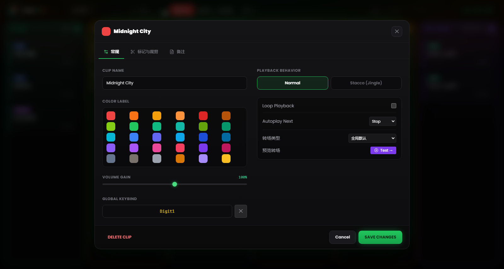
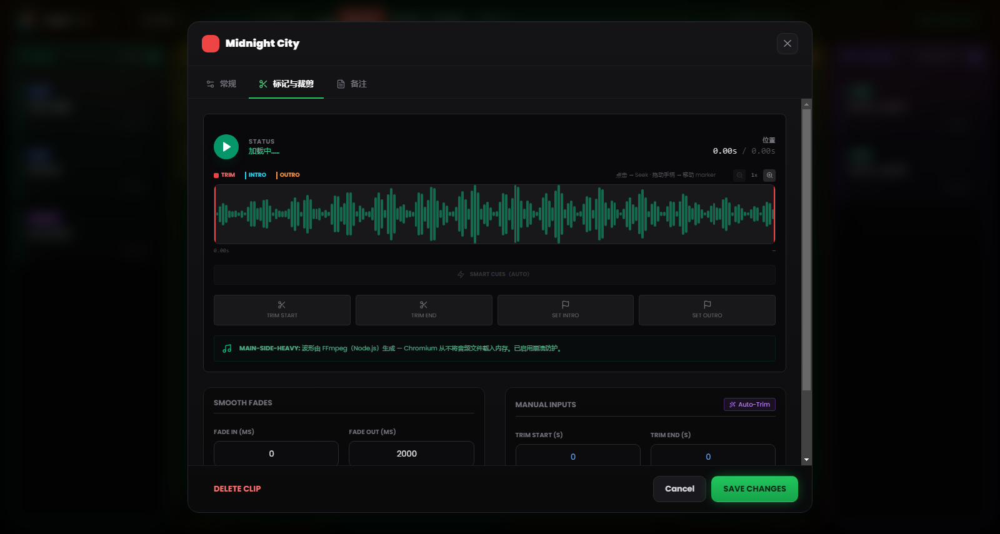

# 第 5 章 — 片段属性与波形编辑器

---

每个音频文件在进入网格之前都有自己的来历：开头带着数秒静音的录音、结尾拖沓不止的曲目、电平比节目其余部分低得多的访谈。RLMP 没有让你每次遇到「未准备好播出」的文件时都去求助外部音频编辑器，而是为每个片段提供了一个配置面板，以及一个具备裁剪与标记功能的可视化波形编辑器。

通过这些工具所做的一切修改都是**非破坏性**的：磁盘上的原始文件保持不变。RLMP 将设置记录在 `.lmp` 项目文件中，并在播放时即时应用。

若要打开某片段的设置，请在卡片上**右键单击**。

---

## 5.1 基础属性

*图 5.1 — 片段设置：名称、颜色标签、Volume Gain、行为、Next Action 与按键分配。*

### 名称与外观

**Clip Name。** 你可以为片段指定一个自定义名称，独立于原始文件名。该名称会显示在网格中的卡片上。请使用在直播中描述性强、便于操作的名称：当你只有三秒钟去找对片段时，「SIGLA DI APERTURA」远比 `sigla_rev3_finale_def.mp3` 好认。

**Color Label（自定义颜色）。** 默认情况下，片段继承所属列的颜色。在这里你可以指定一个特定颜色，让它在视觉上更突出。这对标记关键片段（如收尾片头）、或在同一列内区分主题分组很有用。

### 音量（Volume Gain）

Volume Gain 滑块的范围为 0% 到 150%，作为该片段特定的 pre-fader，作用在全局主音量之前。

最常见的用途是电平对齐：若你有一段以低强度录制的人声（例如一条 WhatsApp 语音或一通电话录音），可以把它推过 100% 以靠近其他轨道的音量。反之，你也可以在不动主音量的情况下压低某个特别「烫」的片段。

---

## 5.2 波形编辑器

*图 5.2 — 波形编辑器：Trim 手柄、Intro 与 Outro 标记、Auto-Trim、Smart Cues 与淡变。*

可视化编辑器是配置面板中最强大的功能。它占据面板的中部区域，显示整个片段音频的图形表示。

### 在编辑器中导航

**水平缩放。** 你可以将波形视图从 1×（完整视图）放大到 8×，含若干中间档位（1×、2×、3×、4×、6×、8×），通过缩放滑块或在编辑器上方滚动鼠标滚轮实现。在高倍缩放下，视图会跟随当前位置滚动。

**自适应标尺（Ruler）。** 编辑器上方的时间轴会随缩放自动调整：完整视图时显示稀疏的参照点，最大缩放时则加密到秒级。

**Playhead。** 在预览播放期间，一个白色的竖直指示器会沿波形实时滑动，显示当前位置。在波形上单击可将播放跳到该点。

### 四个手柄

编辑器上有四个可拖动的**手柄**，各有精确的功能与颜色：

**Trim Start（红色手柄，左侧）。** 定义片段实际的起始点。位于其左侧的一切在播放时都会被跳过。将其向右拖动，可去除开头的静音或不想要的部分。

**Trim End（红色手柄，右侧）。** 定义实际的结束点。位于其右侧的一切都会被忽略。将其向左拖动可缩短结尾。Trim Start 与 Trim End 不能重叠。

**Intro 标记（青色手柄）。** 标记曲目主旋律在可能存在的前奏之后进入的结构点。一旦设定，正在播放的卡片上会出现倒计时 **INTRO: −MM:SS**。

**Outro 标记（橙色手柄）。** 标记曲目结尾段落开始的那一点，通常是你开始说话以填补转场的时机。卡片上会出现倒计时 **OUTRO IN: −MM:SS**。若该值与裁剪或时长不一致，软件会将其停用并向你提示。

除拖动外，四个 *Set* 按钮可将各手柄设到 playhead 的当前位置，便于在试听中即时标记。这些数值仍可在各自的字段中精确修改。

### Auto-Trim（魔法棒）

带**魔法棒**图标的按钮通过 FFmpeg 启动静音的自动检测。阈值不是固定的：软件先估算文件的平均电平，再把静音阈值设在该电平之下约 25 dB（限定在 −55 到 −20 dB 的安全区间内；若无法估算，则回退到 −40 dB）。Trim Start 与 Trim End 由此被自动设定，无需手动干预即可去除开头的静音与结尾的哑段。

此功能对未加处理的人声录音尤其有用：电话、语音消息、用移动设备录制的访谈。在节目前对整个 Voci 列应用 Auto-Trim 用时不到一分钟，却能改善转场的干净度。

> **技术说明。** 分析在 Main Process 中通过 FFmpeg 进行，不会在 Renderer 中将文件载入内存。即便对大文件，分析时间也保持在数秒的量级。

### Smart Cues（标记的自动检测）

在 Auto-Trim 旁边，**Smart Cues** 功能会自动提议 Intro 与 Outro 标记。它使用更激进的阈值，找出音频达到满能量的那一点（Intro）与结尾淡出开始的那一点（Outro），无需靠耳朵寻找即可放置这两个标记。

### 转场预览

若同一列中存在**后续**片段，**「Test →」**按钮会播放当前片段的最后几秒，并让转场直接在编辑器中触发到下一个片段。预览期间，一个 *Stop* 按钮可中断试听。

---

## 5.3 行为与自动化

### Playback Behavior（叠加模式）

**Normal** — 默认行为。当此片段启动时，会中断同一列中任何正在播放的片段（带淡出）。这是歌曲与垫乐的正确行为：一首歌会排除其他歌。

**Stacco（Jingle，短切叠加）** — 片段启动时不中断其他片段。它具有高优先级：将本列的其他 asset 静音并压低音乐，但不停止任何东西。典型用途是需要「骑」在曲目 intro 上的 *station ID*（「你正在收听……」），或叠加在循环垫乐之上的短 jingle。

### Next Action（结束时的自动化）

定义片段到达 Trim End 时会发生什么。

**Stop** — Canzoni、Voci 与 Assets 的默认行为。片段结束并停止。

**Play Next** — 当片段接近结尾时，以配置好的转场自动启动本列的下一个片段。卡片上出现 **NEXT** 徽标。这是 Pre-Show 列的默认行为，实际上会构成一个自动播放列表：你可以在多个连续片段上配置它，构建出无间断流动的段落。

**Loop（循环）**播放是一个独立的选项：启用时，片段会从头（从 Trim Start）无缝重新开始，卡片上出现 **LOOP** 徽标。用它处理需要一直运转、直到被明确停止的音乐垫、环境声或背景片头。转场模式——Crossfade、Segue、Gapless——在第 13 章描述。

---

## 5.4 淡变（Fade In 与 Fade Out）

面板允许针对单个片段设置淡入与淡出的时长。数值范围为 0 到 60000 毫秒（60 秒），所应用的曲线为线性。

**Fade In。** 音量从启动到达到最大电平所需的时间。2000 ms 的值会产生两秒的渐升。用它处理需要柔和浮现的音乐垫；对需要立即被听到的人声与效果则保持为 0。

**Fade Out。** 收尾时的淡出时间——无论是点击活动片段时，还是在转场中。典型值：歌曲 2000–3000 ms，垫乐 500–1000 ms，硬切 stacco 为 0 ms。

0 ms 的淡出会产生即时的收尾（「hard cut」）。在直播中的一首音乐曲目上，这可能被听成技术失误：请谨慎判断何时合适。

---

## 5.5 控制分配

每个片段也可以通过键盘按键或 MIDI 控制器来触发。

**Global Keybind。** 分配给片段的键盘按键。你可以在片段设置的专用字段中设置它（点击后按下想要的按键），或从工具菜单中的 **Keybinds** 窗口设置。对应的徽标会出现在卡片上。若该按键已分配给另一个片段，软件会在覆盖之前提示冲突。

**MIDI Bind。** 分配的 MIDI 音符（例如 `NOTE:60`）。分配通过 **MIDI Learn** 模式完成（见第 8 章），而非手动输入编号。

片段的绑定会保存在项目文件中：将项目带到另一台配有相同 MIDI 控制器的电脑上，映射无需重新配置即可工作。
