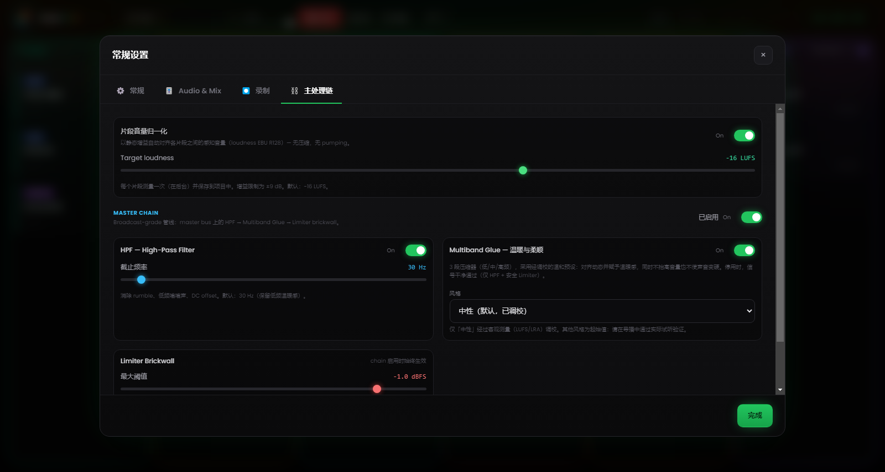

# 第 6 章 — 混音引擎

---

手动电台导播的根本难题在于同时动作的成倍增加：启动一首曲目、压低音乐、对着麦克风说话、准备下一个片段、盯着时钟。每多一步操作，就多一次出错的机会——而在这种场景里，错误是公开且即时的。

Runtime Live Machine Pro 的混音引擎把这些中间动作的大部分交给软件，从而将它们消除。这不是「软件在你不知情的情况下替你做事」意义上的自动化，而是把你本人会定义的那些规则自动化——如果你有足够多的手去把它们全部执行的话。

---

## 6.1 音频层级

自动混音系统建立在片段类型之间的**优先级层级**之上。理解它最直接的方式，是把它想象成一架「话语权」的阶梯。

**人声 / 预录 — 绝对优先。**
当一个人声片段正在播放时，它保持在自己的标称音量，其余一切都被压低。没有任何其他信号能覆盖这条规则。

**本期歌曲。**
它们向人声让出空间，但凌驾于 Assets 的垫乐之上。当一首歌进入时，Assets 的音乐垫会被清零（不是停止：它们继续在静默中运转，随时准备回归）。这就是稍后描述的 Music Dominance。

**Show Assets、Jingle 与 Promo — 服务性的垫乐。**
它们被人声压低、被歌曲静音。不过，当某个 asset 是 **Stacco** 时，反倒是它来发号施令（见 §6.4）。

**pad FX 的效果。**
音效处于层级之外：它们以自己的音量播放，叠加在正在播出的内容之上，且不会被静音。只有对口播的一点让步：当人声活动时，效果会降到一半音量（50%）以免盖过它，随后自行升回。

---

## 6.2 自动 Ducking

**Ducking** 是这样一种机制：当一个更高优先级的信号进入播放时，另一个信号被压低。

最常见的情形：一首歌正以完整动态播放；你从 Voci 列启动一段预录访谈。此刻 RLMP 会以半秒的柔和淡变把歌曲带到约 **20% 的音量**（约 14 dB 的衰减），好让人声以可听清的方式占据声音空间。访谈一结束，歌曲便以同样流畅的淡入升回原始音量。

操作员什么都不用碰。所执行的动作只有一次点击：启动访谈。衰减的幅度及其快慢可在设置中调节（第 13 章）。

---

## 6.3 Music Dominance：对垫乐的智能管理

一个经典的声音失误，是一首歌与一段音乐垫（*bed*）叠在一起的时刻：两个节奏元素相撞，两记不同步的 kick drum，结果一片混乱。

RLMP 用 **Music Dominance** 来处理这种场景。

**典型情形。** 一段垫乐正在 Assets 列里循环，垫在主持人的人声之下。主持人从 Canzoni 列启动了一首曲目。

**RLMP 的处理。** 它不停止垫乐，因为停止之后还得手动重新启动。它转而悄然把垫乐带到**零音量**，让它「幽灵般」继续播放：文件继续走，循环继续，但什么也听不见。

**声音上的结果。** 只听得到那首歌。垫乐消失了，而操作员什么都没做。

**回归。** 当那首歌结束时，垫乐以自动淡入重新浮现，从它在循环中所处的那一点续上。整个流程（垫乐 → 歌曲 → 垫乐）不需要一次额外的点击。

---

## 6.4 Stacco：规则的例外

**Stacco（短切叠加）**行为（可在每个片段的属性中配置，见第 5 章）会暂时颠覆层级：携带该行为的片段变为优先。它将本列的其他 asset 静音并压低音乐，但不停止任何东西。所应用的淡变比普通 ducking 更快，以获得更具冲击力、更利落的进入。

典型用途是人声 *station ID*（「你正在收听……」）：它必须被清晰听到，而底下的垫乐继续运转。若想效果更讲究，可给 Stacco 配上一个短促的 fade in（300–500 ms）：进入会变得柔和，而非生硬。

---

## 6.5 音量归一化（loudness）

来源各异的片段几乎总是带着不同的电平：一个精心母带过的片头、一段小声录制的电话人声、一首下载来的、音量自成一格的曲目。为免于不断手动调整 Gain，RLMP 默认应用一种基于 EBU R128 loudness 标准的**音量归一化**，目标为 **−16 LUFS**。

实际上，软件会评估每个片段的感知响度，并将其向一个共同参照靠拢，从而让歌曲、人声与垫乐一开始就处在一致的平面上。该功能默认启用，目标值可在 设置 → 主处理链 中调节。

---

## 6.6 Master Chain：master bus 上的处理器链

*图 6.1 — Master Chain：音量归一化（−16 LUFS）、30 Hz 的 HPF、multiband glue 与 limiter brickwall。*

所有正在播放的片段的合成信号，在经过主音量之后、抵达输出设备之前，会穿过 master bus 上的一条**处理器链**。该链默认启用，其设计意在提供 broadcast-grade 的声音而无需高级配置。

它包含串联的三级。

**High-Pass Filter（HPF），30 Hz。**
以柔和的斜率消除那些无用的 sub-bass 频率——它们既耗费 headroom，又可能弄脏扩声系统。截止频率可调（20–200 Hz）。停用时，该级完全透明。

**Multiband glue（多频段黏合）。**
它不是单个压缩器，而是三个「温和」的压缩器在三个频段（低、中、高）上并行工作，由 crossover 分开。每个频段的阈值与比例都经过校准，以「黏合」混音而不将其压扁，并抑制不同电平片段之间的动态差异。风格可在若干预设间选择（Neutro、Rock、Jazz、Elettronico）；默认预设为 Neutro。

**Limiter brickwall（砖墙限制器）。**
阈值为 −1 dBFS，限制比例高、反应极快。它确保信号绝不超过允许的最大电平，无论上游发生什么，都能防止数字失真（clipping）。

整条链，以及其中每一级，都可在 设置 → 主处理链 中配置并停用，那里还有一个恢复默认值的按钮。在信号已由硬件混音器或外部处理链加工过的环境中，你可以将其停用，以避免重复处理。
