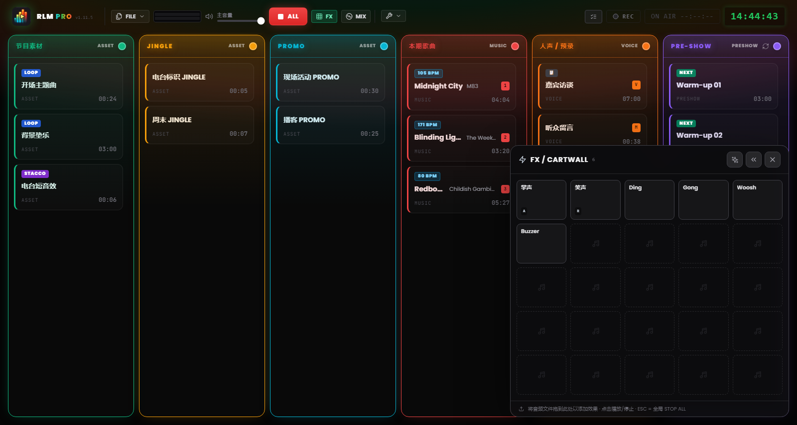
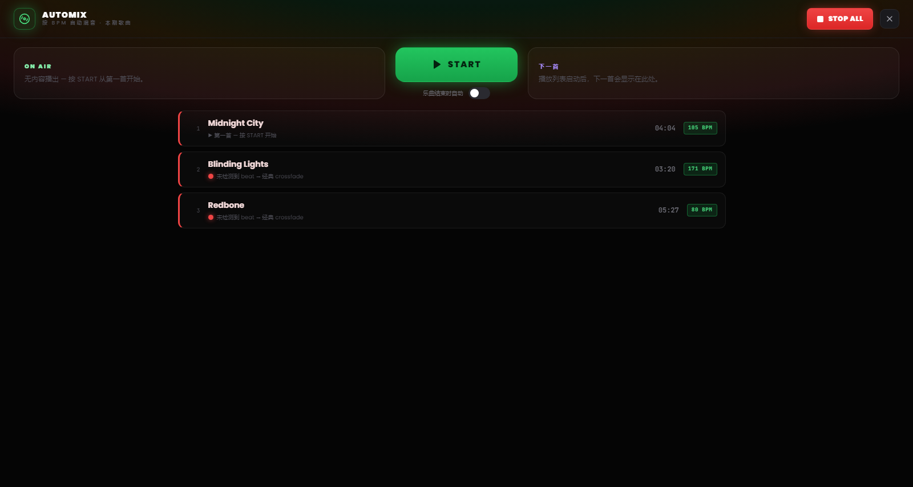

# 第 7 章 — Pad FX 与 Automix 视图

---

两个工作面存活于网格之上，各用一个按键唤出，分别为导播的两个相反时刻而设：**pad FX**，用于稳稳地触发效果与 stacco 而不打断任何内容；以及 **Automix 视图**，用于像 DJ 那样管理音乐流。两者都不占用网格空间：需要时打开，一点即关。

---

## 7.1 Pad FX：jingle machine

*图 7.1 — pad FX：5×5 的音效 jingle machine，支持叠加式触发。*

音效在网格中没有列。它们存活于 **pad FX** 中——一个由格子组成的网格面板（一台 *jingle machine*），由页眉中的 **FX** 按钮打开，浮动于屏幕的一角。

pad 是一个**非阻断式的浮层**：它不遮挡看板，也不拦截指向别处的直接点击。你可以触发一个效果，同时继续在各列或页眉的命令上操作。正因如此，`Esc` 键不会关闭 pad：它保留为 STOP ALL 命令，始终可用。pad 通过其关闭按钮、或再次点击 FX 开关来关闭。

### 加载与触发效果

pad 初始为一个 25 格（5×5）的网格，当你添加更多效果时会按行增长。若要填充它，请**把音频文件直接拖到 pad 的格子上**，就像你对网格的某一列所做的那样。

在格子上单击即**触发效果**。pad 的效果是复音的，可叠加：多个格子可以一起响，叠在任何正在播出的内容之上而不将其停止。音频行为与普通片段完全一致：只是触发的操作面不同。页眉中 FX 按钮旁的计数器指示此刻正在响的效果数量。

### 配置效果

效果分两个层级配置，为两种不同的需求而设：

- **快速设置** — jingle machine 的常见情形：名称、颜色、音量、循环。几秒钟即可。
- **完整设置** — 与网格片段相同的窗口（波形编辑器、trim、标记、淡变、按键分配），可从快速设置内的「完整设置……」项进入。

### pad 的位置

pad 可以停在屏幕的左下角或右下角：偏好由 pad 上的箭头设置，并在各次会话之间被记住。停在右侧时它会盖住 NoteBoard 与最后一列；请根据你排布播出单的方式来选择一侧。

> **注意。** 在 MIDI Learn 模式下，点击 pad 的某个格子会**选中**该效果用于分配，而不是播放它——这样你在映射控制时就不会把一段 jingle 送上直播（见第 8 章）。

---

## 7.2 Automix 视图

*图 7.2 — Automix 视图：Music 列的 deck、BPM 兼容性，以及曲目结束时的自动模式。*

**Automix 视图**是 Music 列的 deck：一个全幅界面，由页眉中的 **MIX** 按钮唤出，把音乐播出单呈现为一台 DJ 控制台。它打开于看板之上、但在 pad FX 之下，因此即便 Automix 打开着，效果仍可使用。与 pad 一样，`Esc` 不会关闭它：它仍是紧急命令，而 STOP ALL 按钮在页眉中始终可达。

### deck

中央是**正在播出**的曲目，队列中是 Music 列的**下一首**曲目，附带剩余时间。你可以从这里让一条轨道开始，并用一个命令管理曲目之间的过渡：那颗大转场按钮所应用的 crossfade，与你从网格所用的相同，只是多了一份节奏对齐的用心。

### 兼容性与 beat-matched 转场

每首曲目旁都有一个与前一首曲目的**兼容性圆点**，标示两者的节奏亲和度：

- **绿色** — 两者节奏对齐良好：转场可以 beat-matched。
- **黄色** — 可以对齐，但略有保留。
- **红色** — 节奏相差太远，无法干净地对齐。

当节奏对齐不可行时（未检测到 BPM、beat 不确定、节奏相差太大），软件会明确声明，并自动回退到**经典 crossfade**，直播中不会有意外。

### 自动模式

视图底部有一个用于**曲目结束时自动**的开关。启用时，当正在播出的轨道接近结尾，RLMP 会自行启动向下一首曲目的过渡。

这一模式是对软件理念的一次有意的例外——软件出于选择并不将节目自动化。因此它**默认关闭**，且**仅在 Automix 视图打开时才生效**：关闭视图即停用自动。它是连续音乐段落的合适工具，比如重新回到人声之前那半小时的纯音乐，而不适用于整场直播。
